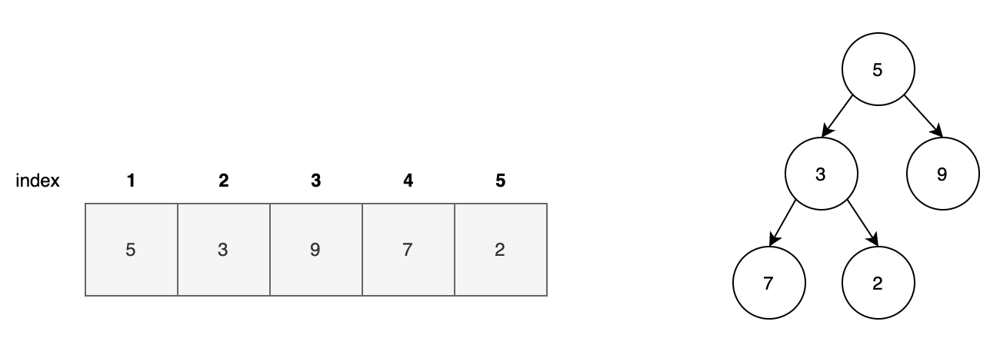
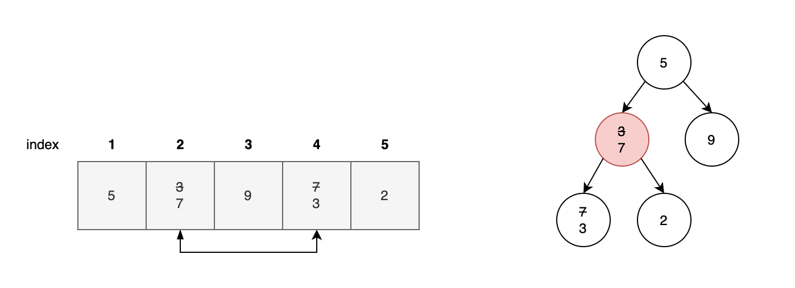
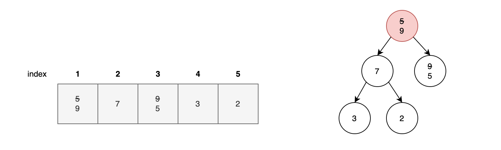

### 힙이란

힙은 특정 규칙이 있는 이진트리이며 힙이라는 자료구조를 사용해 정렬합니다.  
**최대힙은 부모 노드가 자식 노드보다 크고, 최소힙은 부모 노드가 자식 노드보다 작습니다.**

### 최대 힙 구축하기

- `max_heapify()` 함수 연산
    - 배열의 마지막 노드 부터 힙 구축을 시작합니다
    - 현재 노드와 자식 노드의 값을 비교합니다
        - 현재 노드의 값이 가장 크지 않으면 자식 노드 중 큰 값과 현재 노드의 값을 바꿉니다
        - 만약 자식 노드가 없거나 현재 노드의 값이 가장 크면 연산을 종료합니다
    - 맞바꾼 자식 노드의 위치를 현재 노드로 하여 과정 1을 반복합니다

**1단계**: 초기 배열을 보면 최대힙 조건에 맞지 않습니다. 따라서 힙 구축을 시작합니다.

**2단계**: `max_heapify(5)`, `max_heapify(4)`, `max_heapify(3)`은 자식노드라 연산을 종료합니다.

**3단계**: `max_heapify(2)`를 수행하면 자식노드인 4번 노드가 더 크므로 위치를 바꿉니다. 현재 노드가 2번이므로 바뀐 4번 노드로 이동해서 
`max_heapify(4)`를 수행하지만 자식노드이므로 종료합니다.

**4단계**: 루트노드를 현재노드라 생각하여 `max_heapify(1)`을 수행합니다. 3번 노드인 9가 루트 노드인 5보다 크므로 위치를 바꾸고 3번노드로 이동합니다.
`max_heapify(3)`은 자식노드가 없으므로 종료합니다.

### 최대힙 정렬 과정

1. 정렬되지 않은 데이터로 **최대힙을 구축**합니다.
2. 현재 최대힙의 **루트 노드와 마지막 노드를 맞바꿉니다**. 맞바꾼 뒤, 마지막 노드는 최대힙에서 제외합니다.
3. 현재 최대힙은 마지막 노드가 루트노드가 되었습니다. 따라서 최대힙을 다시 구축해야 합니다. `max_heapify(1)`을 진행하여 **최대힙을 구축하고 2번을 수행**합니다. 이 반복은 힙의 크기가 1이 될때까지 반복합니다.
4. 힙에서 다 제외되면 내림차순 형태 입니다.

### 시간 복잡도

정렬되지 않은 값 N개를 힙으로 나타내면 높이가 logN인 트리가 됩니다. 각 데이터에 대해서 힙 정렬을 수행하면
**시간복잡도는 O(NlogN)**입니다.