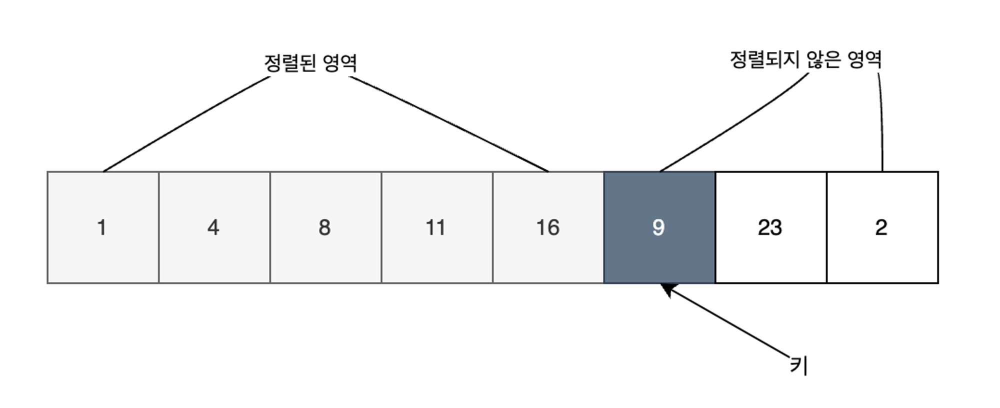

### 삽입정렬 이란

삽입정렬은 데이터의 전체 영역에서 정렬된 영역과 정렬되지 않은 영역을 나누고, 정렬되지 않은 영역의 값을 정렬된 영역의 적절한 위치로 놓으며 정렬합니다.

1. 최초에는 정렬된 영역은 왼쪽 1개, 정렬되지 않은 영역을 나머지로 합니다.
2. 키와 정렬된 영역의 맨 끝 값부터 거슬러 올라가며 다음 처리를 합니다.
   - **키보다 크면** 해당 값을 오른쪽으로 한 칸 밀어냅니다
   - **키보다 작거나 더 이상 비교할 값이 없으면** 밀어낸 자리에 키를 넣습니다.
3. 모든 데이터가 정렬된 영역이 될때까지 2단계를 반복합니다. 

### 시간복잡도

1. 이미 배열이 정렬되어있을 때 **가장 최선의 경우로 O(N)**입니다. 
2. 완전히 반대로 정렬되어있을 때 **최악의 경우로 O(N^2)**입니다.