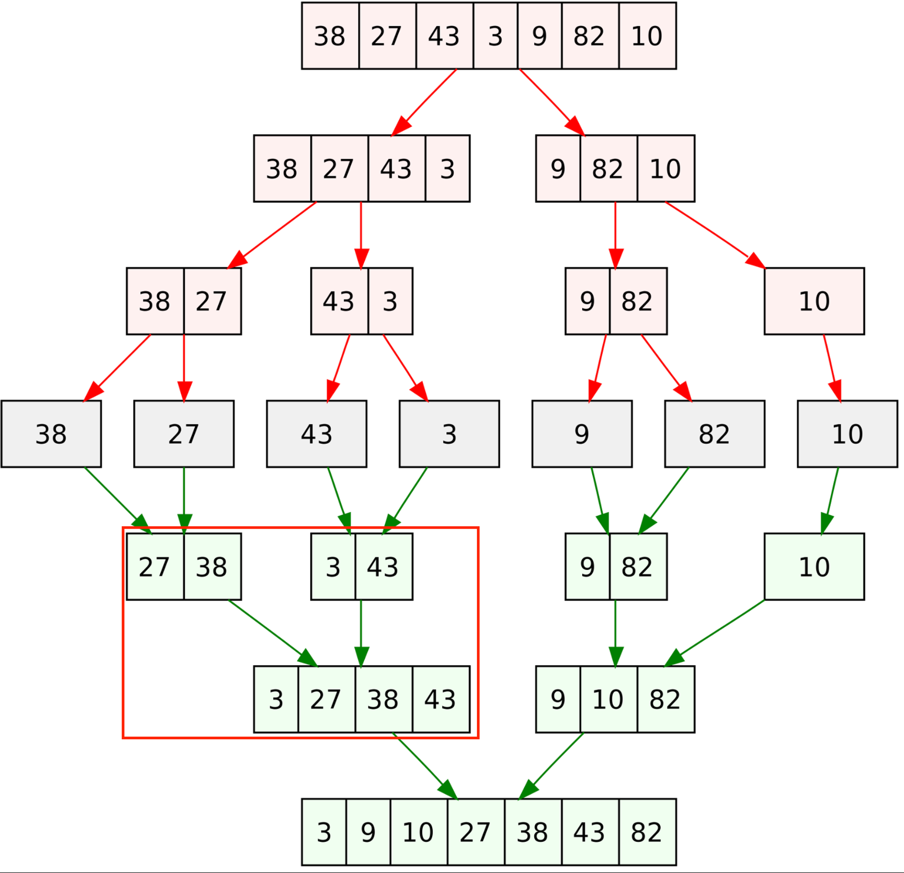

### 병합정렬 이란
병합 정렬은 정렬되지 않은 영역을 쪼개서 각각의 영역을 정렬하고 이를 합치며 정렬합니다.



### 병합할 때 부분 정렬 구현 방법

**상단 빨간색 박스**를 보면서 아래의 내용을 보겠습니다.

1. 각 분리된 데이터의 첫 번째 원소를 가리키는 포인터를 만듭니다.
    - 1-1. 포인터가 가르키는 두 값중 작은 값을 선택해 새 저장 공간에 저장합니다
    - 1-2. 값이 선택된 포인터는 다음 위치의 값을 가리킵니다.
2. 새 저장 공간에 하나의 데이터가 완전히 저장될 때까지 과정 1을 반복합니다
    - 2-1. 그러고나서 저장할 값이 남은 데이터의 값을 순서대로 새로운 저장 공간에 저장합니다.
    - 2-2. 그러면 새로운 저장 공간에 두 개의 데이터가 정렬된 상태로 저장됩니다.
3. 새로운 저장소에 저장된 값의 개수와 초기에 주어진 데이터에 들어 있는 값의 개수가 같을 때까지 과정 1, 2를 반복합니다.

#### 합치는 코드

```java
   // 정렬된 배열을 저장할 배열 생성
   int[] merged = new int[arr1.length + arr2.length];
   int k = 0, i = 0, j = 0; // 3개 배열의 인덱스 초기화
   
   while (i < arr1.length && j < arr2.length) {
      merged[k++] = arr1[i] <= arr2[j] ? arr1[i++] : arr2[j++];
   }
   
   // arr1 이나 arr2 중 남아 있는 원소들을 정렬된 배열 뒤에 추가
   while(i < arr1.length){
      merged[k++] = arr1[i++];
   }
   while(j < arr2.length){
      merged[k++] = arr2[j++];
   }
   
   return merged;
```

### 병합정렬의 시간 복잡도

**1단계:** N개의 데이터를 1/2로 몇 번 나눠야 가장 작은 1칸이 될 지 계산하는 식을 세워 정리하면 **logN**을 얻을 수 있습니다.

- 1(칸) = N * (1/2)^h
- 2^h = N
- h = logN

**2단계:** 정렬 과정에서 각 단계마다 N개의 데이터를 정렬하여 병합한다고 생각하면 **NlogN**으로 연산 횟수를 계산할 수 있습니다.

결론: 나누는 횟수는 logN, 이를 합치는 횟수는 NlogN 이므로 **시간복잡도는 O(NlogN)입니다.**