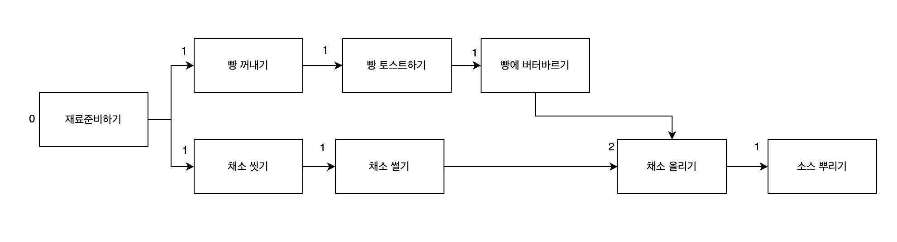
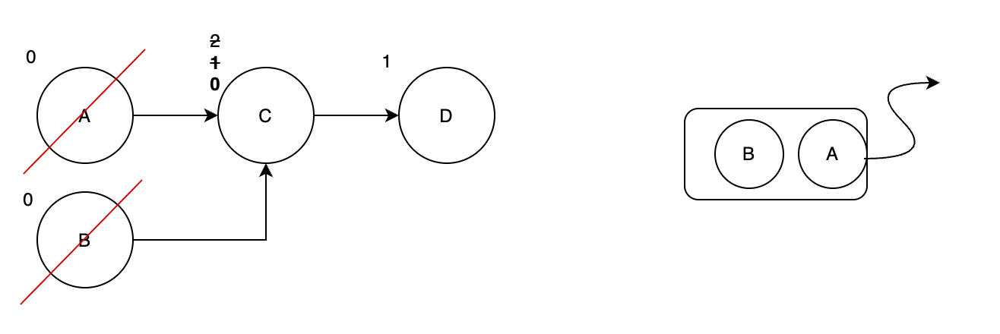
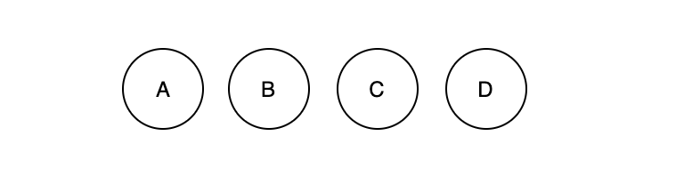

### 위상정렬 이란

**순서가 정해져있는 작업**을 차례로 수행해야 할 때 그 순서를 결정해주기 위해 사용하는 알고리즘입니다.
 

예를들어 샌드위치를 만드는 과정에 작업의 순서가 결정됩니다. 즉, 선행 작업과 후행 작업이 존재합니다. 
위상정렬은 자신을 향한 화살표 개수를 진입차수로 정의하여 진행합니다.  

**진입차수가 0이라면**, 자신을 향한 화살표 개수가 없습니다. 이 말은 선행 작업이 필요없는, 바로 할 수있는 일 입니다.

### 위상정렬 과정

**1단계**: 진입차수가 0인 A,B노드(작업)을 큐에 add 합니다. 그런다음 poll을 하면서 인접한 노드 C의 진입차수를 -1합니다.

**2단계**: 다음은 진입차수가 0인 C를 add 합니다. add 후 poll하며 작업을 완료하고 인접노드의 D의 진입차수를 -1합니다.

 

**3단계**: 이런 방식으로 poll한 순서를 늘어놓으면 위상정렬이 끝납니다.

### 시간 복잡도
위상정렬은 모든 정점과 간선을 딱 한번만 지나가므로 **시간복잡도는 O(V+E)** 입니다.

