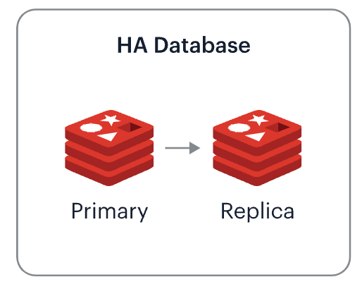
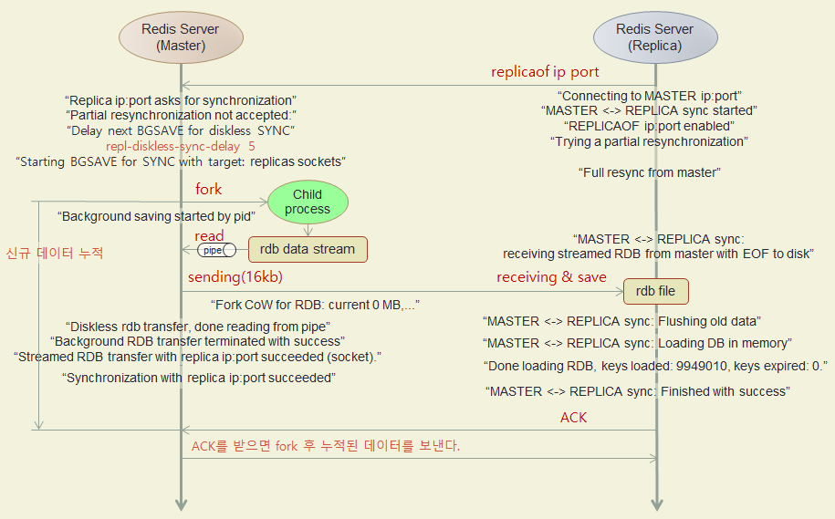
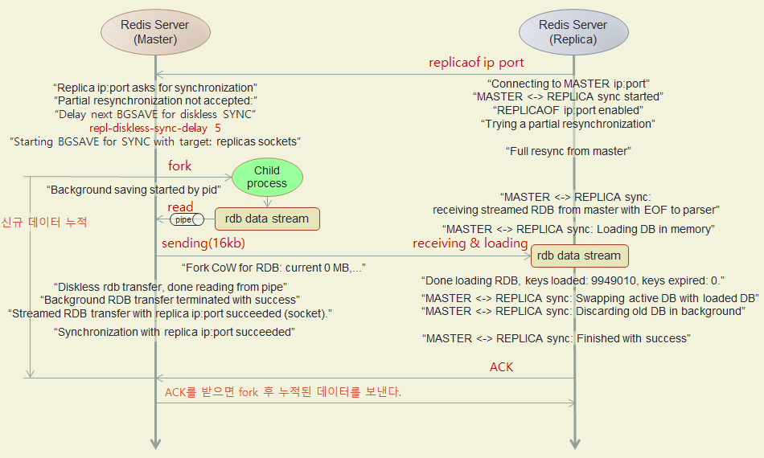

**Redis 버전 7.0.15 기준으로 설명합니다.** 

## Redis Master Slave Architecture



- 기본적인 Redis Replication 구조는 Master-Replica 구조로 이루어져 있습니다.
- Master는 데이터를 저장하고, Replica는 Master의 데이터를 복제합니다.
- 레디스는 비동기(asynchronous) 복제를 합니다.
- 복제서버는 또 복제서버를 둘 수 있습니다. 마스터 -> 복제 -> 복제 -> ... 순으로 연결할 수 있습니다.

## Replication 구성 방법 (docker compose)

```yaml
  redis-master: 
    image: redis:7.0
    container_name: redis-master
    ports:
      - "0.0.0.0:6379:6379"
    volumes:
      - ./redis/data:/data
    command: redis-server --appendonly yes
    networks:
      - app-network
    restart: always

  redis-slave1:
    image: redis:7.0
    container_name: redis-slave1
    ports:
      - "0.0.0.0:6380:6379"
    command: redis-server --replicaof redis-master 6379 --appendonly yes
    networks:
      - app-network
    restart: always
    depends_on:
      - redis-master

  redis-slave2:
    image: redis:7.0
    container_name: redis-slave2
    ports:
      - "0.0.0.0:6381:6379"
    command: redis-server --replicaof redis-master 6379 --appendonly yes
    networks:
      - app-network
    restart: always
    depends_on:
      - redis-master
```

slave를 구성할때 command 명령어에 `--replicaof` 옵션을 사용하여 Master의 IP와 Port를 지정합니다.
하지만 이미 redis-master라는 이름으로 구성했으니 이 이름을 지정해주면 됩니다.

그리고 replication을 구성할 때 무조건 master 먼저 실행해야 합니다.
따라서 slave 노드에 depend_on을 지정하여 master가 먼저 실행되도록 합니다.

---


서버를 구성한 뒤, 마스터 노드의 정보를 보면,

- role이 master로 설정되어 있습니다.
- 연결된 slave(replica)가 2개 존재하며, 각각의 slave에 대한 정보를 확인할 수 있습니다.
- master_repl_offset은 마스터가 몇 번째 명령어까지 처리했다는 의미로, 복제 지연 확인과 부분 재동기화가 가능합니다.

## Replication 작동 방식

<br>

**master 로그**
```
Replica 172.20.0.3:6379 asks for synchronization
Full resync requested by replica 172.20.0.3:6379

Starting BGSAVE for SYNC with target: replicas sockets
Background RDB transfer started by pid 35

Background RDB transfer terminated with success
Streamed RDB transfer with replica 172.20.0.3:6379 succeeded
Synchronization with replica 172.20.0.3:6379 succeeded
```

**replica 로그**
```text
Connecting to MASTER redis-master:6379
MASTER <-> REPLICA sync started
MASTER <-> REPLICA sync: receiving streamed RDB from master with EOF to disk
MASTER <-> REPLICA sync: Loading DB in memory
Done loading RDB, keys loaded: 2, keys expired: 0
```

💡 **Full resync(전체 동기화) VS Partial resync(부분 동기화)** 

```text
Full resync(전체 동기화)
1. 마스터는 자식 프로세스를 시작해 백그라운드로 RDB 파일을 생성하고 데이터를 저장합니다.
2. 데이터를 저장하는 동안, 마스터에 새로 들어온 명령어들은 복제 버퍼에 저장됩니다.
3. RDB 파일 저장이 완료되면, 마스터는 파일을 복제서버에게 전송합니다.
4. 복제서버는 파일을 받아 디스크에 저장하고, 메모리로 로드합니다.
5. 마스터는 복제서버에게 복제 버퍼에 저장된 명령어들을 전송합니다.

Partial resync(부분 동기화)
1. 마스터와 복제서버는 각 서버의 run id 와 replication offset을 가지고 있습니다.
2. 마스터와 복제서버간 네트워크가 끊어지면 마스터는 복제서버에 전달할 데이터를 backlog-buffer에 저장합니다.
3. 다시 연결되었을 때 backlog-buffer가 넘치지 않았으면 run id와 offset을 비교해서 그 이후 부터 동기화를 합니다.
4. 네트워크 단절 시간이 길어져, backlog-buffer가 넘쳤을 경우, 전체 동기화를 수행합니다.
```

**💡 마스터: 디스크를 사용하지 않는 동기화 (Diskless Replication)**

```text 
- 이 기능은 레디스를 케시 용도로 사용할 경우 또는 마스터가 설치된 머신의 디스크 성능이 좋지 않을 경우 이용할 수 있습니다.
- 마스터의 자식 프로세스가 RDB 데이터를 소켓을 통해서 복제서버에게 직접 쓰는 방식입니다.
- 디스크를 사용하지 않는 것은 마스터만 적용됩니다. 복제서버는 받은 데이터를 RDB 파일에 저장합니다.
```

**💡 마스터에서 Diskless Replication 기능으로 바꾼 이유**

```text
- 기존에는 Redis 복제 과정에서 마스터 서버가 반드시 디스크를 사용해야 했음
- 이는 성능 저하의 원인이 되었고, 특히 캐시용도로 Redis를 사용할 때 불필요한 디스크 사용이었음
- 디스크에 데이터를 쓰지 않고 마스터에서 슬레이브로 직접 소켓을 통해 데이터 전송
- 특히 디스크는 느리지만 네트워크는 빠른 환경(예: EC2)에서 유용
- 이 변경은 Redis가 순수하게 디스크를 사용하지 않는 방식으로 운영될 수 있는 길을 열었으며, 
- 특히 캐싱 시스템으로서의 Redis 활용도를 높였다는 점에서 의미가 큼
```

**💡 마스터가 다운되면 슬레이브가 마스터가 될까?**

```text
Redis에서는 기본적으로 마스터가 다운되어도 슬레이브가 자동으로 마스터가 되지 않습니다.
이를 자동으로 처리하려면 Redis Sentinel이라는 별도의 시스템이 필요합니다. 
뒤에서 이에 대해 자세히 정리하려고 합니다.
```

**💡 AOF VS RDB**

```text
- RDB는 스냅샷을 저장하는 방식으로, 특정 시점의 데이터를 저장합니다.
- AOF는 명령어를 저장하는 방식으로, 명령어를 저장하고 재실행하여 데이터를 복구합니다.
- RDB는 빠르고 작은 파일을 생성하며, AOF는 느리고 큰 파일을 생성합니다.
- 보통 중요한 데이터를 다루는 프로덕션 환경에서는 AOF와 RDB를 함께 사용하는 것이 좋습니다.
```


PSYNC와 관련된 전체 동기화 과정입니다.



**💡 복제(Replica): 디스크를 사용하지 않는 동기화 (repl-diskless-load)**

```text
- Redis 버전 6.0 부터 Replica에서도 디스크를 사용하지 않는 동기화 방식이 추가되었습니다. 
- 즉, 복제 서버에 RDB 파일을 생성하지 않습니다.
- redis.conf(Replica) 파라미터: repl-diskless-load   disabled/on-empty-db/swapdb, default disabled
- disabled: 기본값으로 디스크를 사용합니다.
- on-empty-db: 복제 서버의 데이터베이스가 비어있을 때만 디스크를 사용하지 않습니다.
- swapdb: 복제본의 기존 데이터를 임시로 보관 -> 마스터의 데이터를 모두 받아 DB(메모리)에 저장 후, 임시로 보관한 기존 데이터를 삭제한다. 
그러므로 두배의 메모리가 필요합니다.
```

`CONFIG SET repl-diskless-load swapdb` 명령을 사용하여 디스크리스 로드를 사용하도록 변경했습니다.

mem to mem의 동기화 과정입니다.




## 마스터 서버가 장애가 발생해 내려간다면?


## Reference

http://redisgate.kr/redis/configuration/replication.php

