신규 Repo 생성 > Actions 탭 > **set up a workflow yourself** 클릭합니다.
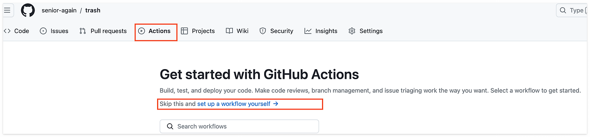

### 1. CI 테스트 워크 플로우 작성

<br>

**backend_ci.yml**

```yaml
name: 애자일허브 백엔드 CI 테스트 자동화

on:
  pull_request:
    branches:
      - main

permissions: write-all

jobs:
  build:

    runs-on: ubuntu-latest
    env:
      JWT_SECRET: ${{ secrets.JWT_SECRET }}
      REDIS_HOST: localhost
      MAIL_USERNAME: 1234
      MAIL_PASSWORD: 1234
      OPEN_API_KEY: 1234

    steps:
      - name: 레포지토리를 가져옵니다
        uses: actions/checkout@v3

      - name: JDK 17를 설치합니다
        uses: actions/setup-java@v3
        with:
          java-version: '17'
          distribution: 'temurin'

      - name: 그래들 캐시
        uses: actions/cache@v2
        with:
          path: |
            ~/.gradle/caches
            ~/.gradle/wrapper
          key: ${{ runner.os }}-gradle-${{ hashFiles('**/*.gradle*', '**/gradle-wrapper.properties') }}
          restore-keys: |
            ${{ runner.os }}-gradle-

      - name: Gradle 명령 실행을 위한 권한을 부여합니다
        run: chmod +x gradlew

      - name: Gradle build를 수행합니다
        run: ./gradlew build
        env:
          SPRING_PROFILES_ACTIVE: test

      - name: 테스트 결과를 PR에 코멘트로 등록합니다
        uses: EnricoMi/publish-unit-test-result-action@v1
        if: always()
        with:
          files: '**/build/test-results/test/TEST-*.xml'

      - name: 테스트 실패 시, 실패한 코드 라인에 Check 코멘트를 등록합니다
        uses: mikepenz/action-junit-report@v3
        if: always()
        with:
          report_paths: '**/build/test-results/test/TEST-*.xml'
          token: ${{ secrets.GITHUB_TOKEN }}


      - name: Cleanup Gradle Cache
        if: ${{ always() }}
        run: |
          rm -f ~/.gradle/caches/modules-2/modules-2.lock
          rm -f ~/.gradle/caches/modules-2/gc.properties

```

### 2. GITHUB_TOKEN 추가

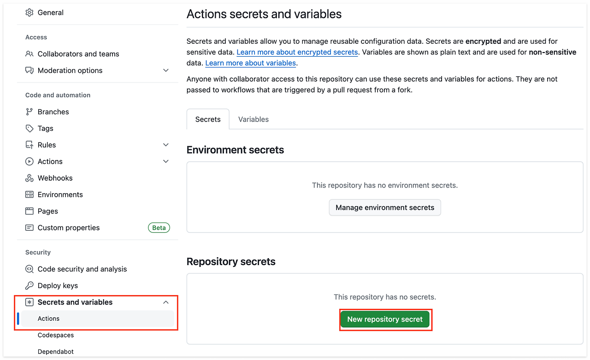
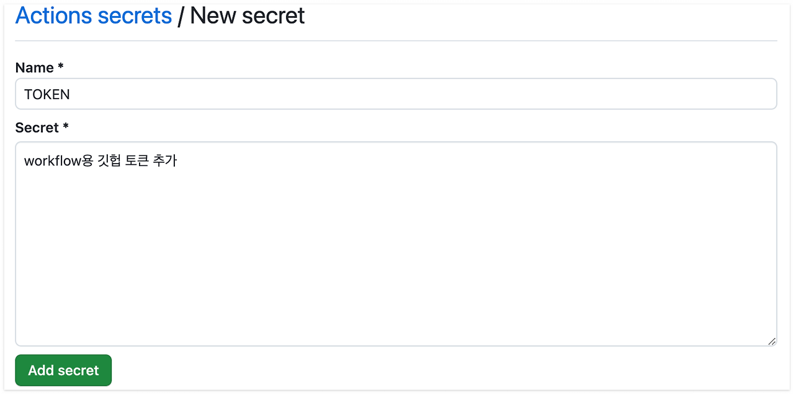

### 3. 테스트가 통과해야 PR merge가 가능하도록 설정
<br>

Repository settings > Branches > Add branch protection rule 클릭합니다.
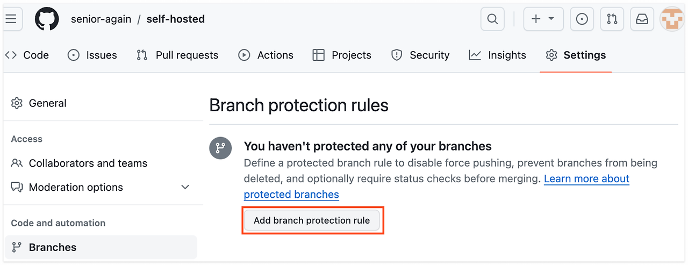
<br>

Branch name pattern을 설정하고, '**Require status checks to pass before merging**' 옵션을 활성화하여 merge 전에 통과해야 할 Action들을 선택할 수 있습니다. 이 과정은 develop 브랜치에도 동일하게 적용합니다.
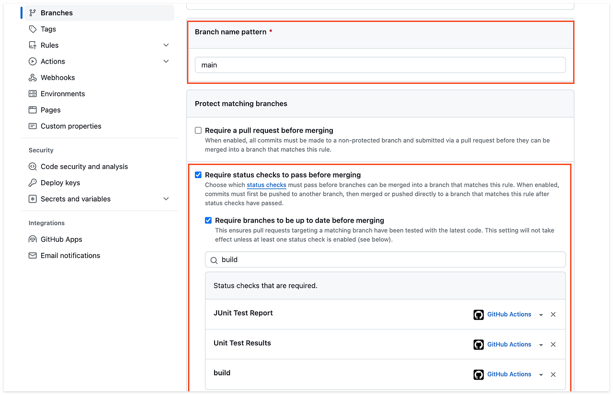
<br>
테스트 실패시 결과물
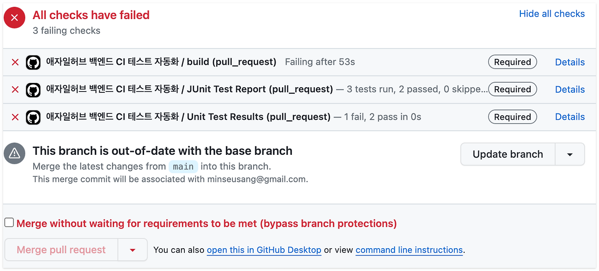

### 4. CD 배포 과정
<br>

1. 깃허브 repo에 새로운 코드가 main 또는 develop 으로 push 된다.
2. 깃허브 액션이 trigger를 감지해 이벤트를 동작하고, 코드를 도커 이미지로 빌드해 Docker Hub에 push 한다.
3. 깃허브 액션이 배포서버(혹은 로컬PC)에 있는 github actions self-hosted runners을 돌려서 was서버가 도커 이미지를 pull하고 컨테이너를 실행하도록 한다.

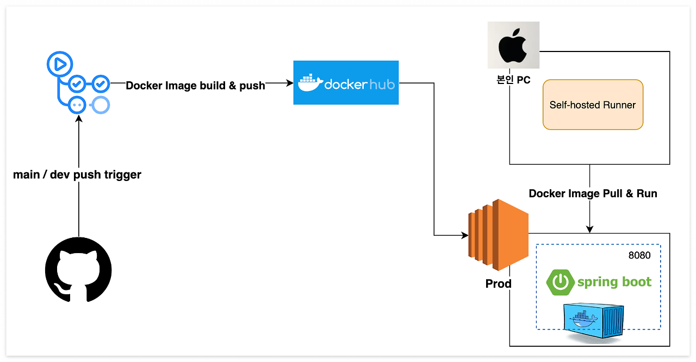

### 5. self-hosted 서버용 인스턴스 구성
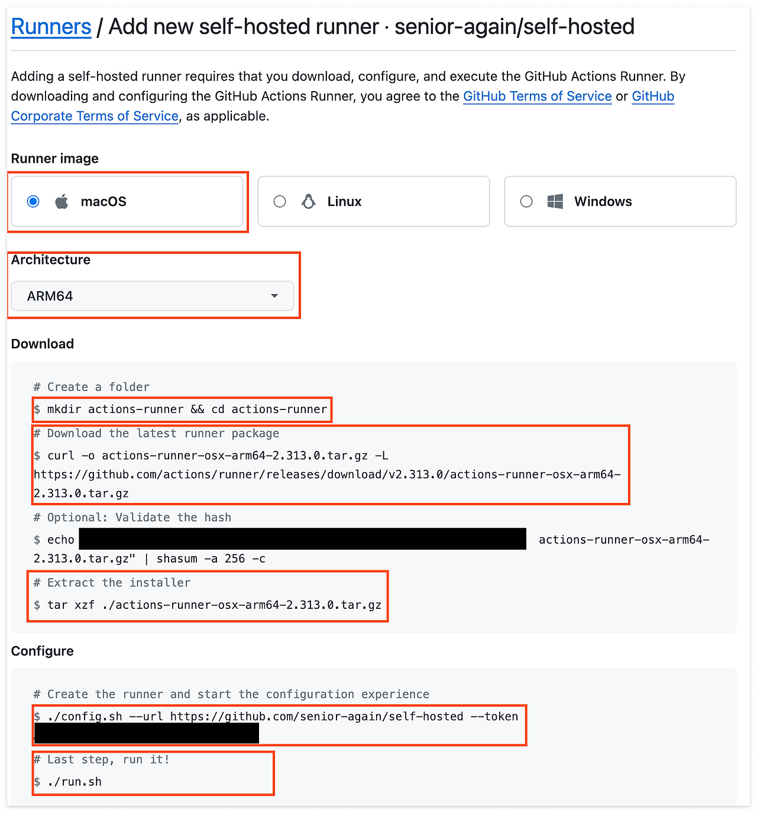
<br>

**self-hosted runner**가 동작할 운영환경을 설정하고 해당 운영환경의 터미널로 접속, actions runner 압축 파일을 다운로드 후 압축 해제해줍니다.<br>
이어서 CI/CD가 진행되기 원하는 저장소 쪽에서 발급된 토큰 등록을 통해서 actions runner와 저장소간 연결을 진행합니다.

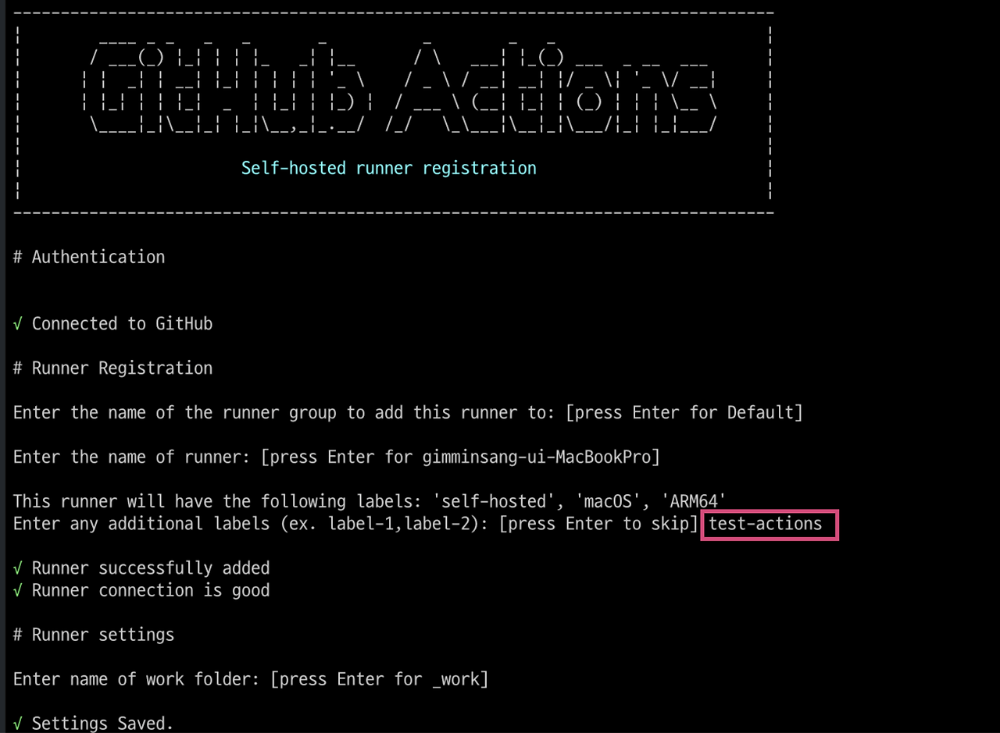

<br>

**name of runner** 설정은 Settings - Actions - Runners 메뉴에서 runner를 식별하기 위한 설정입니다. 간단하게 Runner의 이름이라고 생각하면 됩니다.

<br> 

**additional lables** 설정은 Runner의 추가 라벨이다. 잠시 후 CI/CD 작업을 위한 yml 파일작성시 runner를 식별하기 위해 이름이 아닌 라벨을 사용하므로, 공들여서 라벨을 지정해야합니다. (깃헙에서도 추가로 라벨을 달 수 있습니다.
<br> <br> 연결이 성공적으로 완료되었다면 ./run.sh 명령어 입력시 actions runner가 실행되면서 CI/CD 작업 요청을 기다리는 대기상태로 진입된 것을 확인할 수 있습니다. (nohup ./run.sh & 등의 명령어로 항시 runner가 동작하도록 설정하자.)

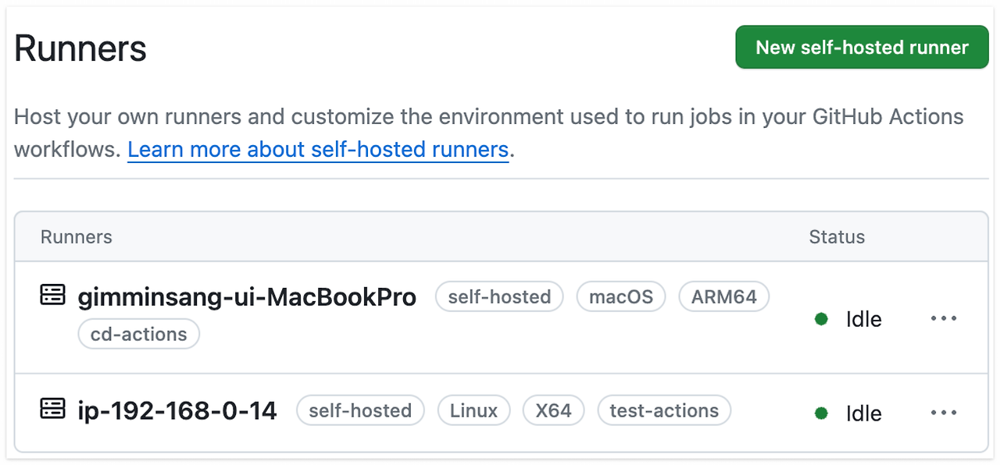
<br>
이미 저는 test-actions라는 라벨을 붙인 러너를 만든적이 있어서 cd-actions라는 라벨을 맥에서 돌릴 러너에 추가적으로 붙였습니다.

### 6. yml 작성 전 사전에 해야할 것
<br>

1. WAS 서버를 구축 했는가
2. WAS 인바운드 정책 설정
   - (443,80,8080,ICMP 전체 대역대. SSH 22번 포트는 러너가 설치된 본인 PC 혹은 EC2 대역대로 설정.)
   - local pc로 러너 설치시 아쉬운점이 pc를 배포할때마다 켜야한다는 점과 다른 곳으로 이동 시 그곳 IP를 등록해야한다는 번거로움이 있지만, 서버 비용을 아낄 수 있다는 점에 매우 좋습니다.
3. SWAP 메모리 설정
4. WAS 서버 직접 접속 후 도커 설치

```shell

# 패키지 리포지토리 업데이트
sudo apt update

# 필수 패키지 설치
sudo apt install apt-transport-https ca-certificates curl software-properties-common -y

# GPG 키 추가
curl -fsSL https://download.docker.com/linux/ubuntu/gpg | sudo apt-key add -

# Docker 저장소 추가: 공식 Docker 저장소를 apt 소스에 추가 
sudo add-apt-repository "deb [arch=amd64] https://download.docker.com/linux/ubuntu $(lsb_release -cs) stable"

# apt-cache 패키지 캐시를 쿼리
apt-cache policy docker-ce

# 도커 설치
sudo apt install docker-ce -y

# Docker 상태 확인
sudo systemctl status docker

# 권한 부여
sudo chmod 666 /var/run/docker.sock

# 도커 버전 확인
docker version

```
5. Actions 시크릿 키 등록 (선택)

```text
DOCKERHUB_USERNAME: 도커허브사용자명
DOCKERHUB_TOKEN: 도커허브토큰
WAS_PRIVATE_IP: EC2 인스턴스의 PRIVATE IP //같은 VPC에 있을 때 사용가능
WAS_USERNAME: EC2 유저이름으로 EC2 인스턴스에서 whoami 명령으로 확인 가능하다. OS이미지가 우분투일경우 기본은 ubuntu
PEM_KEY: .pem파일의 키 
HOST_DEV: 퍼블릭 IP // 로컬 PC로 접속할때 사용

```
6. DockerFile 작성

```dockerfile
# Dockerfile
# gradle && jdk17 이미지 빌드 - build 별명
FROM --platform=linux/arm64 gradle:8.3-jdk17-jammy AS build

# 작업 디렉토리 /app 생성
WORKDIR /app

# 빌드하는데 필요한 build.gradle, settings.gradle 파일 현재 디렉토리로 복사
COPY build.gradle settings.gradle /app/
# 그래들 파일이 변경되었을 때만 새롭게 의존패키지 다운로드 받게함.
RUN gradle build -x test --parallel --continue > /dev/null 2>&1 || true

# 소스코드파일 /app 작업 디렉토리로 복사
COPY . /app

# Gradle 빌드를 실행하여 JAR 파일 생성
ENV JWT_SECRET 12341234
ENV REDIS_HOST redis
ENV MAIL_USERNAME mail
ENV MAIL_PASSWORD 12341234
RUN gradle build -x test --parallel

FROM --platform=linux/arm64/v8 eclipse-temurin:17.0.10_7-jre

WORKDIR /app

# 빌드 이미지에서 생성된 JAR 파일을 런타임 이미지로 복사
COPY --from=build /app/build/libs/*.jar /app/agile.jar

EXPOSE 8080
ENTRYPOINT ["java"]
CMD ["-jar","-Dspring.profiles.active=prod","agile.jar"]
```

### 7. CD 워크플로우 파일 작성

develop 브랜치(개발 서버)에 푸시가 일어날 때 배포되는 backend-dev-cd.yml 작성.
<br>
작성할 때 다음만 변경하면 됩니다.

- env.DOCKER\_HUB_REPOSITORY 경로는 본인이 도커 허브 경로로 변경
- 시크릿 키

```yaml
name: 애자일허브 backend PROD CD

env:
  DOCKER_HUB_REPOSITORY: ${{ secrets.DOCKERHUB_USERNAME }}/agilehub-backend
on:
  workflow_dispatch:
  push:
    branches:
      - main
    paths:
      - "src/**"
jobs:
  backend-docker-build-and-push:
    runs-on: ubuntu-latest
    steps:
      - name: Checkout Repository
        uses: actions/checkout@v3
      - name: Setup Docker Buildx
        uses: docker/setup-buildx-action@v3
        # Docker Buildx를 설정한다
      - name: Login to Docker Hub
        uses: docker/login-action@v3.0.0
        with:
          username: ${{ secrets.DOCKERHUB_USERNAME }}
          password: ${{ secrets.DOCKERHUB_TOKEN }}
      - name: Build and Push
        uses: docker/build-push-action@v5
        with:
          context: ./
          # Dockerfile이 있는 위치
          file: ./Dockerfile
          # Dockerfile의 이름
          push: true
          # 이미지를 레지스트리에 푸시
          tags: ${{ env.DOCKER_HUB_REPOSITORY }}:${{ github.sha }}
          platforms: linux/arm64
          cache-from: type=gha
          cache-to: type=gha,mode=max
  backend-docker-pull-and-run:
    needs: [ backend-docker-build-and-push ]
    if: ${{ needs.backend-docker-build-and-push.result == 'success' }}
    runs-on: [ self-hosted, ec2-runner ]
    steps:
      - name: Checkout code
        uses: actions/checkout@v3
      - name: Setup SSH Key
        run: |
          echo "${{ secrets.PEM_KEY }}" > pem_key
          chmod 600 pem_key
      - name: WAS인스턴스 접속 및 애플리케이션 실행
        run: |
          ssh -i pem_key -o StrictHostKeyChecking=no ${{ secrets.WAS_USERNAME }}@${{ secrets.WAS_PUBLIC_IP }} << EOF
          docker rm -f agilehub-backend || true
          docker pull ${{ env.DOCKER_HUB_REPOSITORY }}:${{ github.sha }}
          docker run -v /var/log/backend:/app/logs \
          --env-file .env \
          -d -p 8080:8080 --name agilehub-backend ${{ env.DOCKER_HUB_REPOSITORY }}:${{ github.sha }}
          EOF
```

### 8. 테스트 방법

1. develop 브랜치에서 feature/000 분기 후, 필요한 코드 작성 후
2. git add .
3. git commit -m "feat: 구현"
4. git push origin feature/000
5. pull request 후 CI 통과되면 develop에 merge
6. push 알아서 진행

<br>


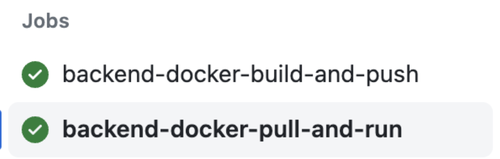

### 참고자료
- https://devs0n.tistory.com/25
- https://hyeon9mak.github.io/github-actions-self-hosted-runner-on-ec2/
- https://engineerinsight.tistory.com/266#%F0%9F%92%8B%C2%A0Github%20Actions%20self-hosted%20runner%20%EC%84%A4%EC%A0%95-1
- https://velog.io/@boo105/Self-Hosted-Runner-%EB%A5%BC-%EB%8F%8C%EB%A0%A4%EB%B3%B4%EC%9E%90
