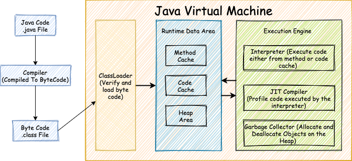

## JVM 개요

**자바프로그램이 JVM 위에서 실행하기까지 다음과 같은 과정**을 거칩니다.

1. 자바 프로그램으로 작성한 `.java` 파일을 **javac 컴파일러**를 이용해 **바이트코드(.class)로 컴파일** 합니다
2. 컴파일된 `.class` 파일을 **ClassLoader**에 의해 JVM 메모리에 저장합니다. (loading, linking, initialising)
3. **Interpreter는** 로드된 코드를 한 줄씩 컴파일하고 실행합니다. 이때 **Method Cache에서 instruction 을 가져오고 어셈블리 코드로 변환**하는 작업을 합니다
4. 성능 개선을 위해 **JIT 컴파일러**는 지속적으로 컴파일된 코드를 프로파일링 합니다. JIT 컴파일러는 자주 해석되는 코드, 즉 hotspot을 식별합니다. **JIT 컴파일러가
   hotspot인 것을 미리 컴파일하여 네이티브 코드를 Code Cache에 배치**합니다. 향후 중복된 instruction에 대해 인터프리터는 Method Cache 대신 Code Cache에서 코드를 가져옵니다

## Garbage Collector 란

**가비지 컬렉터**는 힙 메모리 영역에 동적으로 할당된 메모리를 관리하는 역할을 합니다. 

즉, 애플리케이션의 요청에 의해 **새로 생성된 객체에 대해 힙 영역에 메모리를 할당**하는 역할,
애플리케이션이 **현재 사용되고 있는 객체를 식별**하는 역할, 그리고 **사용하지 않는 객체가 차지하고 있는 공간을 회수(해제)하여 공간을 재사용하는** 역할을 수행합니다.

대부분의 GC 알고리즘은 사용하지 않는 객체가 힙에서 제거되는 동안 모든 스레드를 일시 중지해야 합니다. 이런 GC의 역할은 성능에 많은 비용이 듭니다. 

## GC의 방식

GC는 2가지의 주요 방식이 있습니다.

### Reference Counting

**Reference Counting** 은 객체의 참조 횟수를 기록합니다. 객체가 생성되거나 참조될때 참조 카운트가 증가합니다. 반대로 참조를 안하면 참조 카운트가 줄어듭니다.
참조 카운트가 0이 되었을 때, 객체는 회수됩니다. 이런 단순함 때문에 파이썬, 펄 같은 언어는 해당 방식을 사용합니다.

**장점**
-  메모리는 객체가 더 이상 참조되지 않는 즉시 회수됩니다
- 할당/할당 해제 비용은 계산 전반에 걸쳐 분산됩니다

**단점**
- 참조 카운팅에 대한 모든 읽기 및 쓰기 작업에는 오버헤드가 발생합니다
- 참조 카운트를 조작할 때 원자적으로 구현해야 합니다. (race condition이 발생할 수 있습니다)
- 사이클이 발생한 자료구조는 메모리 회수를 할 수가 없습니다

### Tracing Garbage Collection

참조 카운팅과 달리, 추적 가비지 컬렉터는 메모리를 즉시 해제하지 않습니다. **가비지 컬렉션은 시스템의 메모리가 부족해질 때 실행**됩니다.

**GC는 루트 객체(GC 루트라고도 함)에서 시작하여 도달 가능한 객체를 추적**합니다. GC 루트는 메모리 영역 외부에서 그 메모리 영역으로 향하는 포인터, 즉 힙 외부에서
접근 가능한 객체를 말합니다. 예를들면, 실행중인 쓰레드, 정적 변수, 로컬 변수 그리고 JNI 레퍼런스가 있습니다.

알고리즘은 루트 노드에서 시작하여 전체 객체 그래프를 추적합니다. **객체들이 발견될 때마다 mark** 합니다. Marking 은 객체에 flag를 설정하거나 외부 자료구조를 
사용해서 표시합니다. **추적이 끝나면 도달할 수 없는 모든 객체들이 확인되고 제거** 대상이 됩니다. 그리고 사용되지 않는 객체를 회수하기 위해 메모리를 해제합니다.

추적 가비지 컬렉터를 구현할 때 다양한 기법과 알고리즘이 있습니다. 다음 절부터 그 알고리즘에 대해 소개하겠습니다. 

참고로 세 가지 파라미터로 **tracing garbage collector** 를 평가합니다.
1. `GC throughput` : GC를 수행하는 데 CPU 쓰는 시간
2. `GC latency` : 각각의 garbage collection이 수행하는 데 걸리는 시간
3. `GC footprint` : 애플리케이션을 실행하는 데 사용되는 메모리 양

## Reference

아래 글을 번역했습니다.

https://abiasforaction.net/understanding-jvm-garbage-collection-part-1/

 