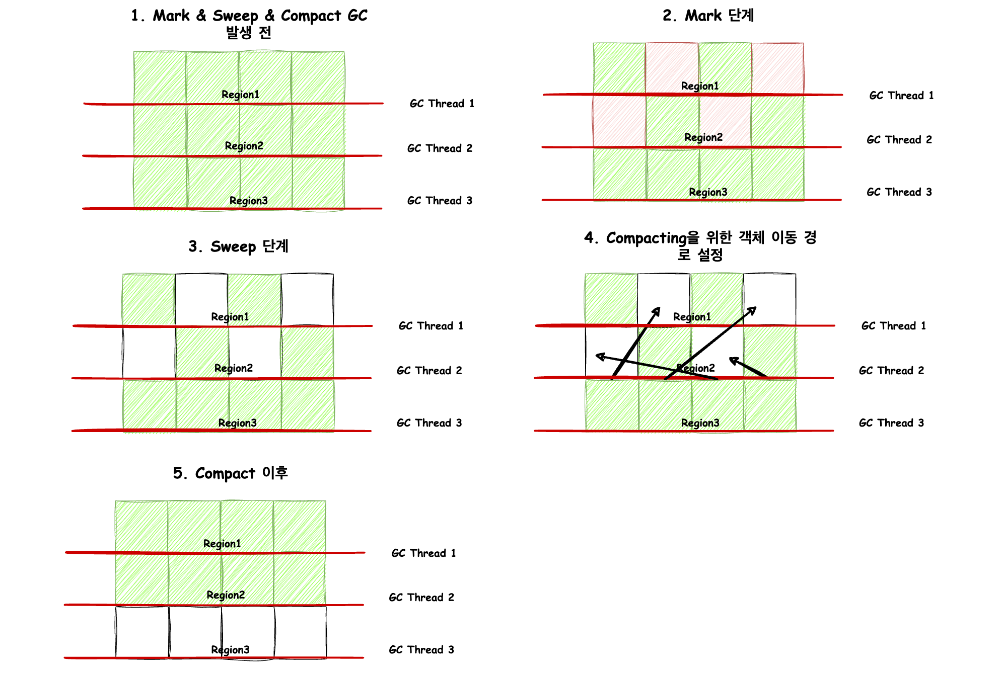
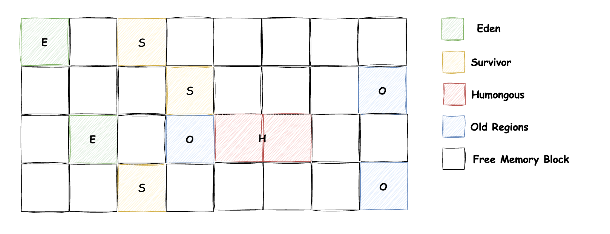
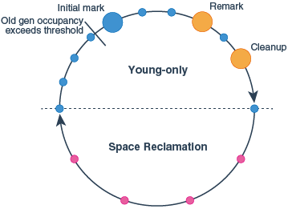

Old 영역은 기본적으로 데이터가 가득 차면 GC를 실행합니다. GC 방식은 `Serial GC`, `Parallel GC`,
`Parallel Old GC`, `Concurrent Mark & Sweep GC(aka CMS)`, `G1 GC`, `ZGC`가 있습니다.

## Serial GC (-XX: +UseSerialGC)

`Serial GC`는 **Young Generation**에서는 `mark & copy`방식을 사용하며, **Old Generation**에서는 `mark & sweep & compact` 방식을 사용합니다.

`Serial GC`는 **garbage collection을 위해 단일 스레드를 사용**합니다. 또한 적은 메모리와 CPU 코어 개수가 적을 때 적합한 방식이므로 최신 운영서버에서는 피해야 하는 방식입니다.

## Parallel GC (-XX: +UseParallelGC)

`Parallel GC`는 `Serial GC`와 기본적인 알고리즘은 같습니다. 하지만 `Serial GC`는 GC를 처리하는 스레드가 하나인 반해,
**`Parallel GC`는 Minor GC를 처리하는 쓰레드가 여러개** 입니다. 그렇기 때문에 `Serial GC`보다 빠르게 처리할 수 있습니다.

메모리가 충분하고 코어의 개수가 많을 때 유리합니다.

## Parallel Old GC

`Pallel old gc`는 기존 parallel gc에서 old 영역을 처리하는 방식이 다른데, **mark-summary-compact 방식을 사용합니다.**

`mark-sweep-compact`방식은 단일 스레드가 old영역을 검사하는 방식이라면 `mark-summary-compact`방식은 여러 스레드를 사용해서 old영역을 탐색합니다.

위의 그림처럼 3개의 GC 스레드가 있다고 가정하면 Tenured Heap 영역은 3개의 영역으로 나뉩니다. 이때 Compact 단계에서 객체를 낮은 영역에서 높은 영역으로 이동하여
메모리 단편화를 제거합니다.

## CMS GC (-XX: +UseConcMarkSweepGC)

CMS GC는 단계적으로 절차를 진행합니다.

- `Initial Mark` 단계 : 루트로 부터 접근 가능한 객체만 찾는 것으로 끝냅니다. 따라서 **stop-the-world**가 매우 짧습니다.
- `Concurrent Mark` 단계 : 애플리케이션 스레드와 함께 진행되며 방금 살아있다고 확인한 객체에서 참조하고 있는 객체들을 따라가면서 확인합니다.
- `Remark` 단계 : `Concurrent Mark` 단계에서 새로 추가되거나 참조가 끊긴 객체를 확인합니다.
- `Concurrent Sweep` 단계 : 참조되고 있지 않은 garbage 객체들을 정리하는 작업을 실행합니다. 이때 다른 애플리케이션 스레드들도 같이 실행되고 있습니다.

이렇게 진행하는 이유는 `stop-the-world` 시간이 짧습니다. 하지만 다른 GC 방식보다 **메모리와 CPU를 많이 사용**하며, **compaction 단계가 기본적으로 제공되고 있지 않기 때문에**
메모리 단편화가 심합니다. 

그래서 Compaction 작업을 따로 실행하는데(Parallel Old 사용) 이러면 `stop-the-world`시간이 다른 GC에 비해 매우 길기 때문에
Compaction 작업을 얼마나 자주 실행할지 확인해야 합니다.

## G1 GC (-XX: +UseG1GC)

`G1(Garbage-First) GC`는 대량의 메모리가 있는 다중 프로세서 시스템을 대상으로 합니다.  

높은 처리량(애플리케이션 실행시간)을 달성하는 동시에 `stop-the-world`  목표를 달성하는 것을 목표로 합니다.

### 기본 개념 

G1은 다음과 같은 특징을 갖고있습니다.

- `Generational`: 객체를 나이에 따라 다른 영역에 배치합니다.
- `Incremental`: 전체 메모리를 한 번에 정리하지 않고 점진적으로 수행합니다.
- `Parallel`: 여러 스레드를 동시에 사용하여 작업을 수행합니다.
- `Mostly concurrent`: 대부분의 작업을 애플리케이션 실행과 동시에 수행합니다.
- `Stop-the-world`: 일부 작업 시 애플리케이션 실행을 잠시 중단합니다.
- `Evacuating`: 살아있는 객체를 다른 영역으로 이동시킵니다.
- `Monitors pause-time goals`: 애플리케이션 중단 시간을 모니터링하고 목표 시간 내에 맞추려고 노력합니다.

또한 다른 GC와 마찬가지로 G1은 Heap을 `Young Generation`과 `Old Generation`으로 나눕니다. 공간 재확보 노력은 가장 효율적인 `Young Generation`에 집중되며 
가끔 `Old Generation`에서도 공간 재확보가 이루어집니다.

### Heap Layout

Eden, Survivor, Old 영역이 존재하지만, 영역들이 **연속적으로 할당된 고정된 크기가 아닙니다**.

G1은 힙을 동일한 크기의 `Region`으로 분할합니다. 각 영역은 메모리 할당 및 메모리 회수의 단위입니다. 또한 각 역할은 비연속 패턴으로 배치됩니다.
각 `Region`의 역할(Eden, Survivor, Old)는 동적으로 변동합니다. 이 크기는 1,2,4,..32 또는 64 MB로 2의 배수로 할당할 수 있습니다. 

* `Humongous` 는 Region 크기의 50% 이상인 객체를 할당할 때 쓰는 공간 입니다. 이는 `Old Generation`에 속합니다
* 애플리케이션은 항상 새로운 객체를 `Eden`영역에 할당하지만 거대한 객체는 `Old Generation` 영역인 `Humongous에` 할당합니다.

### 동작 방식

**Young-only Phase**

`Young-only` 단계에서 아래 순서대로 **Young GC**가 이뤄집니다.

1. 몇 개의 구역을 Young 영역으로 지정합니다.
2. 이 영역에 객체가 쌓입니다.
3. Young 영역으로 할당된 구역에 데이터가 꽉 차면, GC를 수행합니다. (Mark & Copy)
4. GC를 수행하며서 살아있는 객체들만 Survivor 구역으로 이동시킵니다. 
5. 몇번의 aging 작업에서 살아남은 객체는 Old 영역으로 승격됩니다.

Young GC가 일어나다가 설정된 **IHOP(Initial Heap Occupancy Percent)**을 넘으면 `Concurrent Marking Cycle`이 발생합니다.

**Concurrent Marking Cycle (Old GC)**

1. `Initial Mark` : `Old Region` 에 존재하는 객체들이 참조하는 `Survivor Region`을 찾습니다. 이 과정에서는 STW 발생합니다.
2. `Root Region Scan` : Initial Mark 에서 찾은 `Survivor Region`에 대한 GC 대상 객체 스캔 작업을 진행합니다.
3. `Concurrent Mark` : 전체 힙의 Region에 대해 스캔 작업을 진행하며, GC 대상 객체가 발견되지 않은 Region 은 이후 단계를 처리하는데 제외되도록 합니다. 이때 만약 `Young GC`가 발생하면 잠시 멈추도록 합니다.
4. `Remark` : 힙에 있는 살아있는 객체들의 표시 작업을 완료합니다. 이 과정에서는 STW 발생합니다.
5. `Cleanup` : 살아있는 객체와 비어있는 구역을 식별하고, 필요 없는 객체는 지우며 비어있는 구역을 Freelist 로 추가합니다. 이 과정에서는 STW 발생합니다.
6. `Copy` : GC 대상 구역에 있던 살아있는 객체들은 새로운 Region으로 이동합니다. 이 과정에서는 STW 발생합니다.

**Space Reclamation Phase (공간회수)**

이때 Mixed GC가 발생합니다. **Mixed GC란, Young Generation과 Old Generation 영역 모두를 수집**하며, STW를 짧게 가져가기 위해 여러번(8번) 반복합니다.

## Reference

https://d2.naver.com/helloworld/1329

https://abiasforaction.net/understanding-jvm-garbage-collection-part-6-serial-and-parallel-collector/

https://abiasforaction.net/understanding-jvm-garbage-collection-part-8-concurrent-mark-sweep-cms-collector/

https://docs.oracle.com/javase/9/gctuning/garbage-first-garbage-collector.htm

https://blog.leaphop.co.kr/blogs/42/G1GC_Garbage_Collector%EC%97%90_%EB%8C%80%ED%95%B4_%EC%95%8C%EC%95%84%EB%B3%B4%EA%B8%B0___1

https://product.kyobobook.co.kr/detail/S000001032977