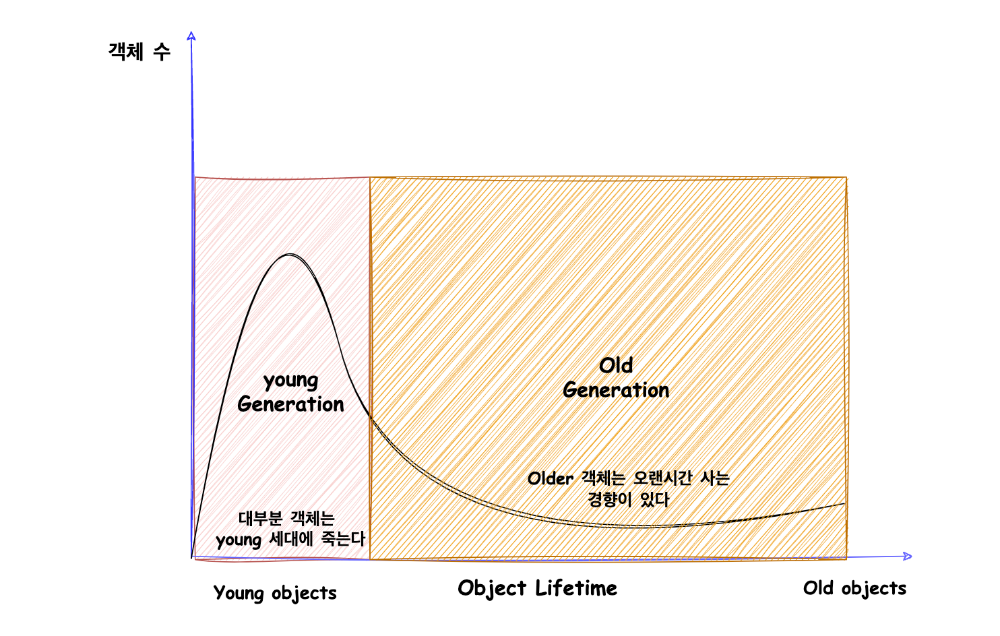
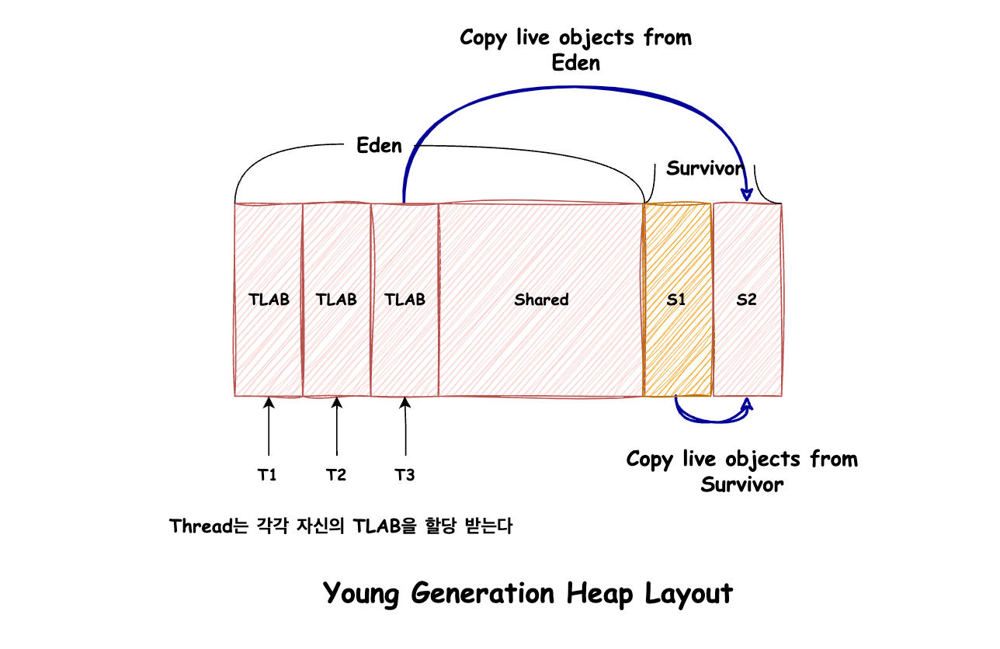
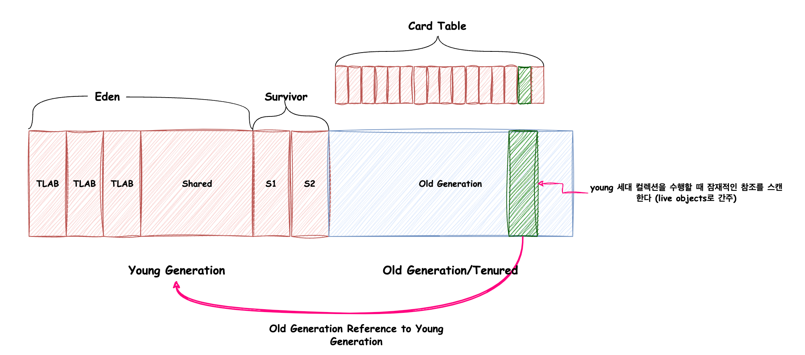

## 약한 세대 가설 (Weak Generational Hypothesis)

자바 가상 머신(JVM)의 메모리 관리 방식에 큰 영향을 준 중요한 개념입니다. 이 가설을 이해하면 다양한 가비지 컬렉션 알고리즘의 작동 원리를 더 잘 이해할 수 있습니다.

이 가설의 핵심 내용은 **"대부분의 객체는 젊어서 죽는다"**입니다. 쉽게 말해, 프로그램에서 새로 만들어진 객체들 중 대부분은 아주 빨리 쓸모없어져서 제거된다는 뜻입니다.

Barry Hayes라는 연구자가 발표한 논문에 따르면, **새로 만들어진 객체들은 오래된 객체들보다 살아남을 가능성이 훨씬 낮다고 합니다**. 이는 많은 실제 시스템을 관찰한 결과로 나온 결론입니다.
또한 이 가설은 재미있는 점을 하나 더 발견했습니다. **어떤 객체들은 일정 시간 동안 살아남으면, 그 이후로도 계속 오래 살아남는 경향**이 있다는 것입니다.

이런 특성을 이해하면 **새로 만들어진 객체들과 오래된 객체들을 다르게 취급**하여 메모리 정리 작업을 더 효과적으로 수행할 수 있습니다.

많은 가비지 컬렉터들은 이 가설을 활용해 힙 메모리를 구조화합니다. 이들은 객체의 '세대'에 따라 메모리를 나눕니다.
이렇게 메모리를 구조화하면 두 가지 이점이 있습니다:

1. 수명이 짧은 객체들을 쉽고 빠르게 정리할 수 있습니다.
2. 수명이 긴 객체들은 짧은 수명의 객체들과 분리해서 다른 방식으로 관리할 수 있습니다.

이렇게 약한 세대 가설을 활용하는 가비지 컬렉터를 "세대별 가비지 컬렉터"라고 부릅니다.

## JVM 가비지 컬렉터 Basic

JVM 가비지 컬렉션(GC) 알고리즘은 '**Tracing Garbage Collection**'를 사용하며, 이는 '**약한 세대 가설**'을 활용합니다. 

이를 바탕으로 JVM 은 힙 메모리를 객체의 나이에 따라 여러 영역으로 나눕니다. 이렇게 나누면 각 영역에 맞는 효율적인 GC 알고리즘을 사용할 수 있습니다.
크게 보면, JVM은 힙을 두 영역인 'Young 세대'와 'Old 세대' 으로 나눕니다.

**Young 세대에서 쓰는 알고리즘은 주로 "copying collectors"**를 사용합니다. 이 방식은 죽은 객체가 많은 영역에서 매우 효율적입니다.
**Old 세대에서 쓰는 알고리즘은 주로 "compacting collectors"**를 사용합니다. 이 영역의 객체들은 오래 살아남아 메모리를 단편화 시키는 경향이 있습니다. 압축
컬렉터는 이런 단편화를 해결하여 메모리를 효율적으로 사용할 수 있게 합니다.

### Young Generation

**모든 새로 생성된 객체들은 young 세대에 공간이 할당**됩니다. 
JVM은 young 세대를 하위 공간으로 세분화 합니다. 즉, **Eden, survivor one(S1), 그리고 survivor two(S2)**입니다. 

정확히 말하자면, **모든 새로 생성된 객체들은 Eden에 공간이 할당**됩니다. **시작 시에는 두 survivor 공간 모두 비어 있습니다. 그리고 특정시점에는
S1 또는 S2 중 하나는 항상 비어있습니다.**

Young 영역에 GC가 발생할 경우 이를 **Minor GC**라고 합니다. Minor GC 동안에, **live objects은 Eden과 "채워진 survivor 공간"에서 "빈 survivor 공간"으로 재배치**됩니다. 
GC는 모든 객체에 대해 "age"라고 불리는 카운터를 유지합니다. 객체의 나이는 객체가 한 힙 영역에서 다른 영역으로 이동할 때마다 증가합니다. 
Java 힙의 각 객체는 헤더를 가지고 있습니다. 이 헤더는 객체의 나이, 즉 객체가 살아남은 GC 주기의 횟수를 추적합니다.

객체의 age 정보는 객체 헤더의 일부에 저장됩니다. 객체는 Young Generation 내에서 여러번 GC를 거치며 survivor 공간들 사이를 이동합니다. 
일정 횟수(나이)에 도달하면 Old Generation으로 이동하게 되는데, 이를 **'aging'**이라고 합니다.

이 임계값은 JVM 옵션`(-XX:+MaxTenuringThreshold)`을 통해 조정할 수 있으며, 기본값은 15 입니다. 즉, 15번의 GC 주기를 살아남은 객체는 Old Generation 으로 이동합니다.

#### 정리

- Minor GC는 Young 세대만을 대상으로 합니다.
- 메모리가 부족할 때 실행됩니다.
- **Mark and Copy 방식**을 사용하여 살아있는 객체만 새 공간으로 옮깁니다.
- **Eden 공간과 한 survivor 공간이 비워지고, 살아남은 객체들은 다른 survivor 공간으로 이동**합니다.
- Old 세대는 이 과정에서 건드리지 않습니다.
- 이 과정 동안 애플리케이션의 실행이 잠시 멈춥니다(**Stop-the-world**).

#### 메모리 할당

메모리 할당은 애플리케이션의 여러 스레드가 동일한 메모리 영역을 두고 경쟁할 수 있기 때문에 **동시성 문제**를 야기합니다. 할당 중에 메모리 세그먼트/영역을 잠그는 것이 간단한 해결책입니다. 하지만 잠금은 간단하지만 메모리 할당을 심각하게 늦출 가능성이 있습니다.

Eden은 본질적으로 여러 애플리케이션 스레드가 경쟁하는 공유 가변 상태입니다. 빠른 메모리 할당을 보장하기 위해 Eden을 효율적으로 관리하는 것은 필수적입니다.

이 문제를 해결하기 위해 **스레드 로컬 할당 버퍼(TLAB)**가 등장했습니다. Eden은 TLAB이라 불리는 하위 영역으로 나뉩니다. 각 스레드에는 TLAB이 할당됩니다. 각 스레드는 자신의 TLAB에 메모리를 할당합니다. 각 스레드가 자신의 TLAB에만 할당하기 때문에, 메모리 할당은 비용이 많이 드는 동기화 페널티 없이 이루어집니다. TLAB에 할당하는 것은 메모리를 할당하고 포인터를 이동시키는 것만큼 간단합니다.

특정 TLAB 내에서 할당이 실패하면, 공유 Eden 공간에서 할당을 시도합니다. **공유 공간에서의 할당은 동기화가 필요**하기 때문에 더 느립니다. 공유 Eden 공간에 충분한 공간이 없으면 마이너 GC, 즉 Young 세대에 대한 GC가 트리거됩니다. GC가 Eden 내에서 충분한 여유 메모리를 확보하지 못하면 객체는 Old 세대에 할당됩니다.

이 방식을 통해 메모리 할당의 효율성과 동시성 문제를 해결하고 있습니다.

### Old Generation

Tenured 또는 수명이 긴 객체들은 young 세대에서 old 세대로 이동됩니다. old 세대의 객체들은 **major garbage collection** 이벤트가 발생할 때
가비지 컬렉션 됩니다.

여러 GC 알고리즘에서 **major GC는** **mark, sweep 그리고 compact**를 수행하는 **stop-the-world** 이벤트 입니다.

full GC와 major GC라는 용어는 혼란의 원인이 됩니다. 공식적인 정의는 없지만, full GC는 전체 힙을 정리하는 것을 의미하고 **major GC는 단지 Tenured(오래된 객체)를 정리하는 것**을 의미합니다.
**full GC는 minor GC와 major GC를 모두 포함**합니다. 
JVM은 모든 Major Collection을 Full GC로 보고합니다. 이는 major GC가 minor GC의 결과로 트리거되기 때문입니다.

**Minor GC 동안** Young Generation에서 살아남은 객체들을 Old Generation으로 옮기려고 합니다. 그러나 **Old Generation(Tenured)에 충분한 여유 공간이 없는 상황**이라면
시스템은 Old Generation의 공간을 확보해야 합니다. 따라서 **Major GC (또는 Full GC)를 트리거**하여 Old Generation을 정리합니다.
이때 stop-the-world가 발생하며 성능에 많은 영향을 미칩니다.

### write barrier + card-table

**old 세대의 주요 과제 중 하나는 old 세대에서 young 세대로의 참조를 추적**(tracking)해야 할 필요성이 있습니다.
그런데 약한 세대 가설에 따르면 old 영역에 있는 객체가 young 영역의 객체를 참조하는 경우가 거의 없긴 합니다.

일반적으로 old 세대에서 young 세대로의 잠재적 참조를 추적하기 위해 **쓰기 장벽(Write barrier)과 카드 테이블(card table)**이 사용됩니다.
카드 테이블은 쓰기 장벽을 사용하여 채워집니다. **old 세대 객체가 변경될 때마다 쓰기 장벽이 사용되어 카드 테이블을 업데이트**합니다. **GC는 카드 테이블의 도움을 받아 old에서 young 세대로의 참조를 기록**합니다.

카드 테이블은 전체 old 세대를 포괄하는 비트맵입니다. young 세대에 대한 잠재적 참조가 생성될 때, 연관된 비트가 뒤집힙니다. 뒤집힌 비트는 young 세대의 잠재적 참조에 대해 스캔되어야 함을 나타냅니다.

#### 정리

Young 세대 가비지 컬렉션이 실행될 때, 시스템은 young 세대의 객체들 중 어떤 것을 유지하고 어떤 것을 제거할지 결정해야 합니다.
이 과정에서 young 세대 객체들이 다른 곳(주로 old 세대)에서 참조되고 있는지 확인해야 합니다.
"잠재적인 참조"란 young 세대 객체를 가리키고 있을 수 있는 모든 참조를 의미합니다.

이 스캔 과정은 young 세대의 객체가 여전히 필요한지(다른 곳에서 참조되고 있는지) 확인하는 데 중요합니다.
만약 young 세대 객체가 old 세대나 다른 곳에서 참조되고 있다면, 그 객체는 "살아있는" 것으로 간주되어 가비지 컬렉션에서 제외됩니다.

모든 잠재적 참조를 스캔하는 것은 시간이 많이 걸릴 수 있습니다.
따라서 JVM은 카드 테이블 같은 자료 구조를 사용하여 이 과정을 최적화합니다.
카드 테이블은 old 세대에서 young 세대로의 참조가 있을 수 있는 영역을 빠르게 식별할 수 있게 해줍니다.

## Reference

아래 글을 번역했습니다.

https://abiasforaction.net/understanding-jvm-garbage-collection-part-3/

