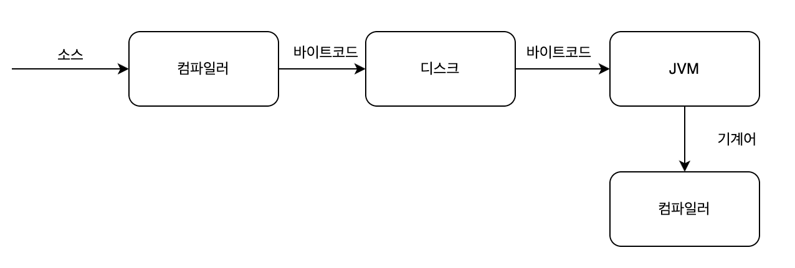
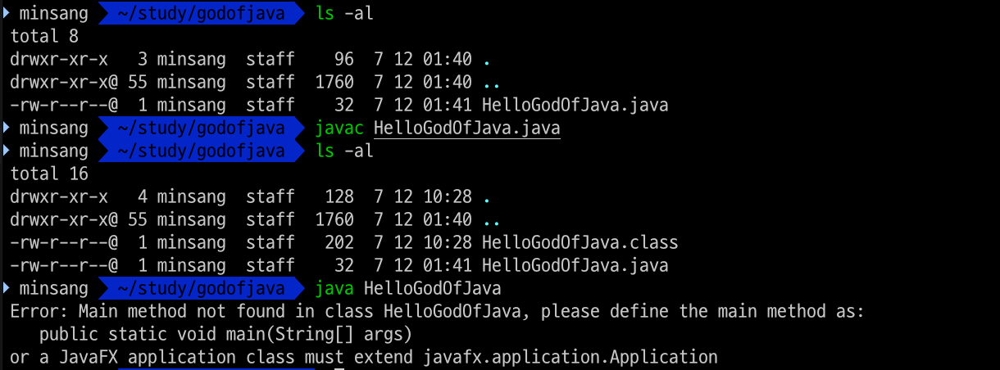

### 컴파일 이란
예를들어, 에디터에 아래 코드를 작성하고 `Java`라는 파일 형식으로 저장합니다. 
```java
public class HelloGodOfJava {

}
```
이제 이 자바파일을 가지고선 컴퓨터는 이해하고 실행시킬 수 없습니다. 반드시 컴파일 단계를 거쳐야지만, 컴퓨터는 이해하고 프로그램을 실행할 수 있습니다.

`.java`라는 확장자로 되어 있는 소스를 컴파일하면 `.class`라는 확장자를 가진 파일이 생성되어 디스크에 저장됩니다. 이 `.class`파일은 바이너리 파일로 되어있어 에디터에서 열어도 보기가 어렵습니다. 

컴파일을 하는 프로그램을 **컴파일러**라고 부르며, 자바에서는 `javac`가 그 역할을 수행합니다.

컴파일을 마친 클래스파일은 JVM에서 읽어서 운영체제에서 실행됩니다.



### 소스코드 컴파일하고 실행하기

이제 위에서 작성한 소스코드인 `HelloGodOfJava.java`를 컴파일하고 실행시켜보겠습니다.


`java`라는 실행프로그램으로 `.class` 확장자 없이 이름만 지정해주면 알아서 `.class`파일들을 찾아 동일한 이름을 찾아 실행시킵니다.

