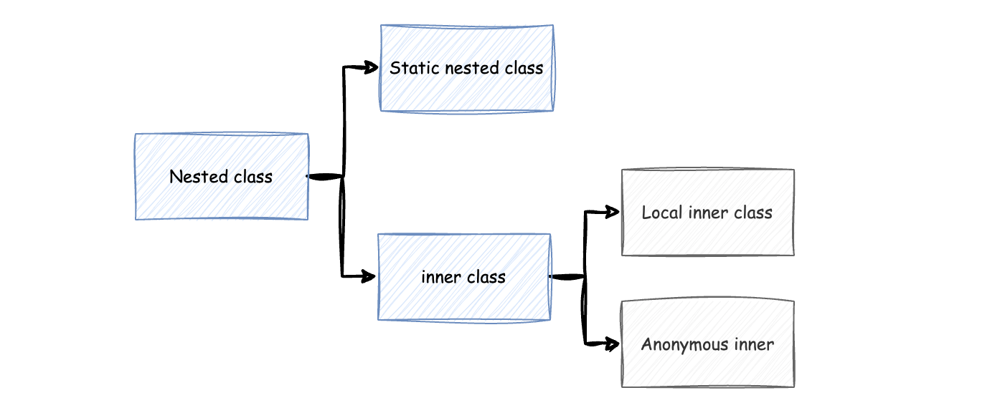

## Nested 클래스에 속하는 3가지 클래스에는 어떤 것이 있나요?

`Nested class`는 선언방법에 따라 `Static nested 클래스`와 `내부(inner) 클래스`로 구분됩니다. 이 둘의 차이는 static 여부의 차이 입니다.

`내부 클래스`는 이름이 있는 로컬(혹은 지역) 내부 클래스와 이름이 없는 익명 내부 클래스로 나뉩니다.

## Inner Class(내부 클래스)의 장점을 말해주세요

**내부 클래스는 외부 클래스의 멤버에 쉽게 접근이 가능**합니다. 
그리고 외부클래스의 **private 멤버를 이용해야 하고**, **만들려는 클래스가 외부에는 노출 시키고 싶지않는 내부 구현이 필요할때** 유용합니다.

즉, **캡슐화의 특성**을 잘 활용할 수 있으며 **가독성과 유지보수성이 높아집니다.**

추가적으로 내부클래스인 **익명클래스를 사용하는 이유**는 클래스를 만들면 이는 메모리에 올려야 하고 메모리가 필요함에 동시에 처음 클래스가 로딩될 때 많은 시간이 소요됩니다.
따라서 익명 클래스로 필요할 때만 객체를 생성하면 되기 때문에 이런 장점을 갖고 있습니다.

**주의할 점은, 내부 클래스는 모두 다른 클래스에서 재사용할 일이 없을 때** 만들어야 합니다. 너무 남발하면 오히려 가독성을 해치는 문제가 생길 수 있습니다.

`static nested class`는 **논리적으로 묶을 필요**가 있을때 와 바깥쪽 클래스의 변수 접근이 필요가 없을 때 사용하면 됩니다.