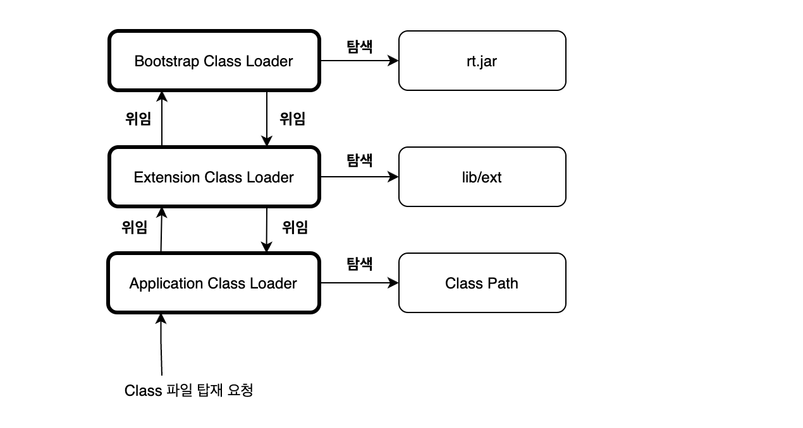

`.java`파일을 컴파일러에 의해 컴파일된 바이너리 파일인 `.class`파일을 생성합니다.
이 `.class`파일을 실행 시 **Class Loader**에 의해 JVM의 메모리에 각 클래스파일들을 탑재합니다.

## Class Loader 역할

ClassLoader 는 크게 Loading, Linking, 그리고 Initialization 3가지 역할을 맡게 됩니다

### Loading

**ClassLoader**가 필요한 클래스 파일들을 찾아 **JVM의 method area**에 클래스에 대한 정보를 저장합니다.
클래스 파일을 찾아 저장하는 과정은 세 가지 수준으로 나뉘어 있습니다.

요청이 들어오면 Application Class Loader가 먼저 요청을 받지만 맨 상단 **Bootstrap ClassLoader**까지 요청을 위임합니다.




**Bootstrap ClassLoader**
<br>


JVM을 구동시키기 위한 가장 필수적인 라이브러리의 클래스들을 JVM에 저장합니다. 
네이티브 언어로 작성되있으며, 아래와 같이 클래스 파일들을 저장합니다.

```text
[Opened /usr/lib/jvm/java-8-openjdk-amd64/jre/lib/rt.jar]
[Loaded java.lang.Object from /usr/lib/jvm/java-8-openjdk-amd64/jre/lib/rt.jar]
[Loaded java.io.Serializable from /usr/lib/jvm/java-8-openjdk-amd64/jre/lib/rt.jar]
```
**Extensions ClassLoader** (Java 11부터 Platform ClassLoader)
<br>

`localedata, zipfs` 등 다른 표준 핵심 Java Class 의 라이브러리들을 JVM에 저장합니다.

**Application ClassLoader**
<br>

**Classpath** 에 있는 클래스들을 저장합니다. 개발자들이 작성한 클래스 파일들 입니다.
```text
...중략...
[Loaded UserClass from file:/home/minsang/OTC/java8/src/]
...중략...
```

위의 **ClassLoader** 들을 모두 거쳤는데도 클래스 파일을 찾지 못하면 `ClassNotFoundException` 예외를 던지게 됩니다. 
```text
...중략....
java.lang.NoClassDefFoundError: UserClass
    	at Main.main(Main.java:7)
Caused by: java.lang.ClassNotFoundException: UserClass
    	at java.net.URLClassLoader.findClass(URLClassLoader.java:382)
...중략...
```

`.class` 파일들을 loading 한 후에 JVM은 힙 메모리에 Class 유형의 객체를 생성합니다.
이 클래스 객체를 사용하여 클래스 이름, 부모 이름, 메서드 및 변수 정보 등과 같은 클래스 수준 정보를 가져올 수 있습니다. 

### Linking

**Linking** 역시 3가지 과정을 수행합니다. 클래스 파일들을 검증하고, 사용할 수 있게 준비하는 과정을 의미합니다.


- **Verification** : 클래스 파일이 유효한지를 확인하는 과정입니다. 검증이 실패하면 예외를 발생시킵니다.
- **Preparation** : JVM이 클래스 정적 변수를 위한 메모리를 할당하고 메모리를 기본값으로 초기화합니다.
- **Resolution** : **기호참조(Symbolic Reference)** 를 **직접참조(Direct Reference)** 로 대체하는 단계입니다. 이 단계에 `new`, `instanceof`가 영향을 받습니다.
**직접참조란**, 실제 메모리 주소를 말합니다.

### Initialization

Initialization 단계에서는 클래스 파일의 코드를 읽게 됩니다. Java 코드에서의 class 와 interface 의 값들을 지정한 값들로 초기화 및 초기화 메서드를 실행시켜줍니다.
이 실행은 클래스 내에서 위에서 아래로, 클래스 계층 구조에서 부모에서 자식으로 실행됩니다.


## Reference

https://www.geeksforgeeks.org/jvm-works-jvm-architecture/
https://tecoble.techcourse.co.kr/post/2021-07-15-jvm-classloader/
https://www.linkedin.com/pulse/understanding-class-loading-java-virtual-machine-pravin-tripathi/