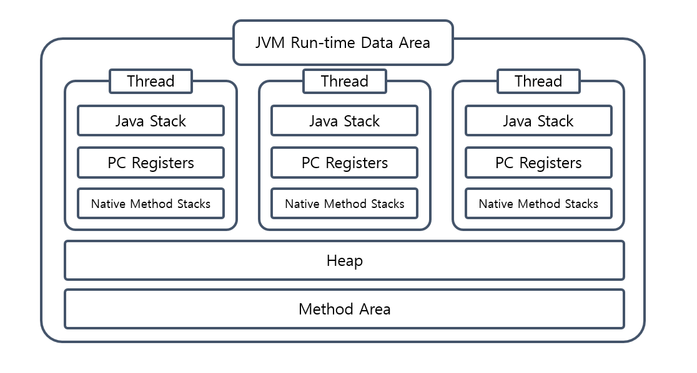

이전 편에서 **Class Loader**에 의해 클래스 파일들이 **Runtime Data Area**에 적재됩니다.

**Runtime Data Area**은 JVM이 프로그램을 수행하기 위해 OS로부터 별도로 할당받은 메모리 영역입니다.

### Method area

클래스 이름, 바로 상위 클래스 이름, 메서드 및 변수 정보 등 정적 변수를 포함한 **모든 클래스 수준 정보가 저장**됩니다. 
**Runtime Constant Pool** (static 변수, 그리고 메소드 데이터와 같은 Class 데이터들)도 이곳에서 관리가 됩니다.

이 영역은 JVM 당 하나만 생성이 됩니다. 인스턴스 생성에 필요한 정보도 존재하기 때문에 JVM 의 모든 Thread 들이 Method Area 을 공유하게 됩니다. 
JVM 의 다른 메모리 영역에서 해당 정보에 대한 요청이 오면, 실제 물리 메모리 주소로 변환해서 전달해줍니다. 
JVM 구동 시작 시에 생성이 되며, 종료 시까지 유지되는 공통 영역입니다.

### Heap
 
이곳에서는 문자열에 대한 정보를 가진 **String Constant Pool** 뿐만이 아니라 실제 데이터를 가진 **인스턴스, 배열** 등이 저장이 됩니다. 
JVM 당 하나만 생성이 되고, 해당 영역이 가진 데이터는 모든 Java Stack 영역에서 참조되어, Thread 간 공유가 됩니다.

또한 이 영역이 가득 차게 되면 **OutOfMemory** 를 발생시키게 됩니다.

### Java Stack

각 스레드 별로 따로 할당되는 영역 입니다. 각 Thread 들은 메소드를 호출할 때마다 Frame 이라는 단위를 push 하게 됩니다. 
메소드가 마무리되며 결과를 반환하면 해당 Frame 은 Stack 으로부터 pop 됩니다. 
Frame 은 메소드에 대한 정보를 가지고 있는 Local Variable, Operand Stack, 힙 참조변수 그리고 Constant Pool Reference 로 구성이 되어 있습니다. 

**Local Variable** 은 메소드 안의 지역 변수들을 가지고 있습니다. 
**Operand Stack** 은 메소드 내 연산을 위해서, 바이트 코드 명령문들이 들어있는 공간입니다. 
**Constant Pool Reference** 는 Constant Pool 참조를 위한 공간입니다. 이렇게 구성된 Java Stack 은 메소드가 호출될 때마다 Frame 이 쌓이게 됩니다.
**힙 참조 변수**는 Heap 영역에 생성된 객체들의 주소를 저장합니다. 이를 통해 메소드 내에서 객체를 참조하고 조작할 수 있습니다.

### Native Method Stacks

Java가 아닌 다른 프로그래밍 언어로 작성된 메서드입니다. 이러한 메서드는 바이트코드로 컴파일되지 않으므로 다른 메모리 영역이 필요합니다.
**Native Method Stacks**은 JVM Stack과 매우 유사하지만 네이티브 메서드 전용으로 사용됩니다.

### PC Registers

각 스레드마다 **현재 실행 중인 명령어의 주소**를 저장하는 메모리 공간을 의미합니다.
스레드마다 독립적으로 관리되며, 각 스레드는 자신의 PC 레지스터를 가지고 있습니다. 
이를 통해 다중 스레드 환경에서 동시에 여러 명령어를 실행할 수 있습니다. 스레드가 다른 스레드로 전환될 때, 해당 스레드의 PC 레지스터 값이 로드되어 다음 명령어를 실행합니다.

### Reference

https://tecoble.techcourse.co.kr/post/2021-08-09-jvm-memory/

https://www.baeldung.com/java-jvm-run-time-data-areas

https://deveric.tistory.com/123