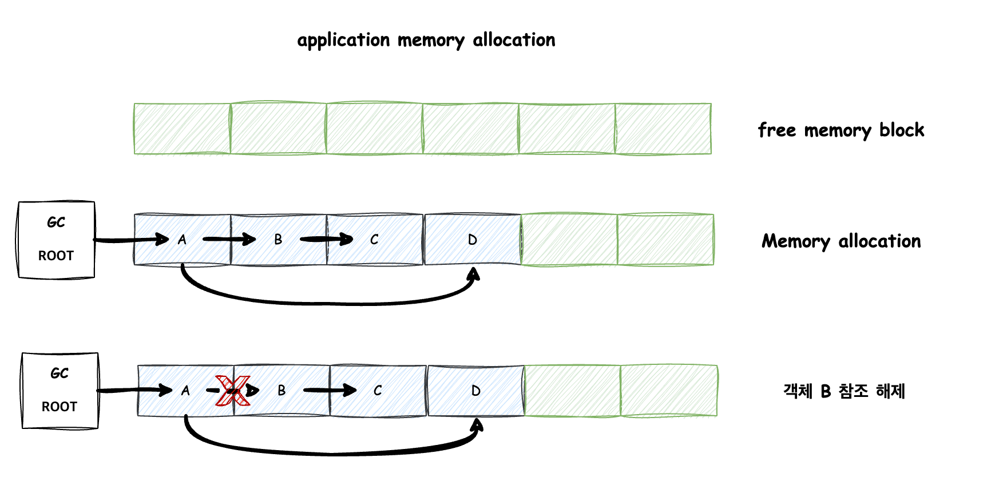
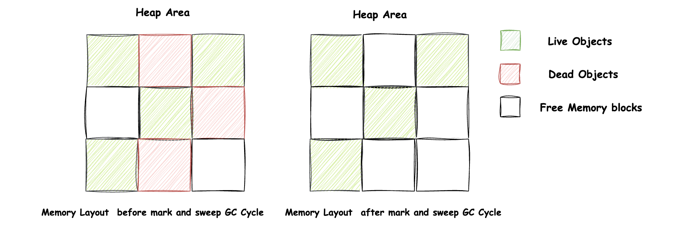
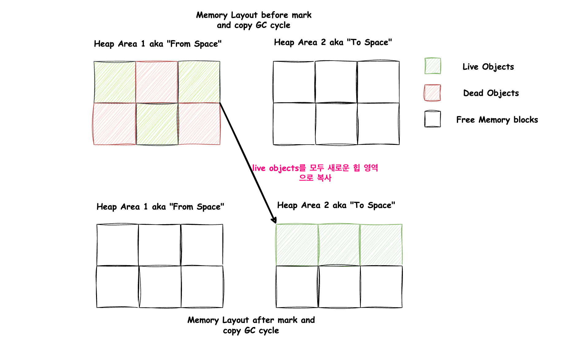
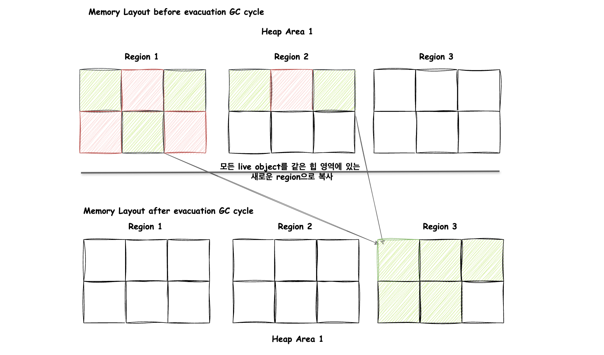

**Mark and Sweep 알고리즘**은 Garbage Collection의 기본 알고리즘 입니다. JVM에서 사용되는 실제 알고리즘은 훨씬 복잡하지만 Mark & Sweep 알고리즘이 기반이므로 확실히 이해해야 합니다.

## Mark 단계

**Mark 단계는** 힙 영역에서 [live objects](https://stackoverflow.com/questions/4821664/what-is-the-difference-between-live-objects-and-allocated-objects-in-visualvm)를 찾아내는 과정입니다.

a) **JVM은 힙에 할당된 모든 객체에 대한 포인터를 가지고 있습니다**. 이를 "할당 리스트" 또는 "[ordinary object pointer(oop) 테이블](https://www.baeldung.com/jvm-compressed-oops)"이라고 합니다.

b) **GC는** 이 **리스트의 모든 포인터를 순회하면서 각 객체의 "mark bit"를 초기화**합니다. 이렇게 하면 모든 객체가 일단 수집 대상이 됩니다.

c) 그 다음, **GC는** "GC root"라고 불리는 특정 지점에서부터 시작하여 모든 **살아있는 객체(live objects)**를 찾아냅니다.

d) 살아있는 객체를 찾으면 해당 객체의 **mark bit를 설정**합니다. 이는 이 객체가 아직 사용 중이므로 삭제하면 안 된다는 표시입니다.

**다음 과정을 그림**으로 살펴봅시다.

먼저 A, B, C, D라는 네 개의 객체를 메모리에 할당합니다. 여기서 A는 B, D를 참조하고 있고, B는 C를 참조하고 있습니다. 그런데 프로그램이 실행되면서 A와 B 사이의 참조가 끊어졌다고 가정해 봅시다.

가비지 컬렉션이 시작되면, 우선 모든 객체의 표시 비트를 0으로 설정합니다. 
그 다음, GC 루트(프로그램에서 직접 접근 가능한 지점)에서부터 시작해서 모든 살아있는 객체를 찾아다니며 그 표시 비트를 1로 바꿉니다. 
표시 비트가 0으로 남아있는 객체들은 더 이상 사용되지 않는 '죽은' 객체로 간주되어 제거 대상이 됩니다.

## Sweep 단계

**Sweep 단계는** 죽은 객체들을 식별합니다. "할당 리스트"를 다시 순회하며 "mark bit"가 비어있는 메모리를 발견하면 **할당 리스트에서 죽은 객체들을 제거**합니다.

이 단계에서는 표시 비트가 0인 모든 객체를 메모리에서 제거합니다. 하지만 이 과정을 거치면 메모리에 빈 공간들이 불규칙하게 생기게 됩니다. 이를 **'메모리 단편화'**라고 합니다.

## Compaction 단계

위 Mark & Sweep 단계를 거치면 메모리 단편화(fragment)가 생깁니다. **Compaction 단계에서는 객체를 재배치하여 할당된 메모리가 연속되도록 합니다.** 
재배치를 하면 해당 객체에 대한 모든 포인터/참조도 업데이트 됩니다.

마지막으로, 살아남은 객체들을 메모리의 한쪽으로 모아 재배치합니다. 이렇게 하면 메모리의 빈 공간이 하나로 뭉쳐져서, 새로운 객체를 할당하기 쉬워집니다.

## 가비지 컬렉션(GC)의 작동 방식

**이전 방식은** 먼저 모든 Application의 스레드를 일시정지 합니다(stop-the-world). 그리고서 GC를 동작합니다. 작업이 끝나면 모든 Application의 스레드를 재실행 합니다.

**최신 방식은** 프로그램이 멈추는 시간을 최소화하려고 노력합니다. 대부분의 GC 작업을 프로그램 실행 중에 할 수 있지만, 여전히 짧은 일시 정지가 필요합니다.

### Mark-Sweep 

이것은 위에서 설명한 고전적인 Mark & Seep 방식 입니다. 이 방식은 **GC 사이클에서 Mark와 Sweep 단계만 진행하고 Compact 단계는 진행하지 않습니다.**
따라서 죽은 객체는 마크되고 제거되지만 메모리는 압축되지 않아 메모리 단편화가 발생합니다. 
**CMS Collector**는 Mark 및 Sweep 단계만 사용하는 대표적인 예 입니다. 

### Mark-Sweep-Compact

Mark-Sweep 방식에 Compact 단계가 추가되었습니다.
GC 사이클은 스윕 단계 이후에 메모리를 압축합니다. 

객체가 재배치되고 참조가 업데이트되어 이런 연속적인 여유 메모리 블록을 구축합니다. 세 단계를 사용하는 Collector의 예로는 **SerialGC와 ParallelGC**가 있습니다.

### Mark and Copy aka Copying Collectors

죽은 객체를 제거하거나 압축하는 대신, **live objects을 힙 메모리의 새로운 영역으로 복사**합니다. 
원래 있던 영역은 이제 비어있다고 간주되어 나중에 새로운 객체들을 위해 사용될 수 있습니다.

Mark와 Copy가 동시에 일어납니다. live objects를 발견하면 바로 새 영역으로 복사합니다.
**이 전체 과정은 한 번의 탐색으로 완료됩니다.**

**장점**

이 방식은 메모리에 객체가 드문드문 있을 때 (즉, 메모리가 많이 비어있을 때) 특히 효과적입니다.

**단점**

가장 큰 단점은 메모리 요구사항입니다.
이론적으로, 이 방식은 원래의 메모리 공간("from-space")과 같은 크기의 추가 공간("to-space")이 필요합니다.

### Mark and Compact 

이 방식은 Sweep 단계를 생략합니다. 죽은 객체를 제거하는 대신, 살아있는 객체들을 힙 메모리의 연속된 영역(또는 '구역')으로 옮깁니다.
이 방식을 가진 알고리즘을 **evacuating collectors**라 부릅니다.

이 방식은 위 Mark and Copy와 매우 비슷해 보이지만 중요한 차이가 있습니다. **Mark & Copy 는 객체를 다른 메모리 영역으로 옮기고 현재 영역을 비웁니다.
반면, Mark & Compact 는 같은 메모리 영역 내에서 객체를 이동시킵니다.**

**Mark & Copy**는 메모리에 객체가 드문드문 있을 때 효과적입니다.
**Mark & Compact**은 어떤 종류의 메모리 상태에서도 잘 작동하도록 설계되었습니다.

## Reference 

아래 글을 번역했습니다.

https://abiasforaction.net/understanding-jvm-garbage-collection-part-2/