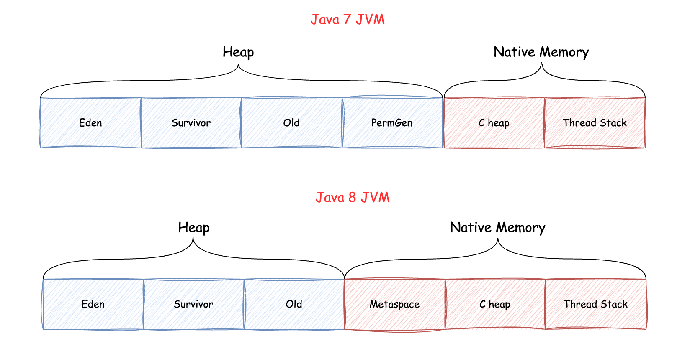

## 값 타입과 레퍼런스 타입의 메모리 할당 방식 차이

먼저 값 타입인 primitive인 `byte, short, int, long, float, double, char, boolean`은 변수에 실제 값을 직접 저장합니다.
이 값들은 스택 메모리에 스택 프레임 형태로 할당됩니다. 예를들어, `int x = 10;`이라고 선언하면, 스택 메모리에 10이라는 값이 직접 저장됩니다.

반면, 레퍼런스 타입은 실제 객체는 힙 메모리에 저장하고, 변수에는 그 객체를 가리키는 메모리 주소를 저장합니다.
예를들어, `String s = new String("Hello")`라 선언하면, "Hello" 문자열 객체는 힙에 저장되고, 변수 s에는 이 객체의 메모리 주소가 저장됩니다.

이러한 차이로 인해 몇 가지 중요한 특징이 있습니다.
**성능면에서**, 값 타입은 스택에 직접 저장되므로 접근 속도가 매우 빠릅니다. 레퍼런스 타입은 주소를 통해 힙을 탐색해야하므로 상대적으로 접근 속도가 느립니다.
**메모리 관리면에서** 값 타입은 메소드가 종료되면 스택에서 자동으로 제거됩니다. 레퍼런스 타입은 가비지 컬렉터에 의해 관리되므로, 개발자가 명시적으로 메모리를 해제할 필요가 없습니다.
**데이터 크기면에서** 값 타입은 작은 데이터를 효율적으로 저장할 수 있지만, 크기가 제한 입니다. 레퍼런스 타입은 힙에 저장되므로 큰 데이터를 다루는 데 적합합니다.
**생명주기면에서** 값 타입은 선언된 블록 내에서만 존재하는 짧은 생명주기를 가집니다. 레퍼런스 타입은 필요에 따라 더 긴 생명주기를 가질 수 있습니다.
마지막으로 각 스레드는 자신만의 스택을 가지므로 값타입은 스레드 안전합니다. 반면, 힙은 모든 스레드가 공유하므로 레퍼런스 타입은 동기화에 주의해야 합니다.

이러한 특성을 고려하여, **간단하고 크기가 작은 데이터를 다룰 때는 값 타입을, 복잡하거나 큰 객체를 다룰 때는 레퍼런스 타입을 사용하는 것이 효율적**입니다. 
예를 들어, 단순 계산이나 플래그 변수에는 값 타입을, 문자열 처리나 사용자 정의 객체에는 레퍼런스 타입을 사용하는 것이 적합합니다.

### 스택이 작은 데이터를 효율적으로 관리할 수 있는 이유

**고정된 크기**: 값 타입(primitive type)은 크기가 미리 정해져 있습니다. 예를 들어, int는 4바이트, long은 8바이트 등입니다. 이 고정된 크기 덕분에 스택에서 메모리를 할당하고 해제하는 과정이 매우 단순하고 빠릅니다.

**빠른 할당과 해제**: 스택은 단순히 포인터를 이동시켜 메모리를 할당하고 해제합니다. 이 과정이 매우 빠르기 때문에 작은 데이터를 자주 할당하고 해제하는 데 적합합니다.

**메모리 단편화 최소화**: 고정 크기의 작은 데이터를 사용하면 메모리 단편화 문제가 거의 발생하지 않습니다. 이는 전체적인 메모리 사용 효율을 높입니다.

**큰데이터를 저장하기에는** 스택 크기가 제한되기 때문에 스택 오버플로우가 발생할 수 있기에 부적합합니다.

## JVM 메모리 구조

JVM에서 메모리 구조는 5가지 주요 영역으로 구성됩니다. 

각 스레드의 현재 명령을 추적하는 **프로그램 카운터 레지스터(PC Register)**, 각 스레드 별로 따로 할당되는 영역이며 로컬 변수 및 참조변수 등에 대해 스택 프레임을 사용하여 메소드 실행을 처리하는 **스택 영역**,
실제 객체 및 배열 할당을 위한 스레드의 공유 공간이자 가비지 수집을 위한 **힙 영역**, 상수 풀이나 정적 변수, 클래스 및 메서드 정보를 포함한 클래스 수준 데이터를 저장하는 **Method 영역**,
네이티브 메서드 실행을 위한 **네이티브 메서드 스택**이 있습니다.

### Metaspace

자바 8이전의 PermGen 을 대체했으며, 클래스 및 메소드 정의, 필드 및 메소드 데이터, Runtime Constant Pool과 같은 클래스 메타데이터를 저장하는 데 사용됩니다.

### PermGen이 Metaspace 영역으로 바뀐 이유

PermGen은 제한된 메모리 영역이기 때문에 OOM이 발생했습니다. 이 문제를 해결하기 위해 Native 메모리를 사용하는 Metaspace로 바뀌게 되었습니다.

Native 메모리란, Heap 영역의 바깥인 Off-Heap 공간을 의미하는 것으로, 메모리가 동적으로 관리되며 필요할 경우 OS에게 요청하여 메모리를 추가 할당할 수 있습니다.

### String constant Pool

힙 메모리 내에 존재하는 **String constant Pool**은 리터럴 String 객체들을 저장합니다. JVM은 문자열의 불변성 덕분에 각 리터럴 문자열의 복사본 하나만 저장하여
할당된 메모리를 최적화할 수 있습니다. 그리고 이 과정을 **Intern** 이라고 합니다.

문자열 변수를 생성하고 값을 할당하면 JVM은 풀에서 동일한 값의 문자열이 있는 지 확인하고 있다면 해당 객체의 주소를 반환하고, 없다면 String Constant Pool에 해당
문자열 객체를 생성하고 주소를 반환합니다.

단, 생성자를 통한 문자열을 생성하면 String Constant Pool 이 아닌 다른 힙영역에 저장합니다. 

**Java 7 이전에는 String Pool을 PermGen 영역에 위치**했습니다. 이는 너무 많은 문자열을 인턴하는 경우 OOM이 발생할 위험이 있었습니다.
**Java 7 부터는 Java String Pool은 JVM에 의해 가비지 수집되는 힙 공간에 저장**됩니다. 
이 접근 방식의 장점은 참조되지 않은 문자열이 풀에서 제거되어 메모리가 해제되므로 OutOfMemory 오류의 위험이 줄어듭니다.

