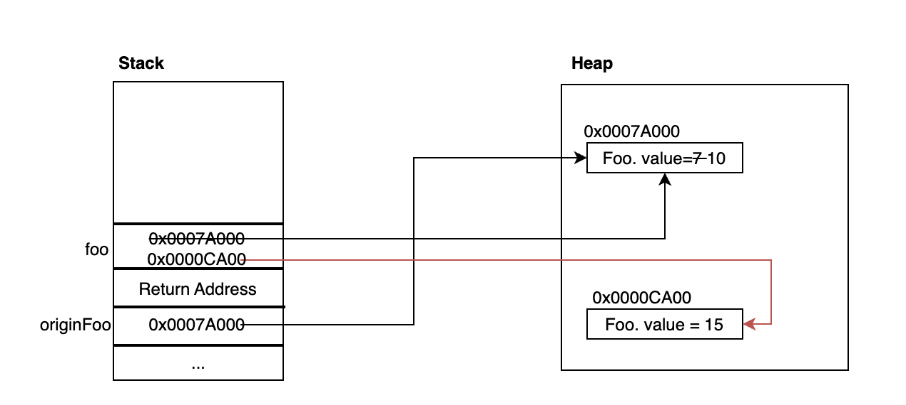
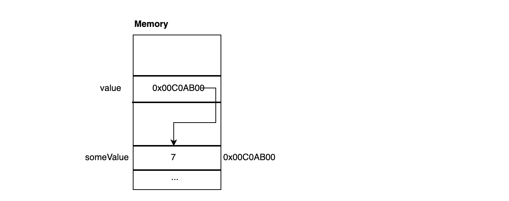

각 언어마다 변수를 파라미터로 넘길 때 방법(Pass by value, Pass by reference) 이 다른데, Java와 C++은 각각 어떠한 방식으로 전달하는 지 알아보겠습니다.

## pass by value

pass by value(값에 의한 전달) 은 **복사된 데이터를 전달하기 때문에 값을 수정해도 원본의 데이터에는 영향을 주지 않는 방식** 입니다. 
예를들어, 어떤 int 값을 전달한다고 가정합니다.  

```java
public class Foo{
    
    public static void main(String[] args) {
        int val = 7;
        Foo foo = new Foo();
        foo.updateValue(val);
        System.out.println(val); // 7 
    }

    private void updateValue(int val2) {
        val2 = 10;
        System.out.println(val2); // 10 
    }
}
```

`updateValue(int val2)`의 파라미터인 val2의 값을 수정해도 원본 데이터인 val의 값은 변하지 않습니다. 이런 이유는 Pass by value의 동작 방식 떄문인데 그림으로 보면 이해할 수 있습니다.


함수를 호출하게 된다면 **Stack 메모리에 val의 값을 복사한 7이 매개변수 val2의 값에 저장되어 쌓입니다.** 그후 val2의 값을 10으로 바꾼다고 해도 기존 val에는 영향이 없습니다.
또한 함수가 종료된다면 스택에 쌓였던 val2는 pop 됩니다.

해당 부분은 사실 쉽게 인지할 수 있는 사실이지만 가장 헷갈릴 수 있는 부분이 **자바에서는 객체 참조도 pass by value 로 동작**합니다.
객체 내부의 값을 변경할 수 있다라고 인지해서 pass by reference 로 착각할 수 있습니다. 예제를 들어 설명하겠습니다. 

```java
class Foo {

    public int value;

    public Foo(int value) {
        this.value = value;
    }

}

public class Main {

    public static void main(String[] args) {
        Foo originFoo = new Foo(7);
        updateValue(originFoo);
        System.out.println(originFoo.value); // 10
    }

    public static void updateValue(Foo foo) {
        // 주소 값을 통해 필드 값을 변경
        foo.value = 10;
        
        // 객체 자체를 변경하는 것은 영향 X
        foo = new Foo(15);
    }

}
```

`originFoo` 객체를 생성할 때 Stack 메모리에는 실제 `originFoo` 객체를 저장하고 있는 것이 아니고 `originFoo` 객체를 가르키는 참조 값(주소 값)을 가지고 있습니다.
그리고 객체를 파라미터에 **originFoo의 참조값을 복사하고 foo에 전달**합니다. 



물론 주소값을 전달 받았으니 실제 객체의 인스턴스 변수인 value 값은 수정이 가능합니다. 하지만 `foo`객체 자체에 변경이 생기면 `originFoo`에는 반영되지 않습니다.

다시 정리하면 **Java는 원시 값이든 객체든 상관없이 모든 데이터를 pass by value 로 전달**합니다. 

## pass by reference

pass by reference 는 **전달하는 변수의 주소값을 받아 Alias로 구성하여, 값을 수정하면 원본의 데이터가 수정되도록 하는 방식** 입니다.
C++에서는 참조 값을 전달하기 위해 &를 사용합니다.

```Java
#include <iostream>
using namespace std;

void updateValue(int& value) {
    value = 10;
}

int main() {
    int someValue = 7;
    updateValue(someValue);
    return 0;
}
```


`updateValue` 함수에서 파라미터로 전달받은 value는 someValue가 저장된 값을 참조하는 Alias이며 
value를 10으로 변경하는 것은 value가 가리키는 메모리의 값을 7에서 10으로 변경하는 것 입니다.

## 결론

**Pass By Value** 는 복사된 데이터를 전달하여 구성하는 방식으로 값을 수정해도 원본 데이터는 수정되지 않습니다. 

**Pass By Reference** 는 주소 값을 전달하여 실제 값에 대한 Alias를 구성하기 때문에 값을 수정하면 원본의 데이터가 수정 됩니다.

## Reference

https://mangkyu.tistory.com/107

https://mangkyu.tistory.com/106
