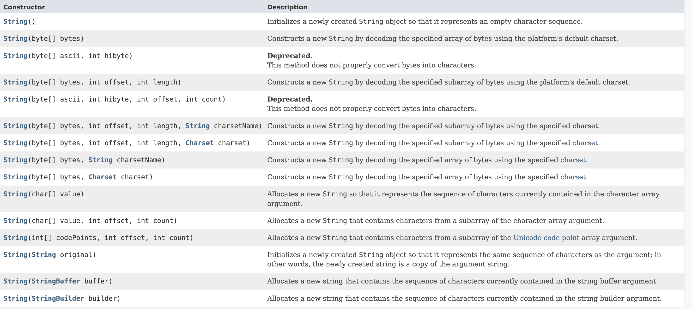
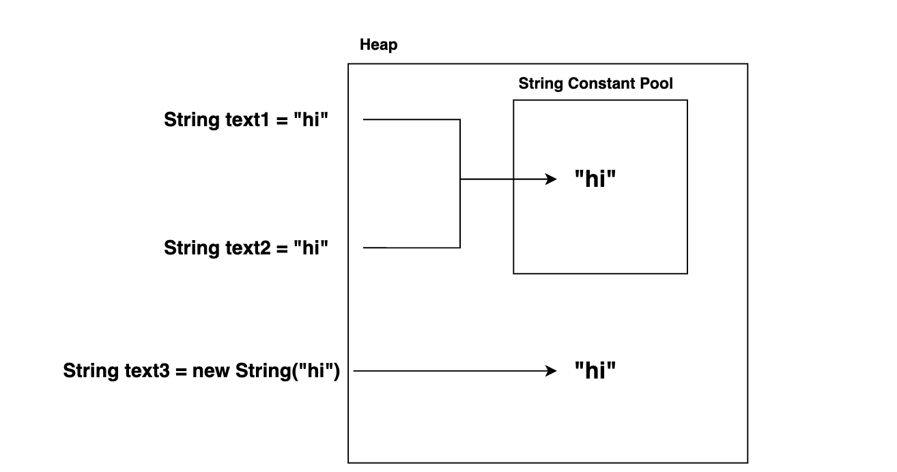

## String 생성자

보통 문자열을 만들 때 다음과 같이 생성합니다.
```java
String name = "Java";
```

하지만 생성자를 이용하여 문자열을 만들 수도 있습니다.


위 사진처럼 여러 생성자가 있는데 그 중에서 **가장 많이 쓰이는 생성자**는 다음과 같습니다. 왜냐하면 다른 나라는 보통 영어만 사용하지만 **우리나라는 한글을 사용하기 때문에** 지정해야 할 경우가 있습니다.
-  `String(byte[] bytes)` : 현재 사용중인 플랫폼의 **기본 문자셋**(e.g. UTF-8)을 사용하여 주어진 바이트 배열로부터 디코딩한 새로운 String을 생성합니다.
- `String(byte[] bytes, String charsetName)` : **주어진 바이트 배열로부터 디코딩**한 새로운 String을 생성합니다. **charsetName은 문자셋을 지정**합니다.

### String 문자열을 byte 배열로 변환하기

생성자의 매개변수로 받는 byte 배열은 다음 메소드로 변환할 수 있습니다.
- `getBytes()` : 기본 문자셋의 바이트 배열을 생성합니다
- `getBytes(Charset charset)`: 지정한 문자셋 객체 타입으로 바이트 배열을 생성합니다
- `getBytes(String charName)` : 지정한 이름의 문자셋을 가진 바이트 배열을 생성합니다

한글을 처리하기 위해 가장 많이 사용하는 문자셋은 `UTF-16`이며 `UTF-8`, `EUC-KR` 문자셋도 사용합니다.

예를들어 다음의 코드를 실행해봅니다.
```java
    String korean = "자바를 자바라";
    byte[] bytes = korean.getBytes(StandardCharsets.UTF_16);
    for (byte data : bytes) {
        System.out.print(data + " ");
    }
    
    String newKorean = new String(bytes, StandardCharsets.UTF_16);
    System.out.println(newKorean);
```

출력의 결과는 다음과 같습니다. 
```java
-2 -1 -57 -112 -68 20 -71 124 0 32 -57 -112 -68 20 -73 124 자바를 자바라
```

`UTF-16`은 **2바이트 BOM(Byte Order Mark)**이고 **문자당 2바이트** 총 7글자이므로 **총 16바이트** 입니다.
`UTF-8`은 **한글 3바이트, 공백문자 1바이트** 이므로 **총 19바이트**를 차지합니다.

그리고 특정 문자셋으로 바이트로 변환하고 다른 문자셋으로 디코딩하게되면 글자가 깨집니다.

## String 메소드

String 메소드는 잘 알아둘수록 코드가 깔끔해지고 개발도 빨라집니다. 각 메소드들의 자세한 사용은 [공식문서](https://docs.oracle.com/en/java/javase/17/docs/api/java.base/java/lang/String.html)에서 보고 특정 메소드들만 보겠습니다.

### 문자열이 같은지 비교하는 메소드

- `boolean equals(Object anObject)` : String 클래스의 문자열이 같은 지 비교
- `boolean equalsIgnoreCase(String anotherStr)` : 대소문자 무시 후 비교 

```java
String text1 = "hi";
String text2 = "hi";
String text3 = new String("hi");

if(text1==text2) System.out.println("출력");
if(text1.equals(text2)) System.out.println("출력");
if(text1 == text3) System.out.println("출력");
```

결과
```java
출력
출력
```

String 클래스도 비교를 할 때 `equals()`를 사용하지만 위 결과와 같이 `==`**도 true를 반환한 이유**는 **Constant Pool**에 존재하기 때문입니다.

**String 클래스는 생성자가 아닌 =을 이용해 생성**하고 동일한 값을 가진 객체면 **String Constant Pool**에서 **재사용합니다**.
반면, new 키워드로 생성하면 별도의 객체를 생성합니다. 



<br>

- `int compareTo(String anotherStr)`
- `int compareToIgnoreCase(String str)`

`Comparable` 인터페이스에 선언되있는 메소드들 입니다. 매개변수로 넘겨준 String 객체가 알파벳 순으로 앞에 있으면 양수,
뒤에 있으면 음수를 리턴하며 알파벳 순서만큼의 정수크기를 반환합니다.  

```java
String text1 = "a";
String text2 = "b";
String text3 = "c";

System.out.println(text2.compareTo(text1)); // 1
System.out.println(text2.compareTo(text3)); // -1
System.out.println(text1.compareTo(text3)); // -2

```

### 기본 자료형을 문자열로 변환하는 메소드

- `static String valueOf(...)` : 기본자료형이나 객체를 문자열로 변환 시킵니다.

객체가 넘어왔을 때 `valueOf(Object obj)`는  toString()을 호출합니다. 그냥 객체에 `toString()`을 사용한다면 객체가 null일 경우 `NullPointerException`이 발생합니다.
하지만 `valueOf(Object obj)`는 객체가 null일 경우 "null"을 반환합니다. 

따라서 객체를 문자열로 변환할 때는 `valueOf(Object obj)`를 사용하는 것이 안전합니다.

## StringBuffer, StringBuilder

String 클래스는 **불변(immutable)**이기 때문에 **문자열을 변경할 때마다 새로운 객체를 생성**합니다. 이러한 작업은 **메모리 낭비**를 초래하며 **GC의 대상**이 되기 때문에 **성능 저하**를 일으킵니다.

이 단점을 보완하기 위해 `StringBuffer`와 `StringBuilder` 클래스가 등장했습니다.

이 둘의 기능은 같지만 `StringBuilder`는 **Thread safe 하지 않습니다**. 하지만 그만큼 속도가 빠릅니다.
반면, `StringBuffer`는 **Thread safe 하지만** 아래 코드와 같이 **임계영역을 설정했기때문에 속도가 느립니다.** 

```java
@Override
@IntrinsicCandidate
public synchronized StringBuffer append(String str) {
    toStringCache = null;
    super.append(str);
    return this;
}
```

따라서, 하나의 메소드 내에서 문자열을 생성하여 더할 경우에는 `StringBuilder`를 사용해도 문제없습니다. 그러나 만약 여러 쓰레드에서 문자열 변수에 동시에 접근하는 일이 있을 경우 반드시
`StringBuffer`를 사용해야 합니다.

## CharSequence

**CharSequence는 Java에서 문자열을 나타내는 인터페이스**입니다. 
이 인터페이스는 읽기 전용 문자 시퀀스를 표현하며, **String, StringBuilder, StringBuffer 등의 클래스가 이 인터페이스를 구현**합니다.

따라서, 아래 코드와 같이 세 가지 중 하나의 클래스를 사용하여 매개변수로 받을려고 할 때 **CharSequence 타입으로 받는 것**이 좋습니다.

```java
public class CharSequenceExample {
    public static void main(String[] args) {
        String str = "안녕하세요";
        StringBuilder sb = new StringBuilder("반갑습니다");
        StringBuffer sbuf = new StringBuffer("또 만나요");
        
        printInfo(str);
        printInfo(sb);
        printInfo(sbuf);
    }
    
    public static void printInfo(CharSequence cs) {
        System.out.println("텍스트: " + cs);
        System.out.println("길이: " + cs.length());
        System.out.println("첫 글자: " + cs.charAt(0));
    }
}
```


