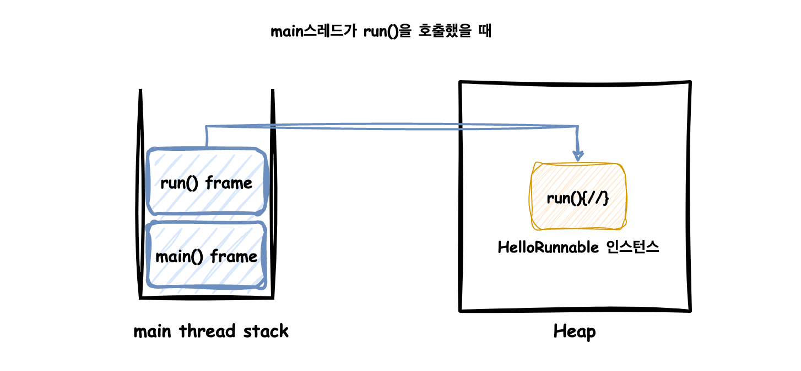
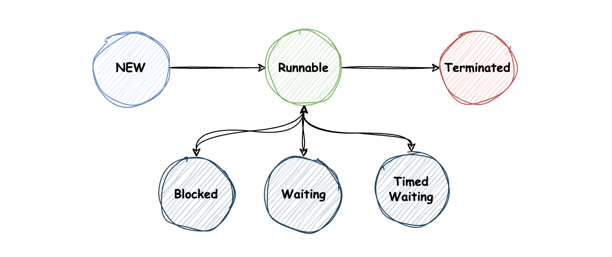

## 스레드를 생성하는 방법 2가지

### Thread 상속

Thread 클래스를 상속하고, 스레드가 실행할 코드를 run 메소드에 재정의합니다. 그리고나서 Thread를 상속한 클래스의 객체를 
생성하고 start() 메소드를 호출합니다. start()를 호출하면 스레드가 만들어지고 해당 스레드에서 run 메소드를 실행합니다.

### Runnable 구현

Runnable 클래스를 구현하는 방법은 run() 메소드만 재정의합니다.
그리고 Runnable을 구현한 클래스를 Thread 객체를 생성할 때 생성자로 전달하여 start() 메소드를 호출합니다.

## run()이 아닌 start()을 호출해야 하는 이유

**run()을 직접 호출하는 경우,** 새로운 스레드가 생성되지 않고, run을 호출한 스레드에 run() 스택 프레임이 올라갑니다. 결과적으로 호출한 스레드에서 모든 것을 처리하게 됩니다.



**start() 메소드는 스레드에 스택공간을 할당하면서 스레드를 시작**합니다. 그리고 해당 스레드에서 run() 메소드를 실행합니다.


## Thread 상속보다 Runnable 구현이 더 유리한 이유

스레드를 사용할 때는 Thread 클래스를 상속 받는 방법보다 Runnable 인터페이스를 구현하는 방식을 사용해야 합니다.
**Thread를 상속하는 방법**은 run() 메소드만 재정의하면 되긴 하지만, **자바는 단일 상속만 허용하므로 이미 다른 클래스를 상속받고 있는 경우
Thread 클래스를 상속받을 수 없습니다.** 

Runnable 인터페이스를 구현하면, **앞서 상속의 문제점에서 벗어날 수 있습니다. 그리고 스레드와 실행할 작업을 분리하여 코드의 가독성을 높일 수 있습니다.**
또한, 여러 스레드가 동일한 Runnable 객체를 공유할 수 있어, 자원 관리를 효율적으로 할 수 있습니다.

## 데몬 스레드 vs 사용자(user) 스레드

**사용자 스레드는** 프로그램의 주요 작업을 수행하며, 작업이 완료될 때까지 실행합니다. 모든 user 스레드가 종료되면 JVM도 종료됩니다.

**데몬 스레드는** 백그라운드에서 보조적인 작업을 수행합니다. 모든 user 스레드가 종료되면 데몬 스레드는 아직 작업이 끝나지 않아도 자동으로 종료됩니다.

**예시**

```java
daemonThread.setDaemon(true); // 데몬 스레드 여부 start()전에 세팅해야 적용됩니다.
daemonThread.start();
```


## 스레드의 정상적인 종료

Thread는 스택에 더이상 수행할 작업(스택 프레임)이 없을 때 Thread가 종료되고 메모리영역에서 제거됩니다.

## 스레드의 생명주기



**NEW는** 스레드가 생성되었으나, 아직 시작되지 않은 상태로 start() 메소드가 호출되지 않은 상태입니다. 

**Runnable은** 실행 가능 상태로, 운영체제의 스케줄러의 실행 대기열에 있거나, CPU에서 실제 실행되고 있는 상태입니다.

**Blocked는** 스레드가 다른 스레드에 의해 모니터 락을 얻기 위해 기다리는 상태입니다. 예를들어, `synchronized` 블록에 진입하려고 할 때, 다른 스레드가 이미 락을 가지고 있는 경우
해당 상태로 변합니다.

**Waiting은** 대기 상태로, 스레드가 다른 스레드의 특정 작업이 완료되기를 무기한 기다리는 상태입니다. 
예를들어, `wait()`, `join()` 메소드가 호출될 때, 해당 상태로 변합니다. 

깨어나기 위해서는 `wait()`같은 경우 다른 스레드가 `notify()` 혹은 `notifyAll()`를 호출해야하며, `join()`은 다른 스레드가 작업이 완료될 때까지 기다립니다.

**Timed Waiting**은 Wating과 마찬가지로 다른 스레드의 작업이 끝날 때까지 기다리지만 주어진 시간이 경과하거나, 다른 스레드가 해당 스레드를 깨우면 이 상태에서 벗어납니다.

**Terminated**은 스레드의 실행이 완료되어 정상적으로 종료되거나, 예외가 발생하여 종료된 경우 이 상태로 바뀝니다. 스레드는 한 번 종료되면 다시 시작할 수 없습니다.

## run 메소드를 구현할 때 체크 예외를 밖으로 던질 수 없는 이유

메서드를 재정의할 때, 예외와 관련된 규칙이 있습니다.

체크예외는 부모 메소드가 체크 예외를 던지지 않는 경우,  **재정의된 자식 메서드도 체크 예외를 던질 수 없습니다.** 또한, 자식 메서드는 부모 메서드가 던질 수 있는 **체크 예외의 하위 타입만** 던질 수 있습니다.

반면, 언체크 예외는 예외 처리를 강제하지 않으므로, 상관없이 던질 수 있습니다.

Runnable 인터페이스의 run() 메소드는 아무런 체크예외를 던지지 않습니다. 따라서 `Runnable` 인터페이스의
`run()` 메서드를 재정의 하는 곳에서는 체크 예외를 밖으로 던질 수 없습니다. 

이렇게 규칙이 생긴 이유는 안전한 예외처리를 의도함으로 보입니다. 강제로 try-catch 문을 만들도록 하여 **프로그램이 비정상 종료되는 상황을 방지할 수 있고,
특히, 멀티스레딩 환경에서 예외 처리를 강제함으로써 스레드의 안정성과 일관성을 유지**할 수 있습니다.

### sleep(long millis)

`Thread.sleep(long millis)`을 통해 Runnable인 상태인 스레드를 Timed Waiting 상태로 바꿉니다. 이때 이 sleep 메소드는 `throws InterruptedException`으로 체크 예외를 던질 수 있는 메소드입니다.
즉, run() 메소드안에서 sleep을 사용할 경우 try-catch 블록을 만들어야 합니다.

sleep이 `InterruptedException` 던질 수 있으므로, interrupt() 메소드로 IntteruptedException을 발생시켜 
**해당 sleep을 사용하여 Timed Waiting 걸린 스레드**를 강제로 깨워서 Runnable 상태로 바꾸고 해당 예외를 던질 수 있게 합니다.

### join

```java
 public static void main(String[] args) {
     Thread thread1 = new Thread(new Job(), "thread-1");
     Thread thread2 = new Thread(new Job(), "thread-2");
     thread1.start();
     thread2.start();

    thread1.join();
    thread2.join();
 }

static class Job implements Runnable {
    @Override
    public void run() {
        sleep(2000);
    } 
}
```

위 코드에서 main 스레드가 먼저 thread1이 작업을 종료할 때까지 기다리고 (Runnable -> Waiting) thread1의 작업이 끝나면 다음 thread2의 작업이 끝날때까지 기다리는 코드입니다.

join 메소드를 사용하는 경우는 특정 스레드들의 작업이 끝나야지 다음 코드를 진행할 수 있을 때 사용합니다.   


### interrupt (인터럽트)

인터럽트를 사용하면, `WAITING` , `TIMED_WAITING` 같은 대기 상태의 스레드를 직접 깨워서, 작동하는 `RUNNABLE`
상태로 만들 수 있습니다. 

참고로, `InterruptedException` 을 던지는 메서드를 호출 하거나 또는 호출 중일 때 예외가 발생하지, 평범한 코드(while)는 예외가 발생하지 않습니다.

```java
public static void main(String[] args) {
    MyTask task = new MyTask();
    Thread thread = new Thread(task, "work");
    thread.start();
    sleep(4000);
    thread.interrupt();
    System.out.println("work 스레드 인터럽트 상태1 = " + thread.isInterrupted()); // sleep 직전이면 true 반환 
}

static class MyTask implements Runnable {
    @Override
    public void run() {
        try {
            while (true) {
                Thread.sleep(3000);
            }
        } catch (InterruptedException e) { 
            System.out.println("work 스레드 인터럽트 상태2 = " + Thread.currentThread().isInterrupted()); // false 반환
        }
        
        System.out.println("자원 정리");
        System.out.println("작업 종료"); 
    }
}
```

위 코드에서 인터럽트를 받은 스레드는 바로 sleep에 진입하기 직전까지는 인터럽트가 걸린 상태로
`thread.isInterrupted()`가 true을 반환하지만, `InterruptedException`은 발생하지 않습니다.

Thread가 sleep에 직면할 때 `InterruptedException`이 발생하여 `TIMED_WAITING`이 `Runnable`상태로 바뀌고 catch문을 실행합니다.

참고로, `Thread.interrupted()`는 스레드가 인터럽트 상태일 때 true를 반환하고, 해당 스레드의 인터럽트 상태를 false로 변경합니다.
만약 스레드가 인터럽트 상태가 아니라면 false를 반환하고, 해당 스레드의 인터럽트 상태를 변경하지 않습니다.

### yield

특정 스레드가 `Thread.yield()`를 호출하면 현재 호출한 스레드가 CPU를 양보하도록 하고 
만약, 양보받을 스레드가 있다면 호출스레드는 스케줄링 대기 큐로 돌아가게 됩니다. 하지만 양보받을 스레드가 없다면 호출 스레드는 여전히 실행됩니다. 

즉 스케줄링 대기큐로 돌아간다는 것은 여전히 RUNNABLE 상태를 유지하는 것과 같습니다. 


## Reference

[김영한의 실전 자바 - 고급 1편, 멀티스레드와 동시성](https://inf.run/DqqWF)