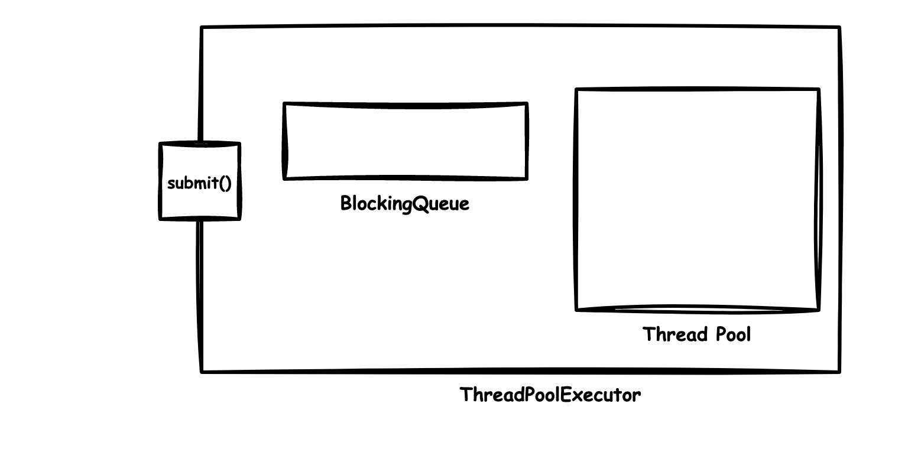
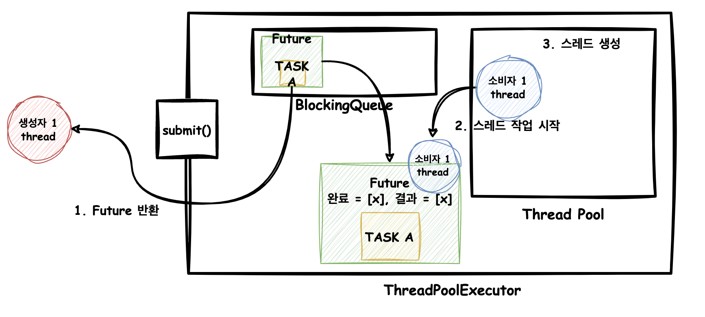
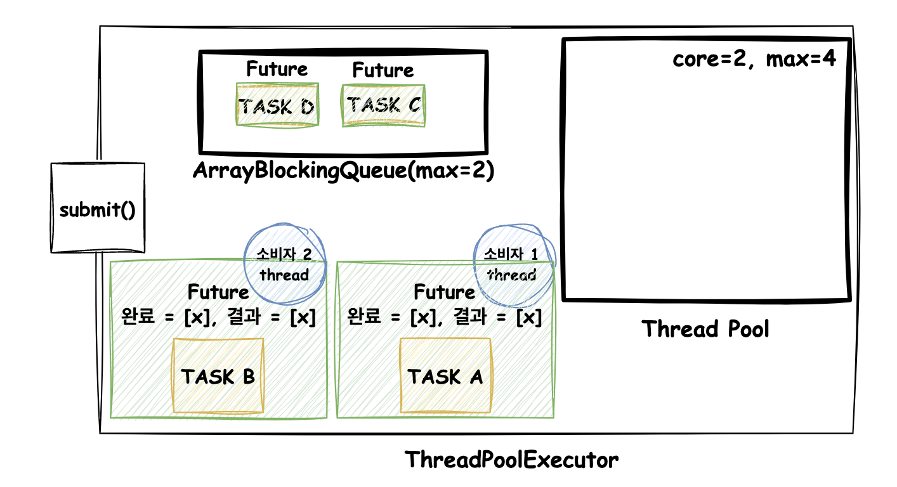
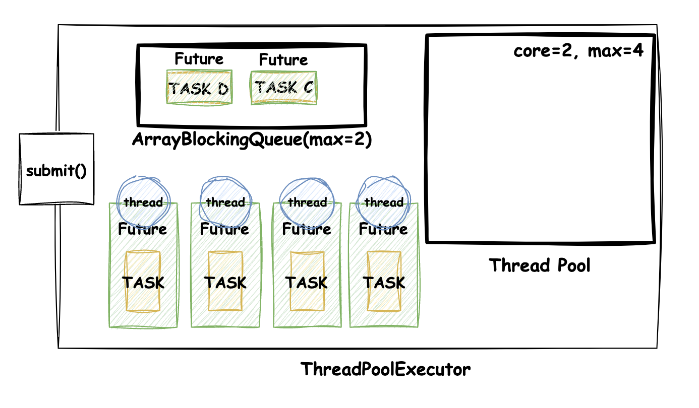
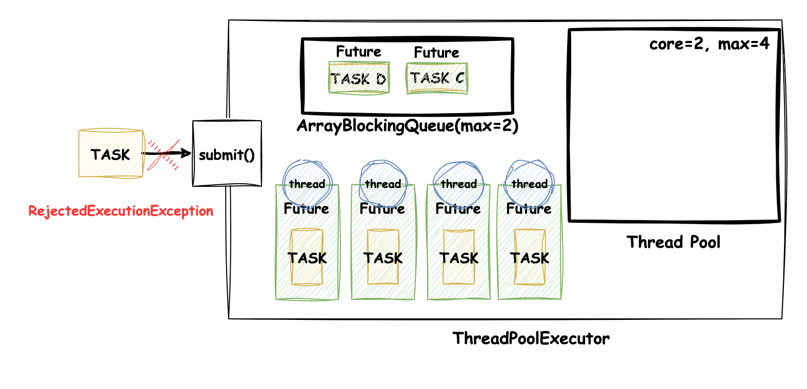

## 스레드를 직접 구현해서 사용할 때 문제점

1. **스레드 생성 비용으로 인한 성능 문제** : 스레드 생성하는 작업은 시스템 콜을 통해 처리되며, 이는 OS 커널 레벨에서 메모리 할당등이 일어나기 때문에 성능이 느립니다. 
                                    또한, 새로운 스레드가 생성되면 운영체제의 스케줄러는 이 스레드를 관리하고 실행 순서를 조정해야하기 때문에 추가적인 오버헤드가 발생합니다.
2. **스레드 관리 문제** : 서버의 CPU, 메모리 자원은 한정되어 있기 때문에 스레드를 무한하게 만들 수 없습니다. 따라서 우리 시스템이 버틸 수 있는 최대 스레드의 수까지만 스레드를 생성할 수 있게 관리해야 합니다.
                     
    또한, 애플리케이션을 종료할 때, 안전한 종료를 위해 스레드의 남은 작업을 모두 수행하고 프로그램을 종료하거나 급하게 인터럽트를 걸어 강제종료시키는 등을 하기 위해서는 스레드의 관리가 있어야 가능합니다.
3. **Runnable 인터페이스 불편함** : run() 메소드는 반환 값을 가지지 않습니다. 따라서 실행결과를 바로 받아볼 수 없기 때문에 인스턴스 변수등에 값을 저장한다음 받아야합니다. 또한, 체크 예외를 던질 수 없기 때문에 체크예외를 run 메소드 내부에서 처리해야 합니다.

## Executor 프레임워크가 생긴 이유

Executor 프레임워크는 앞서 말한 문제점을 모두 해결할 수 있습니다.

1. **스레드 풀** 개념으로 스레드를 `WAITING`상태로 두었다가 작업 요청이 오면 `RUNNABLE` 상태로 바꿔 수행하고 수행이 끝나면 스레드를 보관합니다.
2. 따라서 스레드 풀은 **스레드의 생성 시간을 절약할 수 있으며, 스레드를 관리**할 수 있습니다.
3. 작업요청을 생산자 스레드, 스레드 풀에 있는 스레드가 소비자 스레드라 생각하면 **생산자-소비자 문제를 해결**합니다. 
4. **Runnable 문제**를 해결합니다. 

## Executor

보통 `ExecutorService` 인터페이스를, 구현체로는 `ThreadPoolExecutor`를 사용합니다.

### ThreadPoolExecutor 생성자

- `corePoolSize` : 스레드 풀에서 관리되는 기본 스레드의 수
- `maximumPoolSize` : 스레드 풀에서 관리되는 최대 스레드 수
- `keepAliveTime` , `TimeUnit unit` : 기본 스레드 수를 초과해서 만들어진 스레드가 생존할 수 있는 대기 시간입니다. 이 시간 동안 처리할 작업이 없다면 초과 스레드는 제거 
- `BlockingQueue workQueue` : 작업을 보관할 블로킹 큐

```java
ExecutorService es = new ThreadPoolExecutor(2,2,0,TimeUnit.MILLISECONDS, new LinkedBlockingQueue<>());
```

풀에서 사용되는 스레드의 수를 2개로 고정하고, 생존 시간은 0으로 어차피 고정된 스레드가 2개이니 생존시간이 필요없습니다. 

작업을 보관할 블로킹 큐의 구현체는 `LinkedBlockingQueue`로 작업을 무한대로 저장할 수 있으며, 생산자-소비자 문제를 해결하기 위해 사용됩니다.

### Callable vs Runnable

```java
 public interface Runnable {
     void run();
}
```

`Runnable` 인터페이스는 반환타입이 void라서 값을 반환할 수 없습니다. 또한, 예외가 선언되어 있지 않아 해당 인터페이스를 구현하는 모든 메소드는 체크예외를 던질 수 없습니다.

```java
public interface Callable<V> {
     V call() throws Exception;
}
```

`java.util.concurrent`에서 제공되는 기능이며, Callable의 call()은 반환타입이 제네릭 V라서 어떤 객체든 반환할 수 있습니다.

`throws Exception` 예외가 선언되어 있기 때문에 해당 인터페이스를 구현한 메소드는 체크 예외인 `Exception`과 그 하위 예외를 모두 던질 수 있습니다. 


### 활용 예시

```java
public class ExecutorMain {
    public static void main(String[] args) throws ExecutionException,
        InterruptedException {
        
        //ExecutorService es = new ThreadPoolExecutor(2, 2, 0, TimeUnit.MILLISECONDS, new LinkedBlockingQueue<>());
        
        ExecutorService es = Executors.newFixedThreadPool(2); // 위와 같은 객체지만 유틸리티 클래스 입니다.
        Future<Integer> future = es.submit(new CallableTask());
        Integer result = future.get();
        
        es.close();
    }

    static class CallableTask implements Callable<Integer> {
        @Override
        public Integer call() {
            //
        }
    }
}
```

```java
Future<Integer> future = es.submit(new CallableTask());
```

- `submit` 호출로 CallableTask의 인스턴스를 전달합니다.
- 이때 submit은 call()이 반환하는 Integer 대신에 **Future 객체**를 반환합니다.
- call 메소드는 스레드 풀의 다른 스레드가 실행하기 때문에 언제 실행이 완료되어서 결과를 반환할 지 알 수 없습니다. 
- 따라서 결과를 즉시 받는 것이 불가능합니다. 이런 이유로 `submit`은 CallableTask의 결과를 받는 대신에 Future 객체를 제공합니다.
- submit은 논블로킹 메소드입니다. 따라서 submit을 호출한 main 스레드는 바로 다음 줄을 진행합니다.  
- Future 객체는 전달한 작업의 미래를 뜻하며, 이 객체를 통해 전달한 작업의 결과를 받을 수 있습니다.

### 실행 과정

**[1]** 작업이 전달되기 전, 스레드 풀은 스레드를 미리 생성하지 않고 비워져 있습니다.



**[2]** 요청 스레드는 TASK A(Callable 구현체)를 전달하면 `ExecutorService`는 Future 객체(FutureTask가 구현체)를 생성합니다. 

그리고 생성한 Future 객체 안에 TASK A 인스턴스를 보관하고, 작업 완료 여부와 작업의 결과 값을 가집니다. 그리고나서 블로킹 큐에 담습니다.


**[3]** 블로킹 큐에 담겨진 Future 객체 참조를 즉시 반환합니다. 이때 반환받은 스레드는 논블로킹 메소드(submit)라 다음 줄로 넘어갑니다. 

스레드풀에 있던 스레드는 Future 객체를 큐에서 꺼내어서 `FutureTask`의 run 메소드를 수행합니다.
**run 메소드는 TASK A의 call() 메소드를 수행**합니다. 


**[4]** 요청 스레드는 필요할 때 `future.get()`을 호출해서 TASK A의 작업을 받을 수 있습니다. 

Future 상태가 아직 완료가 아니면 Future가 완료 상태가 될 때까지 대기합니다. 이때 요청 스레드의 상태는 `RUNNABLE`에서 `WAITING`로 바뀝니다.

**이처럼 다른 스레드의 작업이 완료될 때까지 블록(대기)되어 다른 작업을 수행할 수 없는 것을 블로킹이라 부릅니다.**


**[5]** 작업이 완료되면 결과를 Future에 담고 Future 상태를 완료로 변경한다음, 요청 스레드에 반환하며 깨웁니다. (`WAITING` -> `RUNNABLE`)

작업을 마친 스레드는 스레드 풀로 반환됩니다. 

### Future가 필요한 이유

Future를 반환하지 않고 바로 결과를 받으려고 하면, 작업이 끝날 때까지 요청 스레드는 대기해야 합니다.

그래서 이 결과가 필요할 시점에 대기해서 받을 수 있도록 논블로킹 메소드인 submit을 사용하여 Future 객체를 반환받고 다른 작업을 수행하다가 
필요할 때 요청할 수 있도록 했습니다.

보통 여러 작업을 스레드에 전달할때 효과적입니다.

```java
Future<Integer> future1 = es.submit(task1);
Future<Integer> future2 = es.submit(task2);
Integer sum1 = future1.get();
Integer sum2 = future2.get();
```

task1을 수행하고 결과를 받고, task2를 수행하고 결과를 받는 순차적인 처리 방식보다 이렇게 **task1과 task2 작업을 일단 전달하면 스레드풀에 대기하고 있던 스레드들이 병렬적으로 실행하면** 
실행 속도가 2배 더 빠릅니다.

### ExecutorService 종료 메소드

서비기능을 업데이트 하기위해 애플리케이션을 재시작해야 한다면, 작업중인 스레드를 안전하게 종료시켜야 합니다.  

- `void shutdown()` : 새로운 작업을 받지 않고, 이미 제출된 작업을 모두 완료한 후, 종료합니다. + 논블로킹 메소드
- `List<Runnable> shutdownNow()` : 실행 중인 작업을 중단하고, 대기 중인 작업을 반환하며 즉시 종료합니다. 실행중인 작업을 중단하기 위해 인터럽트를 발생시킵니다 + 논블로킹 메소드
- `boolean isShutdown()` : ExecutorService가 종료되었는 지 확인합니다.
- `boolean isTerminated()` : `shutdown` , `shutdownNow()` 호출 후, 모든 작업이 완료되었는지 확인합니다.
- `boolean awaitTermination(long timeout, TimeUnit unit) throws InterruptedException` : 서비스 종료시 모든 작업이 완료될 때까지 대기합니다. 이때 지정된 시간까지만 대기합니다. + 블로킹 메서드
- `close()` : 자바 19부터 지원하며, shutdown() 을 먼저 호출하고, 하루를 기다려도 작업이 완료되지 않으면 `shutdownNow()`을 호출합니다. 

### 우아하게 종료하기

`shutdown()`은 모든 작업을 처리하고 서비스를 종료하지만, 갑자기 요청이 너무 많이 들어와서 큐에 대기중인 작업이 너무 많거나 버그가 생겨, 작업이 멈추지 않는다면 종료되지않는 문제가 발생합니다.

이럴때 60초까지는 작업을 다 처리할 수 있게 기다리고, 60초 후에는 무언가 문제가 있다고 가정하여 `shutdownNow()`을 호출해서 작업들을 강제로 종료하는 방법이 있습니다.

`close()`가 이 매커니즘이지만, 하루를 기다리는 단점이 있습니다. 직접 구현하는 것이 `ExecutorService` 공식 API 문서에서 제안하는 방식 입니다.

```java
public class ExecutorShutdownMain {
    public static void main(String[] args) throws InterruptedException {
        ExecutorService es = Executors.newFixedThreadPool(2);
        es.execute(new RunnableTask("taskA"));
        es.execute(new RunnableTask("taskB"));
        es.execute(new RunnableTask("taskC"));
        es.execute(new RunnableTask("longTask", 100_000)); // 100초 대기 

        System.out.println("== shutdown 시작 ==");
        shutdownAndAwaitTermination(es);
        System.out.println("== shutdown 완료 ==");
    }
    
    static void shutdownAndAwaitTermination(ExecutorService es) { 
        
        es.shutdown(); // non-blocking, 새로운 작업을 받지 않는다. 처리 중이거나, 큐에 이미대기중인 작업은 처리한다. 이후에 풀의 스레드를 종료한다. 
        try {
            // 이미 대기중인 작업들을 모두 완료할 때 까지 10초 기다린다. 
            System.out.println("서비스 정상 종료 시도");
            if (!es.awaitTermination(10, TimeUnit.SECONDS)) {
                
                // 정상 종료가 너무 오래 걸리면...
                System.out.println("서비스 정상 종료 실패 -> 강제 종료 시도"); 
                es.shutdownNow();
                
                // 작업이 취소될 때 까지 대기한다, while문 과 같이 무한반복이 일어나면 종료되지 않을 경우가 있다.
                if (!es.awaitTermination(10, TimeUnit.SECONDS)) {
                    log("서비스가 종료되지 않았습니다."); 
                }
            }
        } catch (InterruptedException ex) {
            // awaitTermination()으로 대기중인 현재 스레드가 인터럽트 될 수 있다.
            es.shutdownNow();
        }
    } 
}

```

## Executor 스레드 풀 관리

ThreadPoolExecutor 생성자에는 `corePoolSize`와 `maximumPoolSize`이 있습니다.

**[1]** 초기 상태에는 스레드 풀에는 스레드가 전혀 없습니다. 이때 작업의 요청이 일어나면, 초기 스레드 숫자까지만 스레드를 생성합니다.


**[2]** 그후에 들어오는 작업은 `BlockingQueue`에 저장합니다. 만약 `LinkedBlockingQueue`이면 무제한으로 저장할 수 있기 때문에 더이상 스레드의 생성은 일어나지 않습니다.

만약 `LinkedBlockingQueue`가 아닌 `ArrayBlockingQueue`와 같이 큐의 사이즈가 정해졌다면 그만큼 작업을 받습니다.




**[3]** 작업이 여기서 더 들어오면 그때부터 `maximumPoolSize` 크기가 될때까지 스레드의 숫자를 늘립니다.



**[4]** 이후에 `mazimumPoolSize`크기도 도달하고 더 작업이 들어오려고 하면 이때는 `RejectedExecutionException`예외가 발생합니다.



**[5]** 작업들을 마친 스레드는 스레드 풀에 반환되고 스레드풀에서 `keepAliveTime`이 넘어간 초과 스레드들은 스레드풀에서 제거됩니다.


### Executor 전략 - 고정 풀 전략

`newFixedThreadPool(nThreads)`

- 스레드 풀에 `nThreads` 만큼의 기본 스레드를 생성합니다. 초과 스레드는 생성하지 않습니다.
- 큐 사이즈에 제한이 없다. ( `LinkedBlockingQueue` )
- 스레드 수가 고정되어 있기 때문에 CPU, 메모리 리소스가 어느정도 예측 가능한 안정적인 방식입니다.

### Executor 전략 - 캐시 풀 전략

`newCachedThreadPool()`

- 기본 스레드를 사용하지 않고, 60초 생존 주기를 가진 초과 스레드만 사용한다. 
- 초과 스레드의 수는 제한이 없다. 
- 큐에 작업을 저장하지 않는다. ( `SynchronousQueue` )
- 대신에 생산자의 요청을 스레드 풀의 소비자 스레드가 직접 받아서 바로 처리한다. 
- 모든 요청이 대기하지 않고 스레드가 바로바로 처리한다. 따라서 빠른 처리가 가능하다.

### Executor 전략 - 사용자 정의 풀 전략

말 그대로 사용자가 스레드 수를 정합니다. 여기서 자주 하는 실수는 

```java
 new ThreadPoolExecutor(100, 200, 60, TimeUnit.SECONDS, new LinkedBlockingQueue());
```

다음과 같이 설정하면 블로킹큐가 무한대로 저장이 가능하기 때문에 초과 스레드 100개가 절대 생기지 않습니다.


## Reference

[김영한의 실전 자바 - 고급 1편, 멀티스레드와 동시성](https://inf.run/DqqWF)


