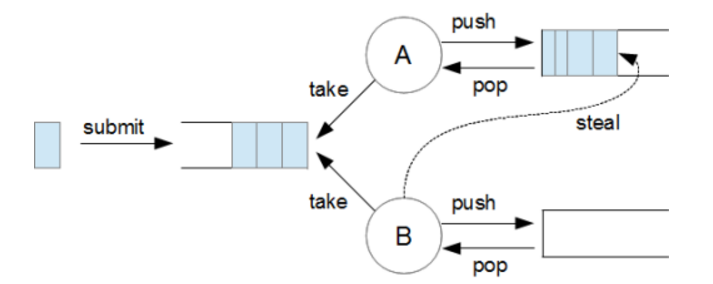
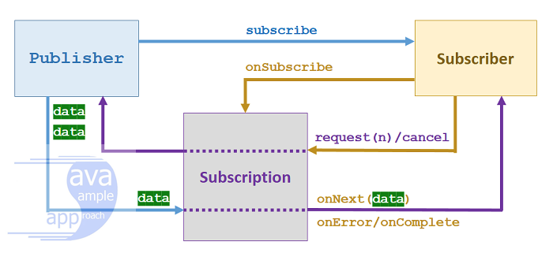

## 1. 동기 & 비동기 & 블로킹 & 논블로킹

동기와 비동기는 호출되는 함수의 작업 완료 여부를 누가 신경쓰냐에 대한 관점입니다.

**동기는 호출하는 함수가 호출된 함수의 작업 완료를 신경**씁니다. 이는 작업의 순차적 실행을 보장합니다.
**비동기는 호출된 함수만이 작업 완료를 신경**씁니다. 이를 통해 다른 작업들이 병렬적으로 실행될 수 있습니다.

블로킹과 논블로킹은 호출되는 함수가 바로 리턴이 되는 지 안되는 지 관심이 있습니다.

**블로킹은 자신의 작업을 진행하다가 호출된 함수의 작업이 시작되면 그 작업이 끝날 때까지 기다렸다가** 자신의 작업을 시작합니다.
반면, **논블로킹은 호출한 함수가 호출된 함수의 작업과 관련없이** 자신의 작업을 하는 것을 말합니다.

### 2. 동기,비동기,블로킹,논블로킹의 조합을 설명해주세요

**블로킹+동기:** 다른 함수가 작업이 끝날때까지 기다리고 결과를 반환하면 그 결과를 토대로 자신의 다음 작업을 시작합니다.

**e.g.** 자바에서 Scanner 처럼 입력요청을 할 때 본인 다음 작업이 수행되지않고 입력하면 그때서야 결과를 받고 처리

**논블로킹+동기:** 다른 작업이 있어도 자신의 작업을 실행합니다. 그런데 동기는 결과에 관심이 있기때문에 중간마다 계속 물어봅니다.

**e.g.** 게임로딩창 (백그라운드에서 게임 로딩중. 그러나 화면 UI에서는 로딩창을 보여줌. 그러면서 계속 뒤에선 다 로드됐는지 물어보고 로드됐으면 결과를 가져오고 다음 거 실행)

**블로킹+비동기**: 다른함수가 끝날때까지 기다렸는데 그 결과를 호출한 함수가 다음 작업을 실행하는데 필요한 결과가 아니라서 아무때나 그 결과에 대해 처리할 수 있습니다. 즉, 결과가 본인의 다음작업에 의존되지 않기때문에 기다릴 필요도 없는것 입니다. 

**e.g.** 보통 개발자의 실수나 자바스크립트에서 비동기함수를 사용했는데 내부에서 DB에 쿼리를 요청하면서 블로킹이 생긴경우

**논블로킹+비동기**: 다른 작업이 시작되어도 본인 작업을 수행합니다. 예를들어 콜백함수도 같이 전달하여 처리하거나 결과가 오면 언젠간 필요할때 그 결과를 처리합니다.

### 참고

https://cornswrold.tistory.com/507

## 3. 쓰레드 start 내부구조에 대해 설명해주세요

```java
public void start() {
    synchronized (this) {
        // zero status corresponds to state "NEW".
        if (holder.threadStatus != 0)
            throw new IllegalThreadStateException();
        start0();
    }
}
```

1. 먼저, synchronized 키워드를 사용해 start 메소드를 동기화 합니다.
2. 그 다음, 스레드 상태를 확인합니다. NEW 상태인지 확인하고 아니면 예외처리를 합니다.
3. NEW 상태인지 확인되면, start0 라는 네이티브 메소드를 호출합니다. 그리고 JVM은 각 머신 OS에 대한 커널 스레드를 만들어 실행합니다. 
4. 이 생성된 커널스레드는 JVM의 스레드와 매핑되어 실행되고 해당 스레드에 스택이 할당된다음, run() 메소드를 호출해 해당 스택에 스택프레임 형태로 쌓입니다. 

## 4. 스레드 풀의 문제점은 무엇인가요?

교착 상태가 일어나거나, 스레드 누수나 리소스 스레싱이 발생할 수 있습니다.

### 5. 교착 상태는 어떻게 발생하며, 이를 어떻게 방지할 수 있나요?

스레드풀이 제한된 수의 스레드를 가지고 있고, 작업A가 작업B의 결과를 기다리고 있는데, 모든 스레드가 사용중이라 B를 실행할 여유 스레드가 없으면, 데드락이 발생할 수 있습니다.

**e.g.** 스레드 풀에 스레드가 하나이고, 작업 A가 스레드를 점유하고 있을 때 작업 B를 요청하면 무한 대기

해결하기 위해 작업 타임아웃을 설정하거나 스레드풀 크기를 적절히 조정하거나 작업 간 우선순위를 부여하면 해당 위험을 방지할 수 있습니다.

### 참고

https://asznajder.github.io/thread-pool-induced-deadlocks/

### 6. 리소스 스레싱이 무엇이며 어떻게 해결하나요?

스레드 풀에 스레드 개수가 너무 많아 각자 CPU 시간을 갖는 시간이 짧아지게 되고, 이는 잦은 컨텍스트 스위칭이 발생하여 전체적인 성능이 저하됩니다. 

역시, 적절한 스레드 개수를 설정해야 합니다.

### 7. 스레드 풀의 적정 개수를 어떻게 계산하나요?

`스레드 풀 적정 크기 = cpu 코어 개수 * (1 / 처리하고 싶은 요청의 전체 처리 시간 대비 cpu를 사용하는 시간)`

하지만 이건 core size를 정할 때고 maximum을 정하기 어렵습니다. 왜냐하면 사용자 요청에 따라 적정개수가 다르기 때문입니다.

### 8. 스레드 풀을 사용하지 않는 경우의 단점은 무엇인가요?

작업이 요청될 때마다 새로운 스레드를 생성하고 소멸시켜야 하므로 생성,소멸에 따른 오버헤드가 발생합니다. 이러면 CPU, 메모리 사용 증가로 전체적인 성능이 저하됩니다.

또한, 스레드의 생성과 해제 관리를 직접해야하고 스레드 개수도 직접 조절해야합니다.

쓰레드 풀을 사용하면 동시에 처리할 수 있는 작업의 개수를 제한할 수 있습니다. 즉, 쓰레드 풀의 크기를 조절하여 시스템 부하를 조절하고, 과도한 작업요청으로 인한 성능 저하를 방지할 수 있습니다.

## 9. 스레드 풀의 종류?

ExecutorService의 구현체인 `forkJoinPool과` `ThreadPoolExecutor의` 두가지 유형 스레드풀이 있습니다.

### 10. 포크조인 풀의 기본 구조와 동작 방식을 설명해주세요

먼저 구조를 보면, 포크조인 풀은 여러 개의 작업자 스레드로 구성됩니다. 각 작업자 스레드는 자신만의 덱(deque)을 가지고 있습니다. 이 덱에는 해당 스레드가 처리할 작업들이 저장됩니다.

동작 방식을 살펴보면, 큰 작업이 풀에 제출되면 스레드에서 이 작업을 가져가고 **재귀적으로 더 작은 하위 작업들로 분할합니다. 이를 '포크'** 라고 합니다. 

작업자 스레드는 모든 하위 작업이 완료되면, **그 결과들을 합쳐서 최종 결과를 만듭니다. 이 과정을 '조인'** 이라고 합니다.

포크조인 풀의 핵심 특징 중 하나는 **작업 훔치기(work stealing) 알고리즘**입니다. 만약 어떤 스레드가 자신의 덱에 있는 모든 작업을 처리하고 할 일이 없어지면, 다른 바쁜 스레드의 덱에서 작업을 가져와 처리합니다. 이를 통해 전체적인 작업 부하가 균형을 이루게 됩니다.

이러한 방식으로 포크조인 풀은 대규모 작업을 효율적으로 병렬 처리할 수 있게 해줍니다. 특히 재귀적으로 나눌 수 있는 작업, 예를 들어 대규모 데이터 처리나 복잡한 계산 작업 등에 매우 효과적입니다.



### 11. RecursiveTask의 구조

`RecursiveTask(리턴이 있는것)`나 `RecursiveAction(리턴이 없는것)`을 상속받은 작업 클래스는 추상메서드 compute()를 정의합니다.

compute 에서는 적절한 임계값을 선택하고, 작업을 분할하는 방법을 정의하고, 작업을 수행하는 방법을 정의해야 합니다.

**예시**

```java
public class ArraySumTask extends RecursiveTask<Long> {
    private static final int THRESHOLD = 1000;
    private final long[] array;
    private final int start;
    private final int end;

    public ArraySumTask(long[] array, int start, int end) {
        this.array = array;
        this.start = start;
        this.end = end;
    }

    @Override
    protected Long compute() {
        if (end - start <= THRESHOLD) {
            // 기본 케이스: 배열 크기가 임계값 이하면 직접 계산
            return computeDirectly();
        } else {
            // 재귀 케이스: 배열을 두 부분으로 나누어 병렬 처리
            int middle = start + (end - start) / 2;
            ArraySumTask leftTask = new ArraySumTask(array, start, middle);
            ArraySumTask rightTask = new ArraySumTask(array, middle, end);

            leftTask.fork(); // 왼쪽 작업을 비동기적으로 실행
            long rightResult = rightTask.compute(); // 오른쪽 작업을 현재 스레드에서 실행
            long leftResult = leftTask.join(); // 왼쪽 작업의 결과를 기다림

            return leftResult + rightResult;
        }
    }

    private long computeDirectly() {
        long sum = 0;
        for (int i = start; i < end; i++) {
            sum += array[i];
        }
        return sum;
    }

    public static void main(String[] args) {
        long[] array = new long[100000000]; // 1억 개의 요소
        Arrays.fill(array, 1); // 모든 요소를 1로 초기화

        ForkJoinPool forkJoinPool = new ForkJoinPool();
        ArraySumTask task = new ArraySumTask(array, 0, array.length);
        long result = forkJoinPool.invoke(task);

        System.out.println("Sum: " + result);
    }
}
```

### 참고

https://bigdown.tistory.com/721

https://hamait.tistory.com/612

### 12. Executors 전략

`newFixedThreadPool(nThreads)`

- 스레드 풀에 **`nThreads`** 만큼의 기본 스레드를 생성합니다. 초과 스레드는 생성하지 않습니다.
- 큐 사이즈에 제한이 없습니다. ( **`LinkedBlockingQueue`** )
- 스레드 수가 고정되어 있기 때문에 CPU, 메모리 리소스가 어느정도 예측 가능한 안정적인 방식입니다.

**`newCachedThreadPool()`**

- 기본 스레드를 사용하지 않고, 60초 생존 주기를 가진 초과 스레드만 사용합니다.
- 초과 스레드의 수는 제한이 없습니다.
- 큐에 작업을 저장하지 않습니다. ( **`SynchronousQueue`** )
- 대신에 생산자의 요청을 스레드 풀의 소비자 스레드가 직접 받아서 바로 처리합니다.
- 사용자 트래픽 예측이 어려울 때 사용합니다.

`newScheduledThreadPool`

- 일정 주기마다 스레드로 작업 실행합니다.

`newSingleThreadExecutor`

- 스레드 풀에 스레드가 단 한개이며, 테스트 용도로 보통 사용합니다.

## 13. 스레드가 공유하는 메모리영역

1. 코드영역: 코드가 있는 영역, read-only이며 동시성관리 필요가 없습니다.
2. 데이터영역: 초기화된 영역에서 상수(static final, final)나 문자열 리터럴은 read-only이고,
   초기값이 있는 전역 변수나 정적 변수, BSS 영역에 있는 초기값이 없는 변수들은 read-write이므로 값 변경이 가능하므로 동기화 필요합니다.
3. 스택영역: 스레드마다 부여되기때문에 공유하지 않습니다. 따라서 동기화필요가 없습니다.
4. 힙영역: 스레드들이 공유하는 영역, read-write 이기 때문에 동기화필요가 없습니다.

## 14. Executor, ExcutorService, Executors, Future 에 대해 아는 대로 설명해주세요

### Executor

Executor 인터페이스는 `execute()` 메소드 하나만 가지고 있고, Runnable 인스턴스를 실행시키기위한 메소드 입니다.

메소드 : `execute()`

### ExecutorService

ExecutorService 인터페이스는 하나 이상의 비동기 작업의 진행상황을 추적하기 위해 Future를 생성할 수 있는 메서드와 종료를 관리하는 메서드를 제공합니다.

**실행 메소드** 

`invokeAll` , `invoke` , `submit` , `invokeAny`

**종료 메소드**

- **`void shutdown()`** : 새로운 작업을 받지 않고, 이미 제출된 작업을 모두 완료한 후, 종료합니다. + 논블로킹 메소드
- **`List<Runnable> shutdownNow()`** : 실행 중인 작업을 중단하고, 대기 중인 작업을 반환하며 즉시 종료합니다. 실행중인 작업을 중단하기 위해 인터럽트를 발생시킵니다 + 논블로킹 메소드
- **`boolean isShutdown()`** : ExecutorService가 종료되었는 지 확인합니다.
- **`boolean isTerminated()`** : **`shutdown`** , **`shutdownNow()`** 호출 후, 모든 작업이 완료되었는지 확인합니다.
- **`boolean awaitTermination(long timeout, TimeUnit unit) throws InterruptedException`** : 서비스 종료시 모든 작업이 완료될 때까지 대기합니다. 이때 지정된 시간까지만 대기합니다. + 블로킹 메서드
- **`close()`** : 자바 19부터 지원하며, shutdown() 을 먼저 호출하고, 하루를 기다려도 작업이 완료되지 않으면 **`shutdownNow()`**을 호출합니다.

### Executors

Executors 클래스는 유용한 구성 설정을 사용하여 `ExecutorService`의 구현인 다양한 형태의 쓰레드 풀을 제공합니다. 예를들어, 고정 쓰레드 풀, 캐시 풀을 반환합니다.

메소드 : `callable(Runnable task, T result)` `defaultThreadFactory()`, `newFixedThreadPool` , `newCachedThreadPool`  `newSingleThreadExecutor`

### Future

Future 클래스는 비동기 작업의 결과를 담습니다. 

메소드: `cancel`, `isCancelled()`, `isDone()`, `get()`

스레드 풀의 스레드에서 수행하던 작업이 예외를 반환하면, Future 객체가 `ExecutionException` 로 예외를 감싸 get() 요청할때 반환합니다.

### 15. Future 불편한 점 

- 여러 Future를 쉽게 연결하거나 조합할 수 없습니다.
- `get()` 메서드는 결과를 기다리는 동안 스레드를 블로킹합니다.
- 예외 처리를 하기 불편합니다.
- 콜백 지원 부재: 작업 완료 시 자동으로 다음 작업을 트리거하는 메커니즘이 없습니다. 따라서 isDone과 같은 메소드로 계속 확인하는 동기 작업을 해야합니다.
- CompletableFuture는 이러한 한계를 극복하고 더 유연하고 강력한 비동기 프로그래밍을 가능하게 합니다

## 16. 컴플리터블 퓨처는 어떤 문제를 해결했나요?

Future 인터페이스는 여러 연산을 결합하기 어렵고, 비동기 처리 중에 발생하는 예외를 처리하기 어려운 문제가 있었는데, 
CompletableFuture 클래스는 이 문제들을 개선하기 위해 생겼습니다.

### 17. 컴플리터블 퓨처와 퓨처 인터페이스의 차이점은 무엇인가요?

CompletableFuture은 Future 인터페이스와 CompleteStage 인터페이스를 구현합니다.

Future 인터페이스는 비동기 연산을 위해 추가된 인터페이스이고,
CompleteStage 인터페이스는 여러 연산이 결합될 수 있도록 하고, 연산이 완료되면 다음 단계의 작업을 수행하게 체이닝 메소드를 제공한 인터페이스 입니다.

### 18. 컴플리터블 퓨처의 주요 메서드를 설명해주세요.

**비동기 작업 실행 함수들**

- `runAsync`
   - 반환값이 없는 경우
   - 비동기로 작업 실행 콜
- `supplyAsync`
   - 반환값이 있는 경우
   - 비동기로 작업 실행 콜

둘다 static 함수이며, 인자로 넘겨줄때 사용할 쓰레드 풀을 넣어줄수 있습니다. 기본 쓰레드 풀은 **ForkJoinPool.commonPool()**


**작업 콜백 함수들**

- `thenApply`
   - 비동기 실행이 끝난 후, **반환값을 받아서 다른 값으로 반환**시켜주는 콜백함수. 
   - get() 호출하면 반환값 받습니다.
   - 해당 메소드는 호출된 스레드에서 실행힙니다.
   - 함수형 인터페이스 Function을 파라미터로 받음
- `thenAccept`
   - 함수형 인터페이스 Consumer을 파라미터로 받음
   - 비동기 실행이 끝난 후, **반환 값을 받아 처리하고 값을 반환하지 않는** 콜백함수. 
   - get() 호출하면 null 반환
   - 호출한 스레드에서 실행.
- `thenRun`
   - Runnable을 인자로 받음. 따라서 **반환 값도 안받고 반환하지도 않음** 
   - get() 호출하면 null 반환합니다.
   - 호출한 스레드에서 실행합니다.
   - 다른 작업을 실행

**작업 조합**

- `thenCompose`
   - 두 작업이 이어서 실행하도록 조합하며, 앞서 작업의 결과를 받아서 사용할 수 있습니다.
   - 비동기 작업을 연결합니다.
- **thenApply와 thenCompose 차이점**
   - thenApply()는 단순 변환에 사용됩니다. 결과값을 다른 형태로 변환할 때 적합합니다.
   - thenCompose()는 연속적으로 비동기 작업을 연결할 때 사용됩니다. 이전 작업의 결과를 기반으로 새로운 CompletableFuture를 생성하고 싶을 때 유용합니다.
   - thenApply()도 비동기 작업이 실행 가능하지만, 중첩된 CompletableFuture를 반환해서 결과를 얻기 복잡합니다. 반면, thenCompose는 평탄화된(flatten) CompletableFuture를 반환합니다.
- 이 차이가 바로 중첩/평탄화 차이를 만들어내는 핵심입니다.
   - thenApply()는 함수형 인터페이스 Function을 인자로 받습니다. (T -> U)
   - thenCompose()는 함수형 인터페이스 Function을 인자로 받지만, 반환 타입이 CompletionStage입니다. (T -> CompletionStage\<U>)
- `thenCombine`
   - 두 작업을 독립적으로 실행하고, 둘 다 완료되었을 때 콜백을 실행합니다.
- `allOf`
   - 여러 작업들을 병렬로 실행하고 비동기적으로 작동하면서 논블로킹.
   - CompletableFuture\<Void> 반환합니다
   - 결과값을 얻기위해서 join을 통해 가져옵니다.
   - CompletableFuture 중 하나라도 예외적으로 완료되면 전체 결과도 실패로 간주됩니다.

**join()과 allOf() 차이점**

**1. 오류 처리** 

join으로만 구현하면 CompletableFutures의 결과를 순차적으로 처리한다는 것입니다. 결과적으로 값이 부분적으로 처리될 수 있습니다. 

즉, CompletableFutures 중 하나가 예외를 발생시키면 체인이 끊어지고 처리가 중지됩니다. 어떤 경우에는 이전 요소가 이미 처리되었기 때문에 오류가 발생할 수 있습니다.

```java
CompletableFuture<String> f1 = waitAndReturn(1_000, "Harry");
CompletableFuture<String> f2 = waitAndThrow(1_000);
CompletableFuture<String> f3 = waitAndReturn(1_000, "Ron");

Stream.of(f1, f2, f3)
  .map(CompletableFuture::join)
  .forEach(this::sayHello);
```

반면에 allOf()를 사용하여 세 인스턴스를 결합한 다음 Join() 메서드를 호출하여 일종의 원자성을 달성할 수 있습니다. 
그렇게 하면 모든 요소를 한 번에 처리하거나 전혀 처리하지 않을 수 있습니다.

```java
CompletableFuture.allOf(f1, f2, f3).join();
Stream.of(f1, f2, f3)
  .map(CompletableFuture::join) 
  .forEach(this::sayHello);
```


**2. 논블로킹**

allOf()의 장점 중 하나는 논블로킹 방식으로 흐름을 계속할 수 있다는 것입니다. 
반환 유형이 `CompletableFuture<Void>`이므로 thenAccept()를 사용하여 데이터가 도착할 때 스레드를 차단하지 않고 데이터를 처리할 수 있습니다.

또한, 비동기 세계를 떠나지 않고 CompletableFuture 체인을 계속 유지한다면 오류 처리 및 복구를 위한 자체 메커니즘인 Exceptionly() 메서드를 활용할 수 있습니다. 
예를 들어 CompletableFututres 중 하나가 예외와 함께 완료되면 이를 간단히 기록하고 기본값을 사용하여 흐름을 계속할 수 있습니다.

```java
CompletableFuture<String> names = CompletableFuture.allOf(f1, f2, f3)
  .thenApply(__ -> f1.join() + "," + f2.join() + "," + f3.join())
  .exceptionally(err -> {
      System.out.println("oops, there was a problem! " + err.getMessage());
      return "names not found!";
  });
```

- `anyOf`
  - 가장 빨리 끝난 1개의 작업에 대해서만 콜백 실행

**예외처리 메서드**

- `exeptionally`
  - 발생한 에러를 받아서 예외를 처리합니다.
- `handle, handleAsync`
  - (결과값,에러)를 반환받아 에러가 발생한 경우와 아닌 경우 모두를 처리할 수 있습니다.

### 19. 컴플리터블 퓨처를 사용할 때 주의할 점은 무엇인가요?

- get()이나 join() 메서드는 블로킹 연산이므로 주의해서 사용해야 합니다.
- CompletableFuture는 기본적으로 ForkJoinPool의 commonPool()을 사용 하므로 오래 실행되는 작업은 별도의 Executor를 사용하는 것이 좋습니다.

### 20. ForkJoinPool의 commonPool() 이란

- ForkJoinPool이란?
  - 병렬 처리를 위해 설계된 ExecutorService의 구현체입니다.
  - 작업 훔치기(work-stealing) 알고리즘을 사용하여 효율적으로 작업을 분배합니다.
- commonPool()의 특징:
  - JVM당 하나의 공유된 ForkJoinPool 인스턴스를 제공합니다.
  - Java 8부터 도입되었으며, 많은 병렬 및 비동기 작업에서 기본으로 사용됩니다.
  - 시스템의 가용 프로세서 수에 기반하여 자동으로 크기가 조정됩니다.
- 사용 사례:
  - CompletableFuture의 기본 Executor로 사용됩니다.
  - 병렬 스트림 작업에서 사용됩니다.
  - 명시적인 Executor를 지정하지 않은 비동기 작업에서 사용됩니다.

### 참고

https://www.baeldung.com/java-completablefuture-allof-join

https://mangkyu.tistory.com/263


## 21. 뮤택스, 세마포어 차이 

**세마포어 (Semaphore)**

- 정의: 여러 스레드가 공유 자원에 접근할 수 있는 동시 접근 수를 제한하는 동기화 도구
- 특징:
  1. 카운팅이 가능 (여러 개의 허가를 가질 수 있음)
  2. 여러 스레드가 동시에 접근 가능
  3. 리소스 풀 관리에 유용
- 사용 사례: 데이터베이스 연결 풀, 스레드 풀 관리

**뮤택스 (Mutex)**

- 정의: 상호 배제(Mutual Exclusion)를 보장하는 잠금 메커니즘
- 특징:
  1. 이진 세마포어의 특별한 경우 (허가가 1개)
  2. 한 번에 하나의 스레드만 접근 가능
  3. 소유권 개념이 있음 (잠금을 획득한 스레드만 해제 가능)
- 사용 사례: 임계 영역 보호, 스레드 간 상호 배제 구현

Java에서는 Semaphore 클래스로 세마포어를, ReentrantLock 클래스로 뮤택스와 유사한 기능을 구현합니다.


## 22. concurrnetHashMap 은 어떻게 구현되어 있나요?

`get 메소드`는 synchronized 키워드가 없습니다. 즉, 동기화가 일어나지 않아서 여러 스레드가 동시에 실행할 수 있습니다.

`put 메소드`는 빈 bucket에 노드를 삽입하는 경우엔 **CAS 알고리즘을 사용해 synchronized 없이 노드를 삽입**합니다. 

이미 bucket에 Node가 존재하는 경우엔 **synchronized를 이용해 다른 스레드가 접근하지 못하도록 lock을 걸어 다른 thread의 Node가 같은 hash bucket에 접근을 차단합니다.**

## 23. 락은 어떤 종류가 있나요?

synchronized, atomic에서 쓰는 CAS 알고리즘, 메모리 가시성을 해결하기 위한 volitile, concurrent 계열의 락, 프록시를 도입한 싱크로나이즈 컬렉션, 레디스에서 사용되는 락,
DB 락 등이 있습니다.

### DB 락

- 공유 락(Shared Lock, Read Lock, S-Lock)
  - 데이터의 읽기 작업을 위해 잠금
  - 다른 세션에서 해당 데이터에 공유 락을 걸고 접근 가능하다
  - 다른 세션에서 해당 데이터에 배타 락을 걸고 접근 불가능
  - 예를들어 공유락으로 세션1이 진입하면 세션2가 베타락을 걸고 진입하려할때 블로킹돼서 대기
  - 세션1이 트랜잭션이 끝나고 커밋하거나 롤백하면 세션2진입
- 배타 락(Exclusive Lock, Write Lock, X-Lock)
  - 배타 Lock은 데이터를 변경하는 작업을 위해 잠금
  - 다른 세션에서 해당 데이터에 공유 Lock을 걸고 접근할 수 없다.
  - 다른 세션에서 해당 데이터에 배타 Lock을 걸고 접근할 수 없다.

### 분산 락

분산 환경에서 상호 배제를 구현하여 동시성 문제를 다루기 위해 등장한 방법입니다.

- Redis를 활용하여 분산 락 구현
  - **Redis SETNX 활용**
     - 레디스 서버에 지속적으로 **`SETNX`** 명령을 보내어 임계 영역 진입 여부를 확인하는 매커니즘
     - 스핀락을 활용
     - 스핀 락이란, 락을 사용할 수 있을 때 까지 지속적으로 확인하며 기다리는 방식
     - 스핀 락 방식으로 사용하여, 레디스 서버에 부하를 줄 수 있다.
  - **Redis Message Broker 활용**
  - Redis에서 **`SUBSCRIBE`** 명령으로 특정 채널(channel)을 구독할 수 있으며, **`PUBLISH`** 명령으로 특정 채널에 메시지를 발행할 수 있다.
  - 끊임없이 레디스 서버에 확인하는 스핀 락을 사용하지 않아도 된다.
  - 직접 구현 없이 **Redisson** 라이브러리 사용 가능
- MySQL의 Named Lock을 활용하여 분산 락 구현
  - `GET_LOCK()`과 `RELEASE_LOCK`을 이용하여 분산 락을 구현

### 낙관락,비관락

- 비관락
  - 비관적 락이란 트랜잭션이 시작될 때 Shared Lock 또는 Exclusive Lock을 걸고 시작하는 방법
- 낙관락
  - 디비 수준에서 락을 잡는 것이 아닌 애플리케이션 수준에서 락관리
  - 두개의 요청 중 먼저 수정한 자만 성공하고 나머지 수정 요청은 실패처리
  - 충돌 발생 시 애플리케이션에서 적절한 처리(재시도 등)가 필요
  - 일반적으로 버전 번호나 타임스탬프를 이용해 구현

비관락은 데드락의 위험이 있지만, 낙관락은 이 위험이 없습니다.

### 출처

https://hudi.blog/distributed-lock-with-redis/

## 24. 스레드 상태가 중요한 이유

- 스레드 상태를 모니터링하면 애플리케이션의 성능 병목 현상을 식별할 수 있습니다.
- 예를 들어, 많은 스레드가 'BLOCKED' 상태라면 동기화 문제가 있을 수 있습니다.
- 불필요하게 'RUNNABLE' 상태의 스레드가 많다면 CPU 사용량이 높아질 수 있습니다.
- 여러 스레드가 'BLOCKED' 상태에 머물러 있다면 데드락 상황을 의심해볼 수 있습니다.
- 문제가 발생했을 때 스레드 덤프를 분석하여 각 스레드의 상태를 확인하면 문제의 원인을 찾는 데 도움이 됩니다.

### 25. 스레드 덤프란?

- 장애가 발생했을 때나 기대보다 웹 어플리케이션이 느리게 동작할 때, 우리는 스레드 덤프를 분석해 봐야 합니다.
- Thread dump란 프로세스에 속한 모든 thread들의 상태를 기록. 즉, 스냅샷을 찍은 것
- 간단하게 Thread dump 를 할 수 있는 방법은 jstack 이라는 도구


## 26. Java9 에 나온 Flow 에 대해 설명해주세요

reactive stream 스펙을 채택하여 사용합니다. reactive stream 이란, non-blocking backpressure를 이용하여 비동기 스트림 처리의 표준을 제공합니다.

**Flow의 주요 구성 요소**

```java
public class FlowComponents {
   // 1. Publisher
   public interface Publisher<T> {
       void subscribe(Subscriber<? super T> subscriber);
   }

   // 2. Subscriber
   public interface Subscriber<T> {
       void onSubscribe(Subscription subscription);
       void onNext(T item);
       void onError(Throwable throwable);
       void onComplete();
   }

   // 3. Subscription
   public interface Subscription {
       void request(long n);
       void cancel();
   }

   // 4. Processor
   public interface Processor<T,R> extends Subscriber<T>, Publisher<R> {
   }
}
```

`Publisher<T>`: 데이터를 생성하고 발행하는 소스입니다. subscribe 메서드로 Subscriber를 등록합니다.

`Subscriber<T>`: Publisher로부터 데이터를 받아 처리하는 소비자입니다.

- onSubscribe: 구독 시작 시 호출됩니다.
- onNext: 새 데이터 항목을 받을 때 호출됩니다.
- onError: 에러 발생 시 호출됩니다.
- onComplete: 모든 데이터 처리가 완료되면 호출됩니다.

`Subscription`: Publisher와 Subscriber 간의 연결을 관리합니다.

- request: Subscriber가 처리할 수 있는 데이터의 양을 요청합니다.
- cancel: 구독을 취소합니다.

`Processor<T,R>`: Publisher와 Subscriber 역할을 동시에 수행하는 중간 처리자입니다.



**Flow의 주요 특징**

- 비동기 처리: 데이터를 비동기적으로 처리하여 시스템 자원을 효율적으로 사용합니다.
- 백프레셔(Backpressure): Subscriber가 처리할 수 있는 만큼만 데이터를 요청할 수 있어, 과부하를 방지합니다.
- 확장성: 대량의 데이터 처리에 적합한 확장성을 제공합니다.
- 표준화: Reactive Streams 명세를 Java 표준으로 통합하여 호환성을 보장합니다.


**Flow 동작 순서 예시**

```java
// 1. Publisher 생성
SubmissionPublisher<String> publisher = new SubmissionPublisher<>();

// 2. Subscriber 생성 및 등록
publisher.subscribe(new Flow.Subscriber<>() {
    private Flow.Subscription subscription;

    @Override
    public void onSubscribe(Flow.Subscription subscription) {
        this.subscription = subscription;
        subscription.request(1);  // 최초 1개의 데이터 요청
    }

    @Override
    public void onNext(String item) {
        System.out.println("Received: " + item);
        subscription.request(1);  // 다음 데이터 요청
    }

    // ... 다른 메서드 생략 ...
});

// 3. 데이터 발행
publisher.submit("Hello");    // Subscriber의 onNext 호출됨
publisher.submit("Reactive"); // Subscriber의 onNext 호출됨
publisher.submit("Streams");  // Subscriber의 onNext 호출됨
```