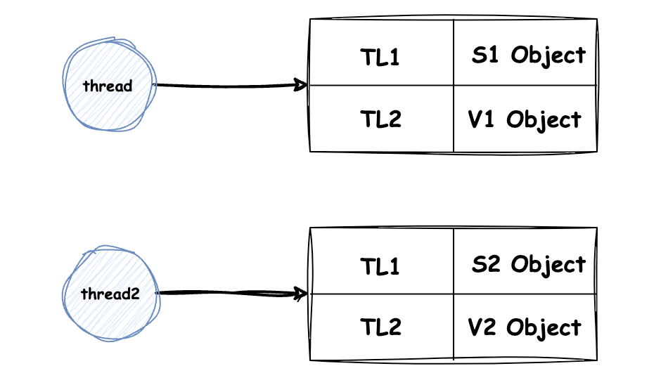

## 스레드로컬이 뭔가요?

`ThreadLocal`은 멀티 스레드 환경에서 각각의 스레드가 별도의 변수를 저장하고 사용할 수 있습니다.

## 스레드 로컬은 어떻게 구현되어 있나요? 단계별로 설명해보세요

### 1단계 구현

`ThreadLocal<T>`를 구현하려고 할 때 `Thread.currentThread()`를 키로 사용하는 `ConcurrentHashMap<Thread,T>`으로 구현할 것 같습니다.

이는 뭔가 잘 작동될 것 같지만 문제가 있습니다.

- `ConcurrentHashMap`은 동시성 문제를 해결하지만 그만큼 **성능저하가** 발생합니다.
- Thread가 완료되어 GC가 가능한 후에도 `ConcurrentHashMap이` 해당 Thread 객체와 값인 객체에 대해 포인터를 유지하고 있으므로 **GC에 의해 정리가 불가능**합니다.


### 2단계 구현

이번에는 `WeakReference`를 사용하여 GC 문제를 해결하겠습니다. 

```java
 Collections.synchronizedMap(new WeakHashMap<Thread, T>())
```

이제 다른 누군가 스레드를 참조하고 있지 않으면 Thread와 값인 객체는 가비지 수집이 될 수 있습니다. 
하지만 여전히 스레드 경합 문제 때문에 성능 저하 문제를 해결할 수 없습니다.

### 3단계 구현

`ThreadLocal`을 구현할 때 스레드를 키로 둔다는 것은 올바른 생각이 아닐 수도 있습니다. 

각 `ThreadLocal` 객체의 키를 Thread로 두는 대신, **각 스레드가 ThreadLocal 객체와 값을 매핑한 것을 저장**하면 이전 구현의 문제를 해결할 수 있습니다.

```java
new WeakHashMap<ThreadLocal,T>()
```

- 각 스레드마다 각자의 Map을 들고 있기 때문에 더이상 동시성 문제가 발생하지 않습니다.



실제 Thread 클래스를 보면 다음과 같이 구현되어 있습니다.

```java
ThreadLocal.ThreadLocalMap threadLocals = null;
```

**앞서 말한 것처럼 Thread에 대해 `ThreadLocal<T> 객체 - T 객체`를 매핑하는 `ThreadLocalMap`을 소유**하고 있습니다. 

`ThreadLocalMap`은 `WeakHashMap`으로 구현되있지는 않지만, 약한 참조로 키를 보유하며, 동일한 매커니즘을 갖고 있습니다.

### ThreadLocal.get()

```java
public T get() {
    Thread t = Thread.currentThread();
    ThreadLocalMap map = getMap(t);
    if (map != null) {
        ThreadLocalMap.Entry e = map.getEntry(this);
        if (e != null) {
            @SuppressWarnings("unchecked")
            T result = (T)e.value;
            return result;
        }
    }
    return setInitialValue();
}
```
현재 수행중인 스레드의 ThreadLocalMap을 꺼내고 ThreadLocal 객체를 키로 넣어 값을 꺼내고 반환합니다. 


### 정리

Java에서 `ThreadLocal`은 내부적으로 `ThreadLocalMap`이라는 내부 클래스를 사용하여 구현됩니다.

각 스레드는 `Thread` 객체 내부에 `ThreadLocalMap`을 가지고 있고, 이 맵은 `ThreadLocal` 객체를 key로 사용하여 값(value)을 저장합니다. 
이를 통해 각 스레드는 자신만의 독립적인 값들을 저장하고 접근할 수 있습니다.

또한, `ThreadLocal` 클래스는 `initialValue()` 메서드를 제공하여 스레드가 해당 `ThreadLocal`에 처음 접근할 때 초기값을 설정할 수 있도록 합니다. 
이를 통해 각 스레드가 최초로 값에 접근했을 때 초기화되는 값을 제공할 수 있습니다.

여기서 중요한 점은 `ThreadLocalMap`이 각 스레드의 내부에 저장되어 있기 때문에 동기화 문제가 발생하지 않고, 각 스레드가 독립적으로 값을 관리할 수 있다는 것입니다.

## 어디에 활용되나요?

스레드 로컬은 사용자 인증 정보, 트랜잭션 컨텍스트 등 스레드별로 독립적으로 유지해야 하는 정보를 저장하는 데 자주 사용됩니다.

예를 들어, 웹 애플리케이션에서 사용자의 요청을 처리하는 각 스레드가 사용자별 세션 정보를 유지해야 할 때 스레드 로컬을 사용할 수 있습니다.

또한, 데이터베이스 트랜잭션 관리에서 현재 트랜잭션의 상태를 스레드별로 관리해야 할 때도 스레드 로컬이 유용하게 사용됩니다.

## 스레드로컬 사용시 주의사항

스레드 풀을 사용하는 환경에서는 스레드 로컬을 사용할 때 스레드가 재사용되기 때문에, 스레드 로컬의 데이터가 의도치 않게 공유될 수 있습니다.

따라서 개발자가 명시적으로 `remove()` 메소드를 호출하여 데이터를 제거해야합니다.


## Reference

https://stackoverflow.com/questions/1202444/how-is-javas-threadlocal-implemented-under-the-hood

https://d2.naver.com/helloworld/329631