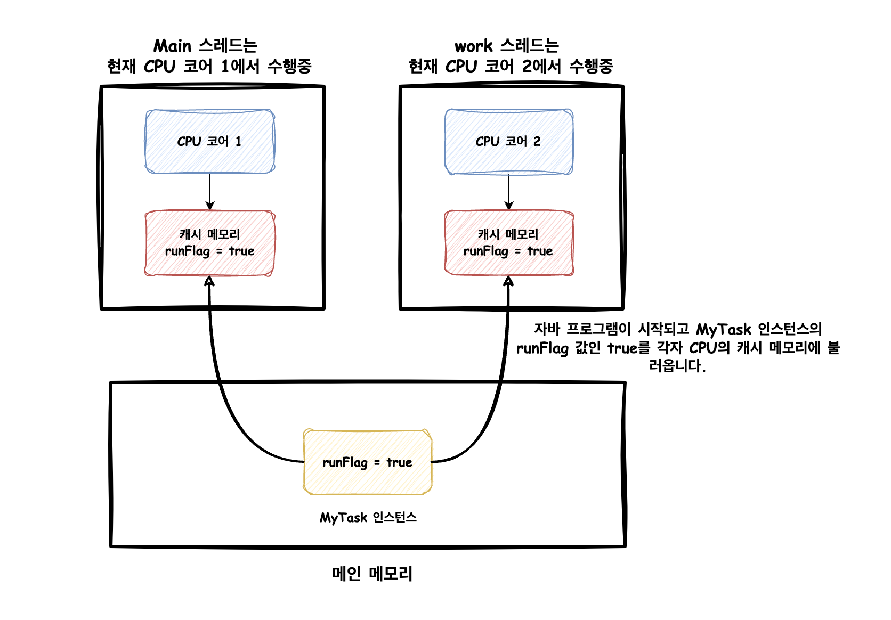
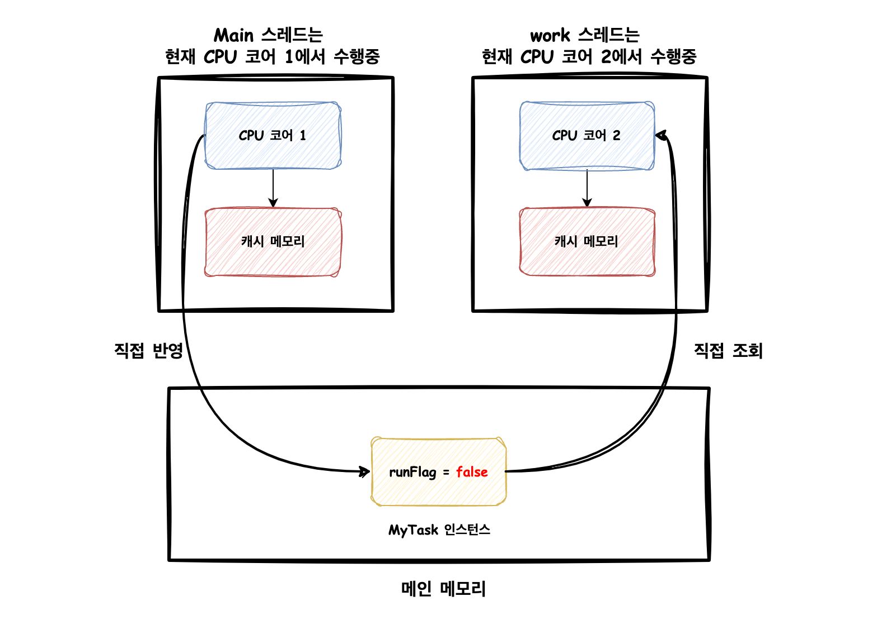
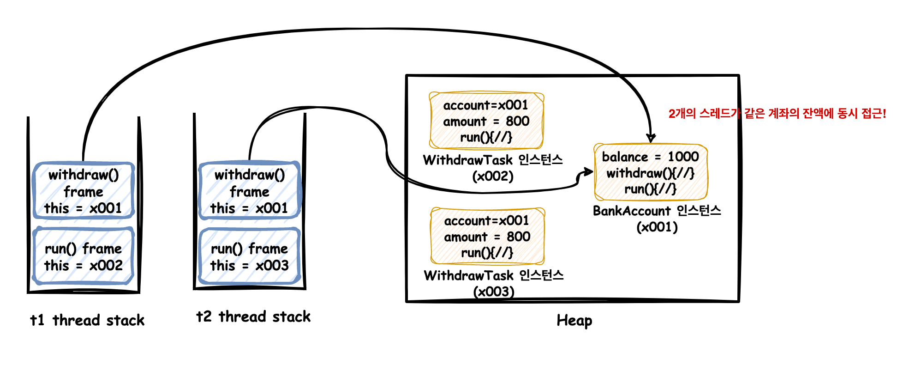
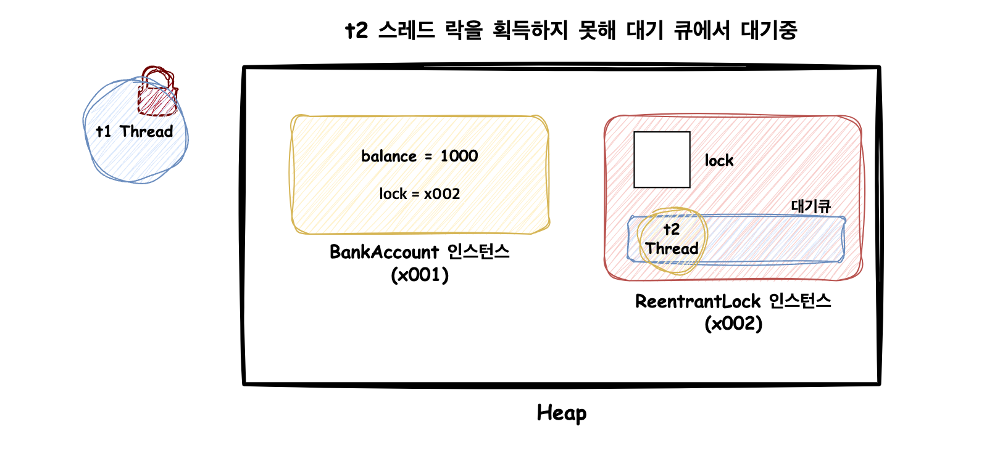

## 메모리 가시성이란

**멀티스레드 환경에서 한 스레드가 변경한 값이 다른 스레드에서 언제 보이는지 알 수 없는 문제를 메모리 가시성(memory visibility)이라 합니다.**

### 문제점 예시 

예를들어, 아래 코드는 메모리 가시성 문제 때문에 work 스레드는 여전히 동작합니다. 
```java
public class VolatileMain{
    public static void main(String[] args) {
        MyTask task = new MyTask();
        Thread t = new Thread(task, "work");
        System.out.println("runFlag = " + task.runFlag);
        t.start();
        sleep(1000);
        System.out.println("runFlag를 false로 변경 시도"); 
        task.runFlag = false; 
        System.out.println("runFlag = " + task.runFlag);
    }
    
    static class MyTask implements Runnable{
        boolean runFlag = true;
        
        @Override
        public void run(){
            System.out.println("task 시작");
            while (runFlag){}
            System.out.println("task 종료");
        }
        
    }
    
}
```

그림으로 나타내면 다음과 같습니다.



`main` 스레드와 `work` 스레드는 각자 CPU에 할당받아 코드를 실행합니다. 이때, 두 개의 스레드 모두 runflag 값을 메인 메모리에서 읽는 순간,
해당 runflag는 CPU 코어 1의 캐시와 CPU 코어 2의 캐시에 할당됩니다.

즉, 이제부터는 `runflag`를 읽을 때 캐시 메모리에서 가져옵니다. 이 문제는 다음과 같은 결과를 초래합니다.


Main 스레드는 `task.runFlag = false;`를 수행하여 캐시 메모리에 있던 runFlag 값을 false로 바꿉니다. 하지만 여전히 work 스레드는 
캐시에 true값이 있기 때문에 while문이 동작됩니다.

여기서 핵심은 캐시 메모리의 runFlag 값만 바뀌고 메인 메모리에 이 값이 즉시 반영되지 않는 것입니다. 그래서 언제 메인 메모리에 반영되는지는
알 수 없고, 메인 메모리에 반영된다고 하더라도 work 스레드가 사용하는 캐시 메모리에도 언제 반영되는 지 알 수가 없습니다.

### 문제점을 해결하기 : volatile

캐시 메모리를 사용하는 것은 CPU 성능에 큰 도움이 됩니다. 메인메모리에서 값을 읽는 것보다 CPU 코어 근처 캐시 메모리를 읽는 것은 큰 성능 향상을 만들어냅니다.

하지만, 성능향상보다는 여러 스레드가 같은 시점에 정확히 같은 데이터를 보는 것, 즉 데이터 정합성이 더 중요할 수도 있습니다. 해결방안은 `volatile`키워드를 통해
값을 읽거나 쓸 때 모두 메인 메모리에 직접 접근하도록 하면 됩니다.

```java
static class MyTask implements Runnable{
    volatile boolean runFlag = true;
    
    @Override
    public void run(){
        System.out.println("task 시작");
        while (runFlag){}
        System.out.println("task 종료");
    }
    
}
```



**정리**

멀티스레드 환경에서 한 스레드가 변경한 값이 다른 스레드에서 언제 보이는지 알 수 없는 문제를 메모리 가시성이라 하는데,
`volatile` 또는 스레드 동기화 기법의 `synchronized, ReentrantLock`을 사용하면 메모리 가시성 문제가 발생하지 않습니다.

## 동시성 문제

```java

public class BankAccountV1 implements BankAccount {
    private int balance;
    
    public BankAccountV1(int initialBalance) {
        this.balance = initialBalance;
    }
    
    @Override
    public boolean withdraw(int amount) {
        if (balance < amount) {
            return false;
        }
        sleep(1000); // 출금에 걸리는 시간으로 가정
        balance = balance - amount;
        return true;
    }
    
    @Override
    public int getBalance() {
        return balance;
    }
}
```

`withdraw()`는 검증 단계와 출금단계로 나뉘어져 있습니다. 그리고 다음과 같이 스레드를 만들어 해당 계좌를 출금하려고 합니다.

```java
public class BankMain {
    public static void main(String[] args) throws InterruptedException {

        BankAccount account = new BankAccountV1(1000);
        Thread t1 = new Thread(new WithdrawTask(account, 800), "t1");
        Thread t2 = new Thread(new WithdrawTask(account, 800), "t2");
        t1.start();
        t2.start();
        sleep(500); // 검증 완료까지 잠시 대기

        t1.join();
        t2.join();
    }
    
    static class WithdrawTask implements Runnable{
        private BankAccount account;
        private int amount;
        
        public WithdrawTask(BankAccount account, int amount) {
            this.account = account;
            this.amount = amount;
        }
        
        @Override
        public void run() {
            account.withdraw(amount);
        }
    }
}
```

`withdraw()` 코드를 그림으로 표현하면 다음과 같이 2개의 스레드 즉, t1,t2가 같은 **account의 balance에 접근**을 하여 검증과 출금단계를 수행하려고 합니다.



이 동시 접근은 두가지 문제 상황이 생길 수 있습니다.

1. withdraw()에 t1스레드가 먼저 진입했을 때 `balance < amount`의 검증단계에 넘어가고 `sleep(1000);` 을 만나 대기 상태로 변합니다. 이때 t2 스레드가 진입합니다.
   
   t2 스레드도 amount가 여전히 1000원이기 때문에 검증단계에 넘어가고 sleep(1000)을 만나 대기 상태로 변합니다. 
    
    그러고나서 t1은 차감을 하여 원금이 200원이 되고 t2 스레드가 깨어나 또 차감을 하여 -600원이 됩니다.

2. t1,t2가 동시 진입하고 역시나 검증단계는 넘어가고 `balance = balance-account`에서 t1이 `balance-account`를 수행하고 balance에 200원을 업데이트 할 시점에 컨택스트스위칭을 하여 t2가 수행합니다.
    
    t2 스레드는 전부 수행하여 200원을 balance에 업데이트하고 t1은 또 다시 200원을 업데이트 합니다. 


### 문제 원인 

문제가 발생한 원인은 여러 스레드가 함께 사용하는 공유 자원을 여러 단계로 나누어 사용하기 때문입니다. 
검증단계와 출금단계는 공유자원을 사용하는데 이 사이에 스레드가 바뀌면 위와 같은 동시성 문제가 발생합니다.

이렇게 `withdraw()` 처럼 **여러 스레드가 동시에 접근해서는 안되는 공유 자원을 접근하고 수정하는 코드 영역을 임계 영역이라 부릅니다.**

## 해결 방법

### synchronized 메소드

단지, `public synchronized boolean withdraw(int amount) {` 처럼 `synchronized` 를 반환 값 앞에 붙이면 이 메소드에는 하나의 스레드만이 진입할 수가 있습니다.

모든 인스턴스는 내부에 자신의 락(lock) 하나를 갖고 있습니다. 이 락을 모니터 락이라고 부르며, 객체 내부에 있고 직접 확인하기 어렵습니다.
스레드가 `synchronized` 키워드가 있는 메소드에 진입하려면 반드시 해당 인스턴스의 락이 있어야 합니다.

t1 스레드가 먼저 메소드에 진입하여 락이 있는 지 확인하고 있으면 락을 획득하고 로직을 수행합니다.
t2 스레드는 lock 획득 시도를 하지만 lock이 아직 없기에 t2는 BLOCKED 상태로 대기 합니다. 

**BLOCKED 상태가 되면, 락을 다시 획득하기 전까지 계속 대기하며, 빠져나갈 다른 방법은 없습니다.(단점)** 

추가: `volatile` 를 사용하지 않아도 `synchronized` 안에서 접근하는 변수의 메모리 가시성 문제는 해결됩니다.

### synchronized 코드 블럭

`synchronized`은 한 번에 하나의 스레드만 수행할 수 있기에 전체적으로 성능이 떨어집니다. 때문에 락이 필요한 코드 영역만 설정하는 방법이 있습니다.

```java
   @Override
     public boolean withdraw(int amount) {
        log("거래 시작: " + getClass().getSimpleName());
        //---------------------------------------------- 여기서 부터 임계 영역
        synchronized (this) {
            log("[검증 시작] 출금액: " + amount + ", 잔액: " + balance);
            if (balance < amount) {
                log("[검증 실패] 출금액: " + amount + ", 잔액: " + balance);
                return false;
            }
            log("[검증 완료] 출금액: " + amount + ", 잔액: " + balance);
            sleep(1000);
            balance = balance - amount;
            log("[출금 완료] 출금액: " + amount + ", 변경 잔액: " + balance);
        }
        //----------------------------------------------
        log("거래 종료");
        return true;
}
```

### 정리

자바에서 동기화는 여러 스레드가 동시에 접근할 수 있는 자원(객체,메소드)에 대해 일관성 있고, 안전한 접근을 보장하기 위한 메커니즘입니다.
동기화는 데이터 손상이나 예기치 않은 결과를 방지할 수 있습니다.

방지하는 방법은 메소드를 동기화하기 위해 리턴 타입 앞에 `synchronized`를 선언해서 메소드에 접근하는 스레드가 하나뿐이도록 보장합니다.
또는 코드 블록을 `synchronized`로 감싸서 동기화를 구현하는 방법이 있습니다.

이를 통해 `Race condition` 즉, 두 개의 스레드가 경쟁적으로 동일한 자원을 수정할 때 발생하는 문제를 막고, 데이터의 일관성을 유지할 수 있습니다.

참고로, `synchronized` 키워드를 사용하면 동시적으로 접근하는 변수의 메모리 가시성 문제도 해결할 수 있습니다. (Blocked 상태 였던 스레드가 깨어나면서 캐시를 무조건 업데이트 합니다.)

## synchronized의 단점

`BLOCKED` 상태의 스레드는 락이 풀릴 때까지 **무한 대기**합니다. 왜냐하면 타임아웃도 없고, 중간에 인터럽트를 걸 수도 없습니다. 또한,
락이 반납되어 돌아왔을 때 `BLOCKED` 상태의 **여러 스레드 중에 어떤 스레드가 락을 획득할 지 알 수가 없습니다**. 최악의 경우, 특정 스레드가 오랜 시간 락을 획득하지 못할 수도 있습니다.

## ReentrantLock

자바는 1.0부터 존재한 `synchronized` 와 `BLOCKED` 상태를 통한 통한 임계 영역 관리의 한계를 극복하기 위해 자바
1.5부터 `Lock` 인터페이스와 `ReentrantLock` 구현체를 제공합니다. 

### Lock 인터페이스

```java
public interface Lock {
     void lock();
     void lockInterruptibly() throws InterruptedException;
     boolean tryLock();
     boolean tryLock(long time, TimeUnit unit) throws InterruptedException;
     void unlock();
     Condition newCondition();
}
```

- `lock` : 락을 획득하고 (여기서 락은 모니터 락이 아니라  `Lock` 인터페이스와 `ReentrantLock` 이 제공하는 기능인 락 입니다.) 
   
  만약 다른 스레드가 이미 락을 획득했다면 WATING 상태에 진입하며, 인터럽트에 응답하지 않습니다. 인터럽트를 걸면 RUNNABLE 이었다가 바로 다시 WATING으로 변경. 
- `void lockInterruptibly()` : 락 획득을 시도하되, 다른 스레드가 인터럽트를 걸 수 있습니다. 대기 중에 인터럽트가 발생하면 `InterruptedException` 이 발생하며 락 획득을 포기합니다.
- `boolean tryLock()` : 락 획득을 시도하고, 즉시 성공 여부를 반환합니다. 만약 다른 스레드가 이미 락을 획득했다면 `false` 를 반환하고, 그렇지 않으면 락을 획득하고 `true` 를 반환합니다.
- `boolean tryLock(long time, TimeUnit unit)` : 주어진 시간 동안 락 획득을 시도합니다. 주어진 시간 안에 락을 획득하면 `true` 를 반환한다. 주어진 시간이 지나도 락을 획득하지 못한 경우 `false` 를 반환합니다. 이 메서드는 대기 중 인터럽트가 발생하면 `InterruptedException` 이 발생하며 락 획득을 포기합니다.
- `void unlock()` : 락을 해제합니다. 락을 해제하면 락 획득을 대기 중인 스레드 중 하나가 락을 획득할 수 있습니다. 락을 획득한 스레드가 호출해야 하며, 그렇지 않으면 `IllegalMonitorStateException` 이 발생할 수 있습니다.
- `Condition newCondition()` : `Condition` 객체를 생성하여 반환합니다. `Condition` 객체는 락과 결합되어 사용되며, 스레드가 특정 조건을
  기다리거나 신호를 받을 수 있도록 합니다.

### 비공정모드 vs 공정모드

앞서 `synchronized`의 단점 중 하나인 공정성 문제가 있습니다. `ReentrantLock` 구현체를 사용하면 공정성 문제를 해결할 수 있습니다.

```java
// 공정 모드 락
private final Lock fairLock = new ReentrantLock(true);

public void fairLockTest() {
   fairLock.lock();
   try {
    // 임계 영역
   } finally {
      fairLock.unlock();
   } 
}
```

이런식으로 생성자에 true을 전달하면 공정모드로 동작합니다. 공정 모드는 락을 요청한 순서대로 스레드가 락을 획득할 수 있게 합니다.
즉, 먼저 대기한 스레드가 먼저 락을 획득하게 하여 스레드간의 공정성을 보장합니다. 그러나 이로인해 성능이 저하될 수 있습니다.

### 활용 예시

```java
import java.util.concurrent.locks.ReentrantLock;

public class BankAccount {
   private long balance;
   private final Lock lock = new ReentrantLock(true);
   
   public BankAccount(int initialBalance){
       this.balance = initialBalance;
   }
   
   public boolean withdraw(int amount){
       lock.lock();
       try {
           if(balance < amount){
              System.out.println('검증실패');
              return false;
           }
           
           sleep(1000);
           balance = balance - amount;
       }finally {
           lock.unlock(); 
       }
   }
}
```

위 코드에서 `lock.unlock()`을 finally 블록에 쌓은 이유는 임계영역이 끝나면 반드시 락을 반납해야 하기 때문입니다. 검증에 실패해서 중간에 return을 호출하거나
또는 예외가 발생해도 lock이 반납되어 다른 스레드가 진입할 수 있게 합니다.




### 정리

**`Lock` 인터페이스와 `ReentrantLock` 구현체를 사용하면 `synchronized` 단점인 무한 대기와 공정성 문제를 모두 해결할 수 있습니다.**


## getter 메소드에 Lock을 걸어야 하는 이유

공유 인스턴스 변수가 수정, 조회가 일어날 때 멀티스레드 환경에서 동시성 관리를 해야합니다.
예를들어, A스레드가 B계좌의 출금을 시도할 때 C스레드가 B계좌내역을 조회한다면 이 역시 공유성 자원에 두 개의 스레드가 동시에 접근한 것입니다.

**데이터의 일관성이 중요하다면 반드시 조회 메서드에도 락을 걸어야 합니다.**

 
## Reference

[김영한의 실전 자바 - 고급 1편, 멀티스레드와 동시성](https://inf.run/DqqWF)