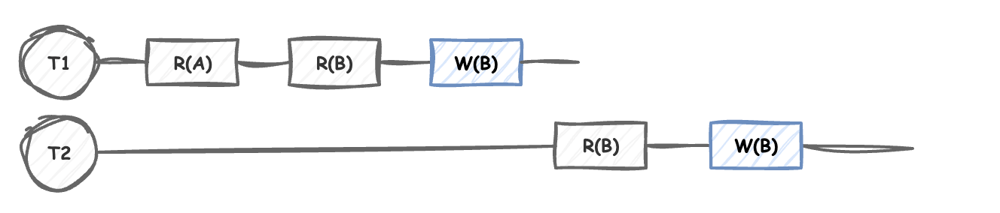
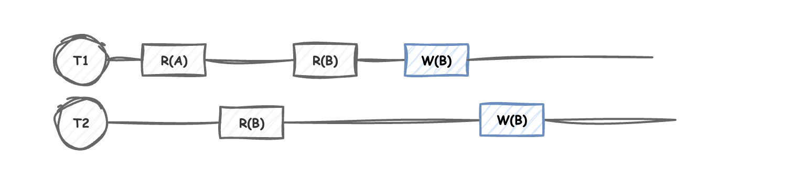
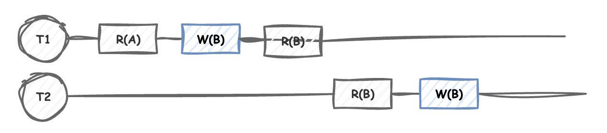

데이터베이스에서 모든 트랜잭션(스케줄)을 한 번에 하나씩만 실행하면 **직렬적으로 실행**되어
동시성 이슈는 발생하지 않습니다. **하지만 이는 성능 저하를 초래**합니다.

특히 데이터베이스는 여러 서버에서 네트워크를 타고 들어오고, 트랜잭션 작업도 길 수도 있고 그런데 위처럼 해결하는 방법 말고도
다른 방식을 생각해야 합니다.

## 직렬적으로 하지않고 데이터베이스 동시성 이슈 해결 방법

데이터베이스에서 여러 트랜잭션이 동시에 실행될 때, 우리는 마치 하나씩 순서대로 실행된 것처럼 만들어야 합니다.

### 🤔 먼저 알아야 할 것: Conflicting Operations

트랜잭션끼리 충돌할 수 있는 조건이 있습니다
1. 서로 다른 트랜잭션의 연산이고
2. 같은 데이터를 사용하며
3. 최소 하나는 쓰기 연산일 때

이런 조건들이 모두 만족되면 "충돌 가능성이 있다"고 판단합니다.

### 트랜잭션을 순서대로 실행


Conflicting Operations에 충족되는 부분은

`T1-R(B)-> T2-W(B)` , `T1-W(B) -> T2-R(B)` , `T1-W(B) -> T2-W(B)` 입니다. 하지만
T1,T2가 순서대로 실행되는 덕분에 충돌이 발생하지 않았습니다.

### 트랜잭션을 동시에 실행 



성능저하를 막기 위해 동시에 실행되고 있습니다.

이때 Conflicting Operations에 충족되는 부분은

`T1-R(B) -> T2-W(B)`, `T1-W(B) -> T2-W(B)`, `T2-R(B) -> T1-W(B)` 입니다.
그리고 실제로도 동시성 문제가 발생했습니다.

동시에 실행할때도 서로 다른 스케줄이 같은 순서를 지켜주면 동시성 문제를 해결할 수 있습니다.
유일한 차이점이 `T2-R(B) -> T1-W(B)` 부분인데 이 부분의 순서를 `T1-W(B) -> T2-R(B)` 처럼 지켜주면 됩니다.

마치 이렇게 바꾸면 동시성 이슈 문제가 발생하지 않습니다.


즉, 이 충돌 가능성이 있는 부분인 임계영역에 대해서 각각의 트랜잭션이 
같은 순서를 지키면 데이터베이스에서의 동시성제어가 가능합니다.

그리고 순서대로 실행했을 때 성능저하 부분을 동시에 실행할때 동시성문제도 해결하고, 성능도 챙길 수 있습니다.
그리고 이를 Conflicting equivalent 이라 부릅니다. Conflicting equivalent 하다는 것은 Serializable Schedule 방식으로 동작하다는 것과 같습니다.

## Serializable Schedule로 동시성 제어를 하면서 성능도 챙기는 방법

이제 위 연산순서를 보장(Conflicting equivalent)하기 위해 여러 구현방법이 존재합니다.

### Isolation - Serializable (X)

자바에서 쓰는 가장 편한 방법이며, 동시성 문제가 없지만, 여러 트랜잭션이 하나씩 실행되고 어떤 트랜잭션은 연산이 길면 성능 저하가 발생합니다. 그래서 거의 사용되지 않습니다.

보통은 격리수준을 `READ COMMITTED`으로 쓰기도 하는데 Non-Repeatable Read 문제가 발생할 수 있어 동시성 이슈가 발생합니다.

따라서 이 `READ COMMITTED` 격리 수준을 사용하되 동시성 제어를 해결하기 위해 다른 방식을 사용해야 합니다.

### 데이터베이스에서의 낙관적 락 

낙관적 락이란, 데이터 충돌이 드물다고 가정합니다.
트랜잭션이 완료되기 전에 다른 트랜잭션이 데이터를 수정하지 않았는 지 버전 정보를 통해 확인합니다. (충돌만 감지)

```java
// 상품 엔티티
class Product {
    private Long id;
    private String name;
    private int stock;
    private Long version; // 버전 정보
}

// 상품 구매 시
public void purchase(Long productId) {
    Product product = productRepository.findById(productId);
    Long originalVersion = product.getVersion();
    
    // 재고 감소
    product.decreaseStock(1);
    
    // 저장 시 버전 체크
    if (originalVersion != product.getVersion()) {
        throw new OptimisticLockException("다른 사용자가 이미 수정했습니다");
    }
}
```

버전 정보가 처음 정보랑 다를 때 즉, 누군가 수정했다고 가정하고 개발자가 코드영역에서 
관리를 해주는 것입니다. 데이터베이스에서는 실패처리를 하지 않습니다. 

장점
- 락을 사용하지 않습니다
- 처리량이 높습니다
- 데드락이 발생하지 않습니다 

단점
- 재시도 작업을 직접 구현해야 합니다
- 충돌이 많이 발생하면 재시도 작업으로 오버헤드가 증가합니다.
- 복구 작업을 직접 코드로 작성해야 하기 때문에 개발자의 손을 많이 타게 됩니다.
- 또한, 실패하고 복구한다라는 방법이라 나이스한 방법은 아닙니다.

실제 사용 예시
- 사용자가 거의 없거나, 충돌이 거의 발생하지 않을 경우에 유용합니다.

### 데이터베이스의 비관적 락 

비관적 락은 Shared Lock(공유락)과 Exclusive Lock(베타락)을 사용하는 것을 의미합니다.

**공유락**은 읽기 전용 락이고, 동일 데이터에 해당 락이 걸린 동안 다른 커넥션은 베타락을 획득할 수 없습니다.

**베타락은** 읽기,쓰기 전용 락이고, 동일 데이터에 해당 락이 걸려있으면 다른 커넥션은 공유락,베타락을 획득할 수 없습니다.

장점
- 데이터 자체에 락을 거는 것이기 때문에 데이터 충돌이 발생하지 않습니다
- **Serialazable은** 완벽한 격리성을 부여하기 위해 **트랜잭션 내에 있는 모든 자원에게** 락을 거는 것과 마찬가지지만, **베타락은 특정 자원에만** 락을 걸기 때문에 다른 자원 접근 시에는 대기하는 현상이 발생하지 않습니다.

단점
- 데드락 위험 존재합니다.
- 병목현상으로 인한 성능 저하가 발생합니다. 

**여기서 말하는 자원이란 어떤건가요?**

데이터베이스마다 테이블일수도, 특정 row일 수도 있습니다. MySQL은 인덱스를 기준으로 락을 걸 수 있습니다.
즉 PK도 인덱스이므로 PK인 row에 락을 겁니다. 

**사용예시**

```java
@Service
class OrderService {
    @PersistenceContext
    private EntityManager em;
    
    @Transactional
    public void createOrder(Long productId, int quantity) {
        try {
            // 비관적 락으로 쓰기작업으로 상품 조회
            Product product = em.find(Product.class, productId,
                                    LockModeType.PESSIMISTIC_WRITE); // 쿼리: select * from product where product_id = :productId FOR UPDATE
            
            // 재고 감소
            product.decreaseStock(quantity);
            
            // 주문 생성
            Order order = new Order(product, quantity);
            em.persist(order);
            
        } catch (PessimisticLockException e) {
            throw new OrderFailedException("일시적인 오류. 다시 시도해주세요.");
        }
    }
}
```

락을 획득하면 트랜잭션 끝날 때까지 락을 소유하고, 만약 획득하지 못하면 타임아웃까지 기다리다가 예외를 발생시킵니다.

**비관적락이 데드락 위험이 높은 이유가 뭔가요?**

데드락이 발생하려면 4가지가 충족되어야 합니다. 

1. 상호배제

```java
// 한 번에 하나의 트랜잭션만 자원 사용 가능
@Lock(LockModeType.PESSIMISTIC_WRITE)  // 배타적 락
Product product = em.find(Product.class, id);
```

2. 점유와 대기 (Hold and Wait)

```java
@Transactional
public void transfer(Long fromId, Long toId) {
    // 자원1 점유하고 있으면서
    Account from = em.find(Account.class, fromId, 
                          LockModeType.PESSIMISTIC_WRITE);
    
    // 다른 자원2를 요청
    Account to = em.find(Account.class, toId,  // 대기 발생 가능
                        LockModeType.PESSIMISTIC_WRITE);
}
```

3. 비선점

```java
// 다른 트랜잭션이 락을 강제로 빼앗을 수 없음
Transaction 1:
Account from = em.find(Account.class, 1L, LockModeType.PESSIMISTIC_WRITE);
// 트랜잭션2는 이 락을 강제로 해제 불가능
```

4. 순환 대기

```java
// 트랜잭션 1
@Transactional
public void process1() {
    Account acc1 = em.find(Account.class, 1L,   // acc1 락 획득
                          LockModeType.PESSIMISTIC_WRITE);
    Thread.sleep(100);  // 데드락 상황 만들기
    Account acc2 = em.find(Account.class, 2L,   // acc2 락 대기
                          LockModeType.PESSIMISTIC_WRITE);
}

// 트랜잭션 2
@Transactional
public void process2() {
    Account acc2 = em.find(Account.class, 2L,   // acc2 락 획득
                          LockModeType.PESSIMISTIC_WRITE);
    Thread.sleep(100);  // 데드락 상황 만들기
    Account acc1 = em.find(Account.class, 1L,   // acc1 락 대기
                          LockModeType.PESSIMISTIC_WRITE);
}
```

MySQL 같은 경우 데드락이 발생하는 것을 감지하고 실패를 발생시켜 락을 반납하게 하는 기능도 있습니다.


