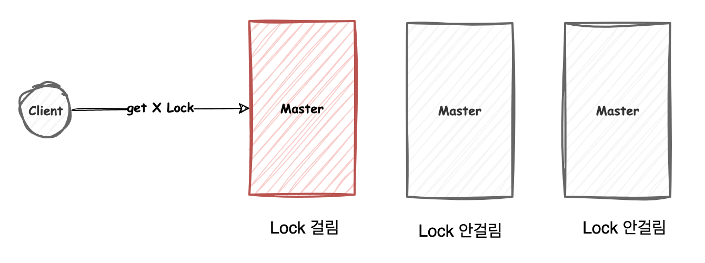
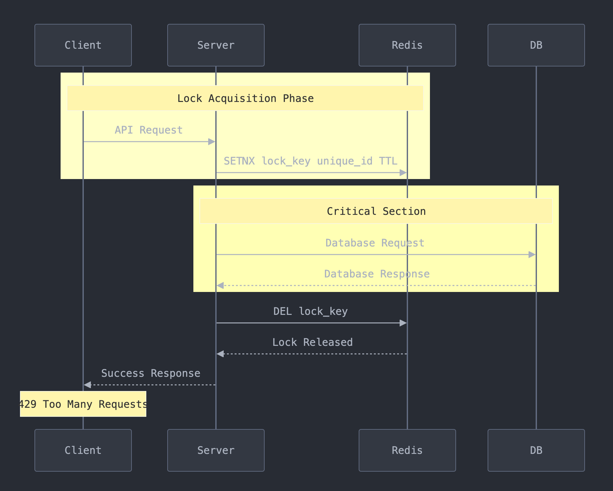
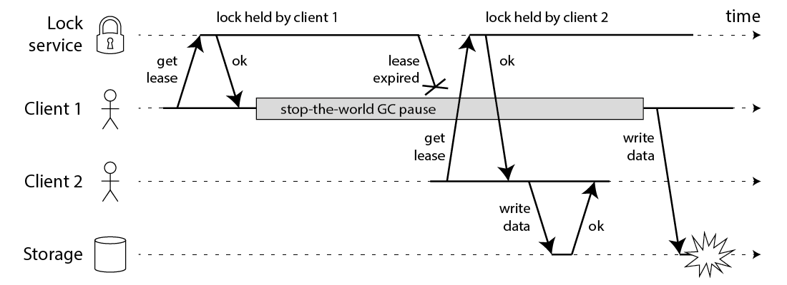

데이터베이스가 2대 이상 있는 상황이나 NoSQL과 서로 다른 DBMS을 사용하는 상황일때, 트랜잭션 하나를 앞서 비관적락이나 낙관적락으로
해결할 수 없는 상황이 많습니다. 

이런 분산데이터베이스 혹은 분산환경에서 CAP 이론이 적용됩니다.

## CAP 이론이란

- Consistency(일관성): 모든 노드가 동일한 시점에 동일한 데이터를 볼 수 있습니다. 즉 데이터베이스 2대가 select문을 날렸을 때 같은 데이터를 보는 것입니다.
- Availability(가용성): 모든 요청에 대해 항상 응답을 제공합니다. 쿼리를 날려야하는데 DB가 죽어있어서는 안됩니다.
- Partition Tolerance(파티션 내성): 네트워크 단절이 발생하더라도 시스템이 계속 동작합니다. 특정 네트워크가 끊겨도 다른 네트워크에서는 동작해야합니다.
- 저장소가 여러 노드일 경우 C / A / P 중 하나를 포기해야 합니다. 


### CA

- 일관성과 가용성을 보장하지만, 파티션 내성을 보장하지 않는다는 것은 불가능합니다.
- 네트워크 단절 시 일관성 보장이 불가, 예를들어 네트워크가 단절되어 노드 A와 노드 B가 서로 통신 불가능한 상태일 때 일관성을 가질려면 모든 노드가 같은 데이터를 가져야하지만 단절되어 불가능합니다

### AP

- 네트워크 분할이 발생하면 일관성을 일부 희생하더라도 가용성을 유지
- 일관성이 제어되지 않으므로, Lock을 사용해도 동시성 이슈 제어 불가
- 결국 분산환경에서는 일관성 제공이 어려워 AP로 자주 사용

### CP

- 예를들어, 서울과 판교에서 서울쪽 네트워크가 전원이 나가버리면 판교도 내려버립니다. 일관성 보장을 할 수 없기 때문입니다.

## CP 환경에서의 동시성 제어

- Multi master 구조에서 MySQL InnoDB 클러스터는 Serializable 격리수준을 지원하지 않습니다
- 또한 각종 Lock을 지원하지 않으며, 비관적락도 사용 불가능합니다.




### 분산락

분산환경에서는 분산락으로 CP 환경에서 동시성을 제어할 수 있습니다.

분산락을 구현하는 주요 시스템으로는 Redis, 카프카, ZooKeeper등이 있고, 
**Redisson 라이브러리를 이용해 Redis 기반의 분산 락을 관리**하는 방법을 소개하겠습니다.



**동작원리**

Redis의 SETNX 명령어를 이용해 특정 키에 TTL(유효 기간)을 설정하고, 다른 프로세스의 접근을 제한하여 동시성을 제어합니다. Redisson은 이러한 기능을 간편하게 제공합니다.

- **락 획득 단계**
: SETNX (SET if Not Exists) 명령어를 통해 고유한 락 키를 설정합니다. 만약 락이 성공적으로 설정되면 임계 영역에 접근할 수 있습니다.

- **임계 영역 (Critical Section)**
: 락을 획득한 프로세스만 데이터베이스에 접근할 수 있으며, 여기서 안전하게 데이터 작업을 수행할 수 있습니다.

- **락 해제 단계**
: 작업이 끝나면 Redis에서 락 키를 삭제하여 다른 프로세스가 접근할 수 있도록 합니다.

즉, 레디스에 먼저 접근해서 특정 락을 획득하고, DB에 접근하도록 하는 것입니다.

**구현코드**

Redisson을 사용해 Java에서 Redis 분산 락을 구현하는 방법은 아래와 같습니다.

```java
RedissonClient redisson = Redisson.create();
RLock lock = redisson.getLock("lockKey");

lock.lock();
try {
    // 임계 영역 코드 - 안전하게 데이터베이스 작업 수행
} finally {
    lock.unlock(); // 작업이 끝난 후 락 해제
}
```

**레디스의 스핀락과 Redisson 차이점**

- 스핀락

  - 구현이 단순하고,즉각적인 락 획득이 가능합니다
  - 짧은 대기시간에 유리합니다
  - 외부의존성 없이 구현이 가능합니다
  - 하지만, CPU 리소스를 과다 사용하고, 공정성 보장이 어렵습니다.

- Redisson

  - 자원사용이 효율적입니다
  - Pub/Sub으로 부하를 분산합니다
  - 공정한 락 처리가 가능합니다(FIFO)

**분산락 주의할 점**

- 레디스의 락 **키를 만들 때 최대한 구별해서 만들어야 합니다**. 하나의 키로 통일하면 데이터베이스 전체가 잠길 수 있기 때문에 개발자가 키를 제대로 만드는 것이 중요합니다.
- 락 서버 장애시 시스템 전체가 영향을 미칩니다. 즉, 가용성을 포기한 것이기 때문에 만약 가용성을 챙길려면 SAGA 패턴을 고려해야 합니다.
- 키를 잘못만들어 락 경합으로 성능 저하가 발생 가능합니다.


### 분산락이 무조건 좋을까?

아래는 아무리 완벽히 락 매커니즘을 구현해도 데이터 충돌이 발생할 수 있다는 예시 입니다.



이 예시에서 잠금을 획득한 클라이언트는 잠금을 유지하는 동안 오랜 시간 동안 일시 중지 됩니다.
예를들어 GC로 Stop-the-world가 발생했습니다.

락 잠금에는 만료시간이 있습니다. 그런데 만약 GC Stop-the-world가 만료시간보다 긴 경우,
클라이언트는 만료되었음을 인식하지 못하고 임계영역을 계속 진행하게되면, 다른 클라이언트도 락을 획득하면서
중복된 락을 갖게되고 이는 데이터 정합성 문제를 발생시킵니다.

스레드의 Stop-the-world가 몇분 내내 지속될 수 있으므로 이 문제에 대해서도 인지가 필요합니다.

해결방법은 락 획득에 버저닝을 합니다. 그래서 버전을 확인해서 락을 반납할 지 판단하여 해결할 수 있습니다  


## Reference

https://helloworld.kurly.com/blog/distributed-redisson-lock/

https://martin.kleppmann.com/2016/02/08/how-to-do-distributed-locking.html