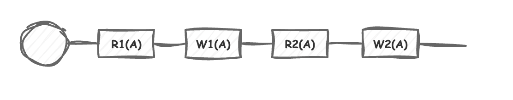

## 동시성 이슈가 뭐고 발생하는 원인이 뭔가요?

동시성 이슈는 이 세가지를 만족시키면 동시성 이슈가 발생할 수 있습니다.
1. 공유자원에 접근한다
2. 동기화 없이 접근한다
3. 적어도 하나의 스레드가 자원을 변경한다.

동시성 이슈는 **스레드가 변경한 값을 다른 스레드가 읽어들이면서 발생하는 문제, 데드락, 기아 발생 이슈**등을 말합니다.

동시성 이슈를 발생하지 않게 하기 위해서 앞서 세가지 조건 중 하나를 끊으면 해결할 수 있습니다.

보통은 동기화를 하면서 이 동시성 이슈를 해결합니다.
동기화는 보통 자바의 synchronized, lock, 데이터베이스의 락 등으로 해결하는 데 이 부분을 중점적으로
살펴보려고 합니다.

## 공유자원이 뭐죠?

**공유자원은** 여러 프로세스나 스레드가 동시에 접근하는 메모리, 파일, 데이터베이스등과
분산 시스템에서 네트워크를 통해 공유되는 자원입니다.

**메모리에서는** 프로세스나 스레드가 동시에 접근할 수 있으며 읽거나 쓸 수있는 메모리 공간입니다. 예를들면,
힙 영역, 메타스페이스 입니다. 그리고 이를 관리하기 위해 자바에서는 synchronized 나 lock으로 관리할 수 있어
쉬운축에 속합니다.

**파일에서는** 여러 프로세스가 접근할텐데 스레드나 프로세스 하나로 제어하기 쉽지 않습니다.
OS 내부에서 락을 획득해 제어하고 있습니다.

**데이터베이스에서는** 여러 사용자가 네트워크를 통해 공유자원을 접근하고 있습니다. 이때
트랜잭션 관리와 동시성 제어가 많이 필요한 부분 입니다.

## 임계영역이 뭔가요?

예를들어 서로 다른 트랜잭션이 같은 공유 자원에 접근하고, 자원을 변경할 수 있는 영역입니다.

해당 임계영역에서 각 트랜잭션의 schedule 작업이 일어나며 동시성 이슈가 발생할수도, 아니면 아예 발생하지 않을 수도 있습니다.

### serial schedule 그리고 non-serial schedule

schedule이란, 여러 트랜잭션들이 동시에 실행될 때 각 트랜잭션이 속한 opeation들의 실행 순서입니다.
또한 이 스케줄로 표현하면 간략하게 표기를 할 수 있습니다.

아래는 **serial schedule을** 표현하고 있으며, 각 트랜잭션이 동기적으로 트랜잭션1이 A자원을 읽고, 쓰고
다음으로 트랜잭션 2가 A자원을 읽고 쓰고 있습니다.

이것은 하나의 작업이 끝나고 다음 작업이 실행되고 있기 때문에 동시성 이슈가 발생하지 않습니다.

다음은 non-serial schedule을 표현하며, 하나의 작업이 끝나기 전에 다른 작업이 시작했기 때문에
동시성 이슈가 발생할 위험성이 있습니다.
