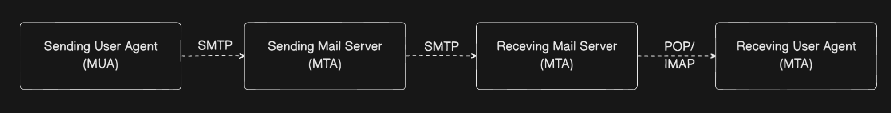
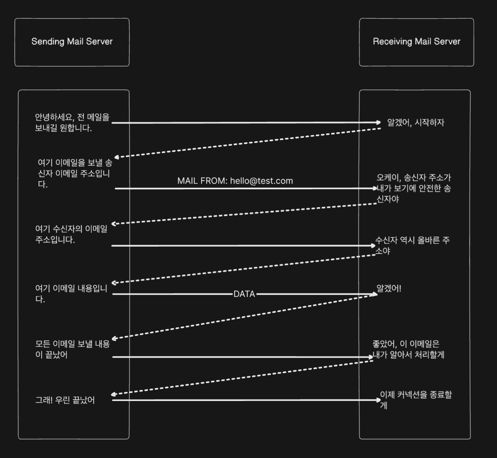

## SMTP란

SMTP(Simple Mail Transfer Protocol)는 인터넷에서 이메일을 전송하는 데 사용되는 표준 프로토콜입니다. 

이 프로토콜은 서로 다른 이메일 시스템 간의 메시지 전달 및 중계를 가능하게 해 주며, TCP/IP를 기반으로 동작합니다. 

## SMTP 구성요소

- MUA (Mail User Agent): 이메일 클라이언트로, 사용자가 이메일을 작성하고 보낼 수 있도록 돕습니다. 
- MTA (Mail Transfer Agent): 이메일을 발신자에서 수신자의 메일 서버로 전달하거나 받는 역할을 합니다. 
- MDA (Mail Delivery Agent): 수신자의 메일박스에 이메일을 최종적으로 저장합니다. 이 방식은 POP3, IMAP 등을 사용합니다.



## SMTP 동작과정   

```java
C: HELO example.com
S: 250 Hello example.com
C: MAIL FROM:<sender@example.com>
S: 250 OK
C: RCPT TO:<receiver@example.com>
S: 250 OK
C: DATA
S: 354 End data with <CR><LF>.<CR><LF>
C: Subject: Test Email
C: This is a test email.
C: .
S: 250 OK
C: QUIT
S: 221 Bye
```



## POP3 와 IMAP 차이

POP3와 IMAP은 이메일을 “받는” 데 사용되며, 각각 다운로드 방식과 동기화 방식을 제공합니다.

POP3는 이메일을 로컬로 다운로드하고 서버에서 삭제하는 것이 기본 설정입니다.
POP3는 단방향 통신으로 동기화 기능이 없으며, 한 장치에서 읽은 메일 상태가 다른 장치에 반영되지 않습니다.
오프라인 환경에서 이메일 확인이 필요한 경우 적합합니다.


IMAP은 이메일을 서버에 유지하며, 모든 장치에서 동일한 상태를 유지합니다.
IMAP은 양방향 동기화를 지원해 여러 장치에서 동일한 메일 상태를 확인할 수 있습니다.
여러 기기에서 실시간으로 이메일을 관리해야 하는 경우 적합합니다.


## SMTP 보안

이메일 보안과 인증을 위해 세가지 프로토콜, SPF, DKIM, DMARC이 사용됩니다.

1. SPF (Sender Policy Framework)
- 이메일을 보내는 서버의 IP 주소가 정당한 권한을 가졌는지 확인하는 프로토콜입니다.
- 도메인 소유자가 DNS TXT 레코드에 이메일을 보낼 수 있는 서버의 IP 주소 목록을 게시합니다.
- 수신 서버는 이메일이 온 IP 주소가 이 목록에 있는지 확인하여 스푸핑을 방지합니다.
- 예를 들어, example.com의 SPF 레코드는 "이 도메인의 이메일은 이러한 IP 주소에서만 발송될 수 있다"라고 명시합니다.

2. DKIM (DomainKeys Identified Mail)
- 이메일 내용이 전송 과정에서 변조되지 않았음을 보장하는 디지털 서명 방식입니다.
- 발신 서버는 비밀키로 이메일에 서명을 하고, 수신 서버는 DNS에 게시된 공개키로 이를 검증합니다.
- 이메일 헤더에 DKIM-Signature 필드가 추가되어 전송됩니다.
- 내용이 변조되면 서명 검증이 실패하여 위조를 탐지할 수 있습니다.

3. DMARC (Domain-based Message Authentication, Reporting & Conformance)
- SPF와 DKIM을 통합적으로 활용하는 상위 정책 프레임워크입니다.
- 도메인 소유자가 인증 실패 시 어떻게 처리할지 정책을 설정할 수 있습니다:
    - none: 아무 조치도 취하지 않음
    - quarantine: 스팸함으로 분류
    - reject: 이메일 수신 거부
- 인증 결과에 대한 보고서를 받아볼 수 있어 모니터링이 가능합니다.
- From: 헤더의 도메인과 실제 발신 도메인이 일치하는지 확인합니다.

세 프로토콜의 주요 차이점:
- SPF는 발신 서버의 IP를 확인하여 권한을 검증합니다.
- DKIM은 이메일 내용의 무결성을 보장하는 전자서명을 제공합니다.
- DMARC는 위 두 프로토콜을 기반으로 정책을 설정하고 모니터링하는 프레임워크입니다.

