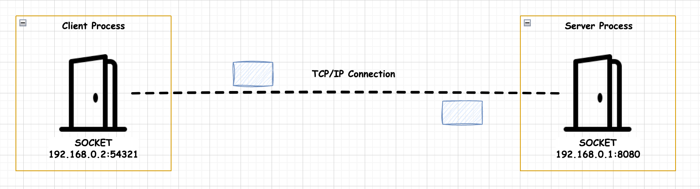

## 웹 소켓

웹 소켓은 웹 서버와 웹 브라우저가 서로 실시간 메시지를 교환하는 데에 사용됩니다. 핸드셰이크를 한 후, 지속적인 연결이 유지됩니다.

웹 소켓은 처음엔 HTTP 프로토콜을 시작으로 하되, 연결이 성립된 후에는 WS(WebSocket) 프로토콜로 전환됩니다.

아래는 웹 소켓 연결을 위한 과정입니다.

<br>

1. **TCP 연결 수립**

```text
Client -> SYN -> Server
Server -> SYN+ACK -> Client
Client -> ACK -> Server
```

TCP 3 way handshake를 통해 연결이 성립됩니다.

<br>

2. **HTTP 업그레이드 요청 (같은 TCP 연결 상에서)**

```text
Client -> HTTP Upgrade Request:
GET /chat HTTP/1.1
Host: server.example.com
Upgrade: websocket
Connection: Upgrade
Sec-WebSocket-Key: dGhlIHNhbXBsZSBub25jZQ==
Sec-WebSocket-Version: 13
```

3. **HTTP 업그레이드 응답**

```text
Server -> HTTP Response:
HTTP/1.1 101 Switching Protocols
Upgrade: websocket
Connection: Upgrade
Sec-WebSocket-Accept: s3pPLMBiTxaQ9kYGzzhZRbK+xOo=
```

4. **WS 프로토콜로 전환**

같은 TCP 연결 상에서, 이후에는 HTTP가 아닌 WS 프로토콜로 통신합니다.
포트는 당연히 80/443를 계속 사용하고, 단지 프로토콜 레벨에서 HTTP에서 웹소켓 프로토콜로 "업그레이드"됩니다.

<br>

5. **SSL/TLS를 사용하는 WSS(WebSocket Secure) 연결 과정은 위와 유사합니다.**

TCP 3-way 핸드셰이크이후 SSL/TLS 핸드셰이크가 추가되고, 암호화된 채널 위에서 웹소켓 업그레이드 요청한뒤,
wss 프로토콜로 전환됩니다.


## 소켓

소켓은 네트워크 통신을 위한 인터페이스로, 서버와 클라이언트 간의 양방향 통신을 가능하게 하는 엔드포인트입니다.



**[소켓 통신 과정]**

**서버쪽에서는** 
1. 소켓을 생성하고 (socket)
2. IP 주소와 포트 번호를 바인딩하고 (bind)
3. 클라이언트 요청 대기 상태 (listen)

**클라이언트쪽에서는**

1. 송신 소켓 생성하고 (socket)
2. 연결 요청하고 (connect)

**서버 쪽에서는** 

1. 연결 수락하고 (accept)

이제 서버와 클라이언트는 데이터를 주고 받을 수 있게 됩니다.


**[소켓 특징]** 

- 소켓은 TCP, UDP 등 다양한 프로토콜을 지원합니다.
- 운영체제에서 제공하는 시스템 콜을 사용하여 소켓을 생성하고 통신합니다.
- 양방향 통신과 TCP IP를 사용하기 때문에 지속적 연결을 지원합니다.


## http도 tcp위에서 동작하는데 왜 지속적 연결이 안될까

HTTP는 설계 목적 자체가 "클라이언트의 요청에 대한 응답을 전송"하는 것이었기 때문에, 
TCP를 사용하더라도 그 위에서 요청-응답 패턴으로 동작하도록 설계되었습니다. 

반면 소켓은 실시간 양방향 통신을 위해 설계되어 TCP 연결을 있는 그대로 유지하고 활용합니다.

**HTTP**

```text
Client  ----------- HTTP Request ---------->  Server
        <---------- HTTP Response ----------
        [연결 종료]
        ----------- HTTP Request ---------->  
        <---------- HTTP Response ----------
        [연결 종료]
```

- 요청-응답 후 연결 종료 (Stateless)
- 매 요청마다 새로운 TCP 연결 수립
- 클라이언트만 요청 가능
- 서버는 응답만 가능 (Server Push 불가)

**소켓 통신**

```text
Client  ----------- TCP 연결 수립 ---------->  Server
        <--------- 연결 유지 상태 ---------->
        --------- 데이터 송신 가능 --------->
        <-------- 데이터 송신 가능 ----------
        [연결 유지]
```

- 한번 연결 후 계속 유지
- 양방향 자유로운 통신
- 서버도 클라이언트에게 능동적 송신 가능
- 실시간 통신 가능

**HTTP Keep-Alive를 사용하면**, 하나의 TCP 연결을 여러 요청에 재사용할 수 있지만, 
여전히 요청 응답 패턴만 가능합니다.

```text
Client  ----------- HTTP Request ---------->  Server
        <---------- HTTP Response ----------
        [연결 유지]
        ----------- HTTP Request ---------->  
        <---------- HTTP Response ----------
        [연결 유지]
```

## 웹소켓 소켓 둘 다 양방향 통신이 가능한데, 실제 사용 사례는?

- 브라우저에서는 직접적인 소켓 통신이 불가능합니다.
- JavaScript로 TCP 소켓을 직접 열 수 없는 보안 제한이 있습니다
- 웹소켓은 이러한 제한을 우회하면서 브라우저와 실시간 통신을 가능하게 합니다

따라서 웹 기반 서비스면, 웹소켓을 사용하는 것이 일반적입니다.
소켓은 실시간 게임 서버나 데이터베이스 연결 등 네이티브 애플리케이션에서 적절합니다. 


