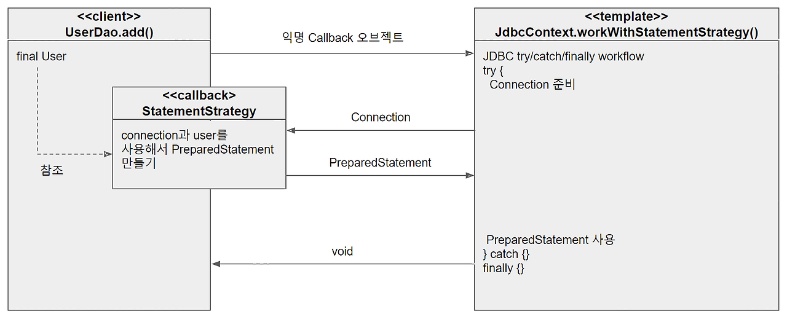

## 1장 복습

- 초난감 DAO 코드에 **DI를 적용해나가는 과정을 통해서 관심이 다른 코드를 다양한 방법으로 분리**하고, **확장과 변경에 용이하게 대응할 수 있는 설계구조**로 개선하는 작업을 했습니다.
- OCP란, **어떤 부분은 변경을 통해 그 기능이 다양해지고 확장**하려는 성질이 있고, **어떤 부분은 고정되어 있고 변하지 않으려는 성질**이 있음을 보여줍니다. 
  - 변화의 특성이 다른 부분을 구분해주고, 각각 다른 목적과 다른 이유에 의해 다른 시점에 독립적으로 변경될 수 있는 효율적인 구조를 만들어주는 것이 개방-패쇄 원칙입니다.
- 전략 패턴은 개방 폐쇄 원칙의 실현에 가장 잘 들어맞는 패턴입니다. 
  - 전략패턴은 **자신의 기능 맥락(context)에서, 필요에 따라 변경이 필요한 알고리즘을 인터페이스를 통해 통째로 외부로 분리**시키고, 
  - 이를 구현한 구체적인 알고리즘 클래스를 필요에 따라 바꿔서 사용할 수 있게 하는 디자인 패턴입니다.

## 템플릿이란

**변경이 거의 일어나지 않으며 일정한 패턴으로 유지되는 특성을 가진 부분을** 자유롭게 변경되는 성질을 가진 부분으로부터 독립시켜서 효과적으로 활용할 수 있도록 하는 방법입니다.

## 초난감 DAO 개선하기

### 예외처리

서버에서는 제한된 개수의 DB 커넥션을 사용하기 때문에 사용한 자원은 무조건 반환해야합니다. 

하지만 예외가 처리되면 자원이 반납이 안될 수도 있기 때문에 finally 블록을 통해 반환시킵니다. 

```java
public void deleteAll() throws SQLException {
  Connection c = null;
  PreparedStatement ps = null;

  try {
    c = dataSource.getConnection();

    ps = c.prepareStatement("delete from users"); // 변할 수 있는 부분

    ps.executeUpdate();
  } catch (SQLException e) {
    throw e;
  } finally {
    if(ps != null) { try { ps.close(); } catch (SQLException e) { } }
    if(c != null) { try { c.close(); } catch (SQLException e) { } } 
  }
}
```

아쉬운 점

- try/catch/finally 블록이 2중으로 중첩까지 나오며, `deleteAll`말고도 `add()` `get()` 메소드에서도 반복될 것입니다.
- 복사,붙여놓기 하다가 실수할 확률이 있습니다. 

### 분리와 재사용을 위한 디자인 패턴을 적용

가장 먼저 할일은 변하는 성격이 다른 것을 찾아냅니다. 위 코드에 주석을 단 부분만이 변할 수 있는 부분이고 나머지는 반복될 것입니다.

**1. 메소드 추출하기**

```java
public void deleteAll() throws SQLException {
    Connection c = null;
    PreparedStatement ps = null;

    try {
        c = dataSource.getConnection();

        ps = makeStatement(c);

        ps.executeUpdate();
    } catch (SQLException e) {
        throw e;
    } finally {
        if(ps != null) { try { ps.close(); } catch (SQLException e) { } }
        if(c != null) { try { c.close(); } catch (SQLException e) { } }
    }
}

private PreparedStatement makeStatement(Connection c) throws SQLException {
    return c.prepareStatement("delete from users");
}
```

아쉬운 점

- 메소드 추출은 보통 중복되는 부분을 추출하는 것이기 때문에 별로 이 코드는 개선한 것 같지 않습니다.

**2. 템플릿 메소드 패턴의 적용**

변하지 않는 부분은 슈퍼클래스에 두고 변하는 부분은 추상 메소드로 정의해둬서 서브클래스에서 오버라이드하여 새롭게 정의해 쓰도록 하는 것 입니다.

```java
import java.sql.PreparedStatement;
import java.sql.SQLException;

public class UserDaoDeleteAll extends UserDao {
  protected PreparedStatement makeStatement(Connection c) throws SQLException{
      PreparedStatement ps = c.prepareStatement("delete from users");
      return ps;
  }
}
```

아쉬운 점

- DAO 로직마다 상속을 통해 새로운 클래스를 만들어야 하는 점 
- 확장 구조가 이미 컴파일 시점의 클래스 레벨에서 결정됩니다. 이는 관계에 대한 유연성이 떨어집니다. 

**3. 전략 패턴 적용**

오브젝트를 아예 둘로 분리하고 클래스 레벨에서는 인터페이스를 통해서만 의존하도록 만드는 전략패턴 입니다.

Context의 contextMethod()에서 일정한 구조를 가지고 동작하다가 특정 확장 기능은 Strategy 인터페이스를 통해 외부의 독립된 전략 클래스에 위임하는 것입니다. 

위에서 `PreparedStatement`를 만들어주는 부분이 전략이고 나머지 DB 커넥션 가져오고, 실행하고, 예외처리하고, 자원정리하는 부분은 컨텍스트라 볼 수 있습니다.

`PreparedStatement` 생성 전략을 만들 때는 Connection을 전달받고, PreparedStatement 오브젝트를 돌려주는 부분이 존재해야합니다.

```java
public interface StatementStrategy {
  PreparedStatement makePreparedStatement(Connection c) throws SQLException;
}

public class DeleteAllStatement implements StatementStrategy{
  @Override
  public PreparedStatement makePreparedStatement(Connection c) throws SQLException {
    return c.prepareStatement("delete from users");
  }
}

public void deleteAll() throws SQLException {
  Connection c = null;
  PreparedStatement ps = null;

  try {
    c = dataSource.getConnection();

    StatementStrategy strategy = new DeleteAllStatement();  // 주목 
    ps = strategy.makePreparedStatement(c);

    ps.executeUpdate();
  } catch (SQLException e) {
    throw e;
  } finally {
    if(ps != null) { try { ps.close(); } catch (SQLException e) { } }
    if(c != null) { try { c.close(); } catch (SQLException e) { } }
  }
}
```

아쉬운 점

- 전략 패턴은 필요에 따라 컨텍스트는 그대로 유지되면서 전략을 바꿔 쓸 수 있는 OCP 원칙인데 이렇게 컨텍스트 안에서 이미 구체적인 전략 클래스가 있으니 이상합니다

**4. DI 적용을 위한 클라이언트/컨텍스트 분리**

전략패턴은 클라이언트가 컨텍스트는 어떤 전략을 사용할건지 구체적인 클래스를 결정하고 오브젝트를 전달하는 것이 일반적입니다.

결국 DI란 이러한 전략패턴의 장점을 일반적으로 활용할 수 있도록 만든 구조입니다.

다음 코드는 클라이언트로부터 `StatementStrategy` 타입의 전략 오브젝트를 제공받고 JDBC try/catch/finally 구조로 만들어진 컨택스트 내에서 작업을 수행합니다.

```java
public class DeleteAllStatement implements StatementStrategy{
    @Override
    public PreparedStatement makePreparedStatement(Connection c) throws SQLException {
        return c.prepareStatement("delete from users");
    }
}

public void jdbcContextWithStatementStrategy(StatementStrategy stmt) throws SQLException {
    Connection c = null;
    PreparedStatement ps = null;

    try {
        c = dataSource.getConnection();
        ps = stmt.makePreparedStatement(c);

        ps.executeUpdate();
    } catch (SQLException e) {
        throw e;
    } finally {
        if(ps != null) { try { ps.close(); } catch (SQLException e) { } }
        if(c != null) { try { c.close(); } catch (SQLException e) { } }
    }
}

public void deleteAll() throws SQLException {
    StatementStrategy strategy = new DeleteAllStatement(); // 선정한 전략 클래스의 오브젝트 생성
    jdbcContextWithStatementStrategy(strategy); // 컨텍스트 호출, 전략 오브젝트 전달
}
```

아직 장점을 모르겠습니다. 여전히 쿼리마다 클래스를 생성한다는 단점이 있습니다. 하지만 관심사를 분리하고 유연한 확장관계를 유지하도록 만든 작업은 매우 중요합니다.

앞으로 이 구조가 기반이 돼서 본격적인 개선 작업이 가능합니다.

**5. 로컬 클래스 구현**

클래스 파일이 많아지는 문제는 메소드 내부에 클래스를 선언합니다. 어차피 DeleteAllStatement는 deleteAll()에서만 쓰이기 때문에 이 메소드와 강하게 결합되어있습니다.

또한 이렇게 선언하면 자신이 선언된 곳의 정보에 접근할 수 있는 장점도 있습니다.

```java
import java.sql.SQLException;

public void jdbcContextWithStatementStrategy(StatementStrategy stmt) throws SQLException {
  Connection c = null;
  PreparedStatement ps = null;

  try {
    c = dataSource.getConnection();
    ps = stmt.makePreparedStatement(c);

    ps.executeUpdate();
  } catch (SQLException e) {
    throw e;
  } finally {
    if (ps != null) {
      try {
        ps.close();
      } catch (SQLException e) {
      }
    }
    if (c != null) {
      try {
        c.close();
      } catch (SQLException e) {
      }
    }
  }
}

public void deleteAll() throws SQLException {
  class DeleteAllStatement implements StatementStrategy {
    public PreparedStatement makePreparedStatement(Connection c) throws SQLException {
      return c.prepareStatement("delete from users");
    }
  }

  StatementStrategy strategy = new DeleteAllStatement(); // 선정한 전략 클래스의 오브젝트 생성
  jdbcContextWithStatementStrategy(strategy); // 컨텍스트 호출, 전략 오브젝트 전달
}
```

**6. 익명 내부 클래스로 전환**

```java
public void deleteAll() throws SQLException {
  jdbcContextWithStatementStrategy(
      new StatementStrategy(){
        public PreparedStatement makePreparedStatement(Connection c) throws SQLException {
            return c.prepareStatement("delete from users");
        } 
      }
  ); 
}
```

굉장히 깔끔해졌습니다.

아쉬운 점

- 컨텍스트 메소드인 jdbcContextWithStatementStrategy 는 일반적인 작업흐름을 담고 있기 때문에 모든 DAO에서 사용할 수 있을 것 같습니다.

**7. 클래스 분리**

```java
public class JdbcContext {
  private DataSource dataSource;

  public void workWithStatementStrategy(StatementStrategy stmt) throws SQLException {
    Connection c = null;
    PreparedStatement ps = null;

    try {
      c = dataSource.getConnection();
      ps = stmt.makePreparedStatement(c);

      ps.executeUpdate();
    } catch (SQLException e) {
      throw e;
    } finally {
      if (ps != null) {
        try {
          ps.close();
        } catch (SQLException e) {
        }
      }
      if (c != null) {
        try {
          c.close();
        } catch (SQLException e) {
        }
      }
    }
  }
}
```

이제 UserDao에서는 JdbcContext를 DI 받아서 사용하면 됩니다. 

```java
public class UserDao {
    ...
    JdbcContext jdbcContext;

    public void setJdbcContext(JdbcContext jdbcContext) {
        this.jdbcContext = jdbcContext;
    }
    ...

    public void add(User user) throws SQLException {
        this.jdbcContext.workWithStatementStrategy(new StatementStrategy(){...});
    }

    public void deleteAll() throws SQLException {
        jdbcContext.workWithStatementStrategy(new StatementStrategy(){...});
    }
    ...
}
```

아쉬운 점

- UserDao와 JdbcContext 사이에는 인터페이스를 사용하지 않고 DI를 적용했습니다. 
- 클래스 레벨에서 의존관계가 결정되었기 때문에 의존 오브젝트의 구현 클래스를 변경할 수가 없습니다. 

### 과연 인터페이스가 적용안된것을 DI라 부를 수 있을까

스프링의 DI를 넓게 보면 객체의 생성과 관계설정에 대한 제어권한을 오브젝트에서 제거하고 외부로 위임했다는 IoC라는 개념을 포괄합니다.  

그런 의미에서 JdbcContext를 스프링을 이용해 UserDao 객체에서 사용하게 주입했다는 것은 DI의 기본을 따르고 있다고 볼 수 있습니다.

**하지만 인터페이스가 원칙인데 왜 굳이 DI로 주입한 이유가 있습니다.**

1. JdbcContext가 스프링 컨테이너의 싱글톤 레지스트리에서 관리되는 싱글톤 빈이 되기 때문입니다.
2. JdbcContext가 DI를 통해 다른 빈(DataSource)에 의존하고 있기 때문에 스프링 빈으로 등록해야합니다.

**7. 수동 DI**

UserDao 내부에서 DI를 적용하는 방법입니다. JdbcContext에 대한 제어권을 갖고 생성과 관리를 UserDao에게 맡기는 것입니다. 

JdbcContext에 주입해줄 의존 오브젝트인 DataSource는 UserDao가 대신 DI 받도록 하면 됩니다.

```java
private JdbcContext jdbcContext;

public void setDataSource(DataSource dataSource){
    this.jdbcContext = new JdbcContext();
    this.jdbcContext.setDataSource(dataSource);
}
```

## 템플릿과 콜백

앞서 결과는 바뀌지 않는 일정한 패턴을 갖는 작업 흐름이 존재하고 그중 일부분만 자주 바꿔서 사용해야 하는 경우에 적합한 구조입니다.

**이는 전략패턴의 기본 구조에 익명 내부 클래스를 활용한 방식이며, 스프링에서는 템플릿/콜백 패턴이라 부릅니다.**

템플릿이란, 미리 만들어둔 모양이 있는 틀이라 부릅니다.
콜백이란, 실행되는 것을 목적으로 다른 오브젝트의 메소드에 전달되는 오브젝트를 말합니다 특정 로직을 담은 메소드를 실행시키기위해 사용합니다. 

### 템플릿/콜백 작업 흐름



- 클라이언트의 역할은 템플릿 안에서 실행될 로직을 담은 콜백 오브젝트를 만들고, 콜백이 참조할 정보를 제공합니다.   
- 만들어진 콜백은 클라이언트가 템플릿의 메소드를 호출할 때 파라미터로 전달합니다.
- 템플릿은 정해진 작업 흐름을 따라 작업을 진행하다가 내부에서 생성한 참조정보를 가지고 콜백 오브젝트의 메소드를 호출합니다. 
- 콜백은 클라이언트 메소드에 있는 정보(User user)와 템플릿이 제공한 참조정보(Connection c)를 이용해서 작업을 수행하고 그 결과(PrepareStatement)를 다시 템플릿에 돌려줍니다.
- 템플릿은 콜백이 돌려준 정보를 사용해서 작업을 마저 수행합니다. 경우에 따라 최종 결과를 클라이언트에게 돌려주기도 합니다. 

### 메소드 방식의 DI 작업

일반적인 DI라면 템플릿에 인스턴스 변수를 만들어두고 사용할 의존 오브젝트를 수정자 메소드로 받아서 사용합니다.

반면에 템플릿/콜백 방식에서는 매번 메소드 단위로 사용할 오브젝트를 새롭게 전달받는 게 특징입니다. 또한 클라이언트와 콜백이 강하게 결합된다것도 특징이고, 
콜백 오브젝트가 내부 클래스로서, 자신을 생성한 클라잉언트 메소드 내의 정보를 직접 참조한다는 것도 특징입니다.

### 콜백의 분리와 재활용

익명 내부클래스의 사용을 최소화하는 방법입니다. 변하는 부분이 쿼리만 냅두고 중복되는 코드는 메소드를 분리시켰습니다. 

final를 사용해야 익명 내부클래스인 콜백 안에서 직접 사용할 수 있게됩니다.

```java
import java.sql.SQLException;

public void deleteAll() throws SQLException{
    executeSql("delete from users");
}

private void executeSql(final String query) throws SQLException{
  this.jdbcContext.workWithStatementStrategy(
          new StatementStrategy(){
            public PreparedStatement makePreparedStatement(Connection c) throws SQLException {
              return c.prepareStatement(query);
            }
          }
  );
}
```

### 콜백과 템플릿 결합

한 단계 더 나아가서 executeSql() 메소드는 UserDao만 사용하기 아쉽습니다. 이렇게 재사용 가능한 콜백을 담고 있는 메소드라면 DAO가 공유할 수 있는 템플릿 클래스인 
JdbcContext에 옮겨도 문제될 것이 없습니다.

```java
import java.sql.SQLException;

public class JdbcContext {
    
    
    
  public void executeSql(final String query) throws SQLException {
    workWithStatementStrategy(
            new StatementStrategy() {
              public PreparedStatement makePreparedStatement(Connection c) throws SQLException {
                return c.prepareStatement(query);
              }
            }
    );
  }
}

public class UserDao {
  ...

  public void deleteAll() throws SQLException{
      this.jdbcContext.executeSql("delete from users");
  }
}
```

이렇게 성격이 다른 코드들은 분리하는 편이 낫긴 하지만, 이 경우는 상황이 다릅니다.

하나의 목적을 위해 서로 긴밀하게 연관되어 동작하는 응집력이 강한 코드들이기 때문에 한 군데 모여 있는 게 유리합니다.

## 정리

- JDBC와 같은 예외가 발생할 가능성이 있으며 공유 리소스의 반환이 필요한 코드는 반드시 try/catch/finally 블록으로 관리되야 합니다.
- 일정한 작업 흐름이 반복되면서 그중 일부 기능만 바뀌는 코드가 존재한다면 전략 패턴을 적용합니다. 
  - 바뀌지 않는 부분은 컨텍스트로, 바뀌는 부분은 전략으로 만들고 인터페이스를 통해 유연하게 전략을 변경할 수 있도록 구성합니다.
- 같은 애플리케이션 안에서 여러 가지 종류의 전략을 다이내믹하게 구성하고 사용해야한다면 컨텍스트를 이용하는 클라이언트 메소드에서 직접 전략을 정의하고 제공하게 만듭니다.
  - 클라이언트 메소드 안에 익명 내부 클래스를 사용해서 전략 오브젝트를 구현하면 코드도 간결해지고 메소드의 정보를 직접 사용할 수 있어서 편리합니다.
  - 컨텍스트가 하나 이상의 클라이언트 오브젝트에서 사용된다면 클래스를 분리해서 공유하도록 만듭니다.
- 컨텍스트는 별도의 빈으로 등록해서 DI 받거나 클라이언트 클래스에서 직접 생성해서 사용합니다.
  - 클래스 내부에서 컨텍스트를 사용할 때 컨텍스트가 의존하는 외부의 오브젝트가 있다면 코드를 이용해서 직접 DI 해줄 수 있습니다.
- 단일 전략 메소드를 갖는 전략 패턴이면서 익명 내부 클래스를 사용해서 매번 전략을 새로 만들어 사용하고, 컨텍스트 호출과 동시에 전략 DI를 수행하는 방식을 템플릿/콜백 패턴이라 합니다.
- 콜백의 코드에도 일정한 패턴이 반복되면 콜백을 템플릿에 넣고 재활용하는 것이 편리합니다.
- 템플릿과 콜백의 타입이 다양하게 바뀔 수 있다면 제네릭스를 활용합니다.
- 스프링은 JDBC 코드 작성을 위해 JdbcTemplate을 기반으로 하는 다양한 템플릿과 콜백을 지원합니다.
- 템플릿은 한 번에 하나 이상의 콜백을 사용할 수도 있고, 하나의 콜백을 여러 번 호출할 수도 있습니다.
- 템플릿/콜백을 설계할 때는 템플릿과 콜백 사이에 주고받는 정보에 관심을 둬야 합니다.

## Reference

토비의 스프링 Vol.1