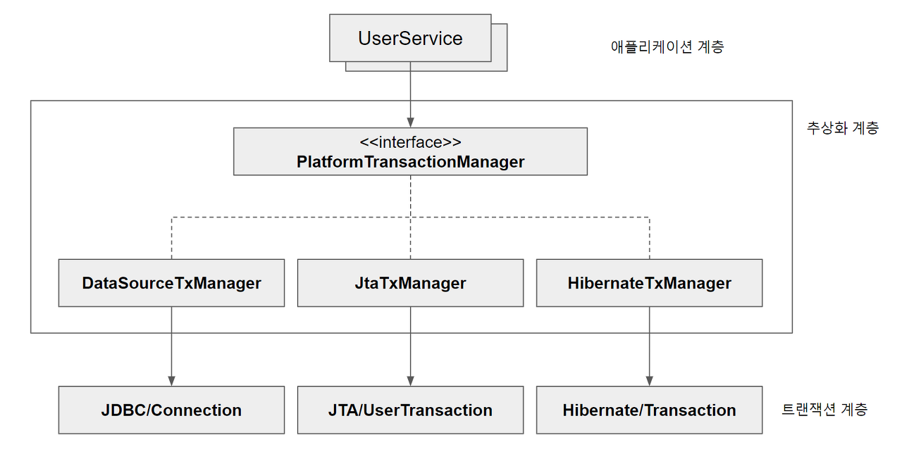
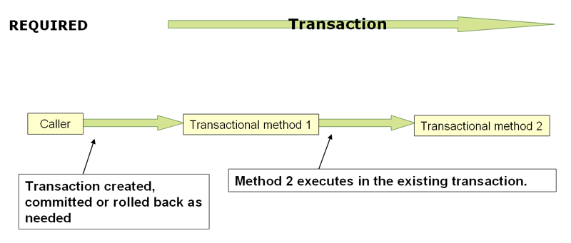
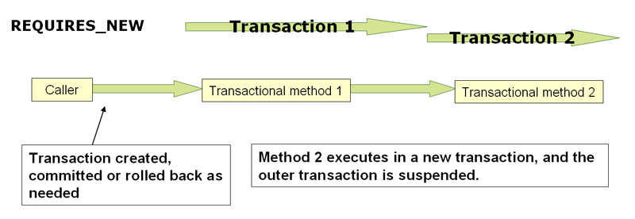
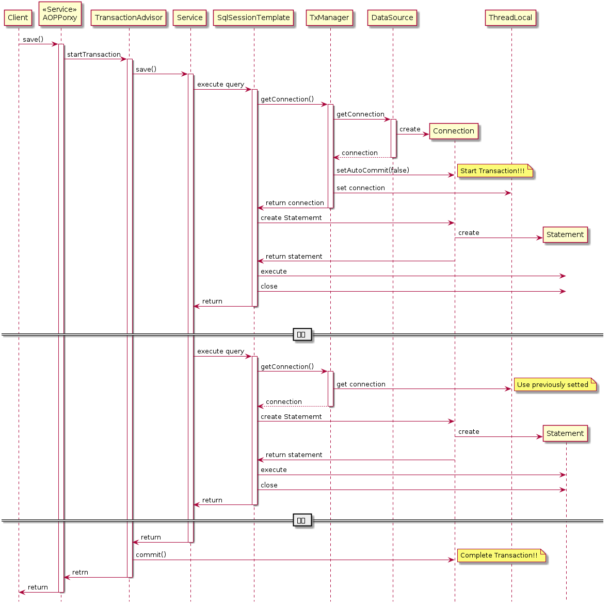

## Transaction 이란

트랜잭션이란, 하나 이상의 SQL문을 묶은 작업단위를 말합니다. 그리고 이 작업단위 범위는 사람이 정한 기준에 따라 정합니다.  

그리고 이렇게 정한 트랜잭션은 4가지 특징이 있습니다. 

원자성은 트랜잭션 범위 안에 모든 SQL 문이 전부 다 데이터베이스에 정상적으로 반영하던가, 아니면 전혀 반영되지 않게 합니다. 

일관성은 트랜잭션이 진행 도중에 데이터베이스가 변경이 일어나도 처음 트랜잭션이 시작됐을 때 데이터베이스의 상태로 진행합니다. 

독립성은 한 트랜잭션이 연산을 마칠 때까지 진행된 연산 작업을 다른 트랜잭션이 도중에 결과를 확인할 수 없습니다.

지속성은 트랜잭션이 성공적으로 완료됐으면, 결과는 영구적으로 반영되어야 하는 점입니다. 


## Spring Framework transaction 추상화 


```java
public interface PlatformTransactionManager {

    TransactionStatus getTransaction(
            TransactionDefinition definition) throws TransactionException;

    void commit(TransactionStatus status) throws TransactionException;

    void rollback(TransactionStatus status) throws TransactionException;
}
```

인터페이스를 제공한다는 것은 정말 여러가지 이점을 얻을 수 있습니다. 

트랜잭션을 처리하기 위해 JDBC에서는 로컬 트랜잭션 방식이나 글로벌 트랜잭션 방식인 JTA/UserTransaction 그리고 Hibernate 에서는 Hibernate/Transaction 
방식으로 트랜잭션을 관리합니다. 

이들은 모두 사용방식이 다르기 때문에 애플리케이션 코드에서 이를 사용하게 된다면 매우 결합도가 높아지고 단일책임원칙, OCP 다 깨집니다.

그래서 스프링에서는 이들을 추상화한 `PlatformTransactionManager`라는 추상화 인터페이스를 제공합니다. 매우 쓰기도 간편하고 위의 원칙도 다 지킬 수 있습니다.


방금 말한 다음 상속관계는 다음과 같습니다.



- **DataSourceTransactionManager** : JDBC나 MyBatis 등의 JDBC 라이브러리로 트랜잭션을 걸 때 사용됩니다. 

    이 트랜잭션 매니저는 DataSource을 DI 하기 때문에 DataSource 역시 빈으로 등록해야 합니다.
- **HibernateTransactionManager** : 하이버네이트를 이용해 데이터베이스를 접근할 경우 사용합니다.
- **JpaTransactionManager** : JPA로 데이터베이스를 접근할 경우 사용합니다. 

    JpaTransactionManager는 LocalContainerEntityManagerFactoryBean 타입의 빈을 등록해줘야 합니다.
- **JtaTransactionManager** : 여러개의 DB에 작업을 할 때 하나의 트랜잭션 내에서 수행하려면 이 트랜잭션 매니저를 등록하면 됩니다.


## Transaction 속성

### Transaction propagation

--- 

**REQUIRED 인 경우(default)**



이미 시작된 트랜잭션에 참여하거나, 없으면 새로 생성해 시작합니다. 즉, 트랜잭션을 하나로 묶습니다.

예외와 관련된 중요한 점은 다음과 같습니다:

1. 내부 트랜잭션에서 롤백이 발생하면, 이는 외부 트랜잭션에도 영향을 미칩니다.
2. 그러나 내부 트랜잭션에서 롤백이 발생했는데 외부 트랜잭션이 이를 인지하지 못하고 커밋을 시도하는 경우가 있습니다.
3. 이런 상황에서 시스템은 `UnexpectedRollbackException`을 발생시킵니다.

---

**REQUIRES_NEW 인 경우**

완전히 독립적인 트랜잭션을 사용합니다. 그래서 외부 트랜잭션은 내부 트랜잭션의 롤백 상태에 영향 받지 않고 독립적으로 커밋하거나 롤백할 수 있습니다. 



---

**NESTED 인 경우**

내부 트랜잭션이 롤백이 일어나도 외부 트랜잭션에 영향을 주지 않습니다. 그러나 외부 트랜잭션의 커밋과 롤백은 내부 트랜잭션에서도 일어납니다.

---

**SUPPORT 인 경우**

현재 진행 중인 트랜잭션이 있으면 그 트랜잭션에 참여합니다. 진행 중인 트랜잭션이 없으면 트랜잭션 없이 실행됩니다. 

---

**MANDATORY 인 경우**

반드시 기존 트랜잭션 내에서 실행되야 합니다. 만약 진행 중인 트랜잭션이 없으면 예외가 발생합니다. 

특정 작업이 반드시 트랜잭션 내에서 실행되어야 할 때 사용합니다.

---

**NOT_SUPPORTED 인 경우**

트랜잭션 없이 실행됩니다. 만약 현재 진행 중인 트랜잭션이 있다면, 그 트랜잭션은 일시 중단 됩니다.

---

**NEVER 인 경우** 

트랜잭션 없이 실행되어야 합니다. 만약 현재 진행 중인 트랜잭션이 있으면 예외가 발생합니다.

### Isolation (트랜잭션 격리 수준)

트랜잭션 격리 수준은 동시에 여러 트랜잭션이 실행될 때, 트랜잭션 내의 작업 결과를 다른 트랜잭션에게 어떻게 노출시킬 것인지 기준을 정합니다.

---

**DEFAULT (default)** 

- 데이터베이스의 기본 격리 수준을 사용합니다. 
- 대부분의 데이터베이스에서 READ_COMMITTED를 기본값으로 사용합니다.

---

**READ_UNCOMMITTED (Level 0)**

- 가장 낮은 격리 수준입니다.
- 다른 트랜잭션의 커밋되지 않은 변경사항을 읽을 수 있습니다.
- Dirty Read, Non-Repeatable Read, Phantom Read 문제가 발생할 수 있습니다.
- 성능은 좋지만 데이터 일관성이 매우 낮습니다.

---

**READ_COMMITTED (Level 1)**

- 다른 트랜잭션이 커밋한 데이터만 읽을 수 있습니다.
- 한 트랜잭션이 커밋한 변경사항(수정하거나 추가한 로우)은 다른 트랜잭션에서 즉시 읽을 수 있습니다.
- Dirty Read를 방지하지만, Non-Repeatable Read와 Phantom Read는 여전히 발생할 수 있습니다.
- 대부분의 데이터베이스의 기본 격리 수준입니다.

---

**Non-Repeatable Read**는 한 트랜잭션 내에서 같은 데이터를 두 번 이상 읽을 때, 그 사이에 다른 트랜잭션이 해당 데이터를 변경하여 서로 다른 결과를 얻게 되는 현상입니다.

**Phantom Read**는 한 트랜잭션 내에서 같은 쿼리를 두 번 실행했을 때, 첫 번째 쿼리에서는 없던 결과가 두 번째 쿼리에서 나타나는 현상입니다. 이는 주로 다른 트랜잭션이 새로운 행을 삽입하거나 삭제할 때 발생합니다.

---

**REPEATABLE_READ (Level 2)**

- 트랜잭션이 읽은 로우는 트랜잭션이 완료될 때까지 다른 트랜잭션에 의해 변경되지 않습니다.
- Dirty Read와 Non-Repeatable Read를 방지하지만, Phantom Read는 여전히 발생할 수 있습니다.
- 데이터 일관성이 높습니다.

---

**SERIALIZABLE (Level 3)**

- 가장 높은 격리 수준입니다.
- 같은 데이터에 접근하는 트랜잭션들 사이에서만 순차적 실행을 보장합니다
- 트랜잭션들이 순차적으로 실행되는 것처럼 동작합니다.
- Dirty Read, Non-Repeatable Read, Phantom Read 모두를 방지합니다.
- 데이터 일관성이 가장 높지만, 성능 저하가 발생할 수 있습니다.

### Timeout

트랜잭션에 제한 시간을 걸 수 있습니다. 디폴트는 시스템의 제한 시간을 따릅니다. 

이 기능을 지원하지 않는 일부 트랜잭션 메니저는 예외를 발생시킬 수 있습니다.

### ReadOnly

트랜잭션 읽기 전용으로 성능을 최적화하기 위해 사용됩니다. 또는 특정 트랜잭션 작업 안에서 쓰기 작업이 일어나는 것을 의도적으로 방지하기 위해 사용합니다. 

### RollbackFor

- 지정된 예외 발생 시 트랜잭션을 롤백합니다.
- 기본적으로 런타임 예외(RuntimeException)와 에러(Error)는 롤백을 발생시키지만 체크 예외는 롤백을 안합니다.
- checked 예외에 대해서도 롤백을 원할 때 사용합니다.

`@Transactional(rollbackFor = {SQLException.class, IOException.class})`

### noRollbackFor

- 지정된 예외가 발생해도 트랜잭션을 롤백하지 않습니다.
- 기본적으로 롤백을 발생시키는 예외(RuntimeException, Error)에 대해 롤백을 원하지 않을 때 사용합니다.

`@Transactional(noRollbackFor = {IllegalArgumentException.class})`

## Spring 트랜잭션 관리 작동 방식

1. @Transactional 어노테이션

   - 개발자가 트랜잭션이 필요한 메서드나 클래스에 `@Transactional`을 붙입니다.
   - 이는 선언적 트랜잭션 관리의 시작점입니다.

2. 프록시 기반 AOP

   - Spring은 @Transactional이 붙은 빈에 대해 프록시를 생성합니다.
   - 이 프록시는 AOP(Aspect-Oriented Programming)를 이용해 구현합니다.  

3. 프록시 생성 방식:

   - 인터페이스가 있는 경우: JDK 동적 프록시를 사용합니다.
   - 인터페이스가 없는 경우: CGLIB을 사용하여 서브클래스를 생성합니다. (스프링부트에서는 디폴트로 인터페이스가 있어도 CGLIB 방식을 사용하도록 합니다.)

4. 프록시의 동작:

   - JDK 동적 프록시는 리플렉션 패키지에 Proxy 클래스를 통해 프록시 객체를 생성합니다.
   - CGLIB은 바이트 코드를 조작하여 프록시 객체를 생성합니다.
   - 이 두 경우 모두, 메서드 호출을 가로채어 트랜잭션 로직을 수행합니다.


4. TransactionManager:

   - 프록시는 PlatformTransactionManager를 사용하여 실제 트랜잭션을 관리합니다.
   - 트랜잭션의 시작, 커밋, 롤백을 담당합니다.


5. 트랜잭션 처리 흐름:

   - 메서드 호출 시, 프록시가 먼저 트랜잭션을 시작합니다.
   - 실제 빈의 메서드를 실행합니다.
   - 정상 종료 시 트랜잭션을 커밋, 예외 발생 시 롤백합니다.



## Reference

토비의 스프링 VOL 1

https://gngsn.tistory.com/152

https://mommoo.tistory.com/62

https://docs.spring.io/spring-framework/docs/4.2.x/spring-framework-reference/html/transaction.html#transaction-motivation

https://www.marcobehler.com/guides/spring-transaction-management-transactional-in-depth?fbclid=IwAR1PsHPKHyLGmiKORaTsvXV6EwIwe5f2RTCkz52QLZFnDdI7QzArXLil4PQ